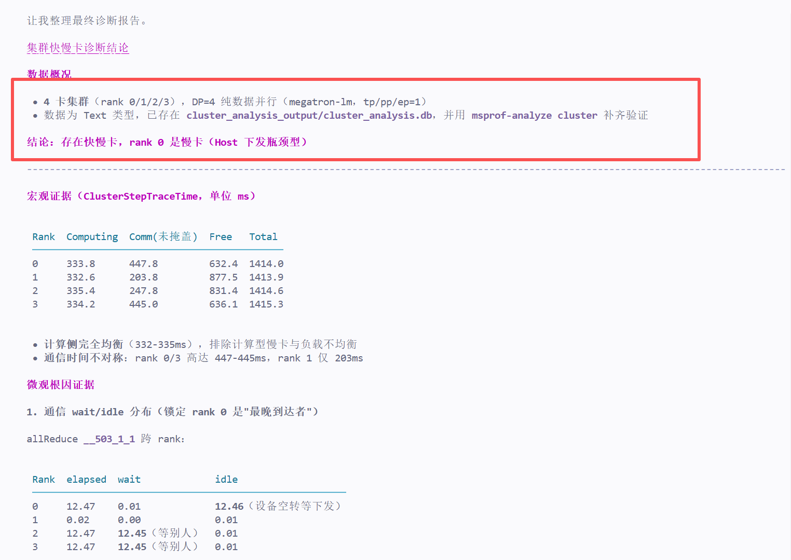
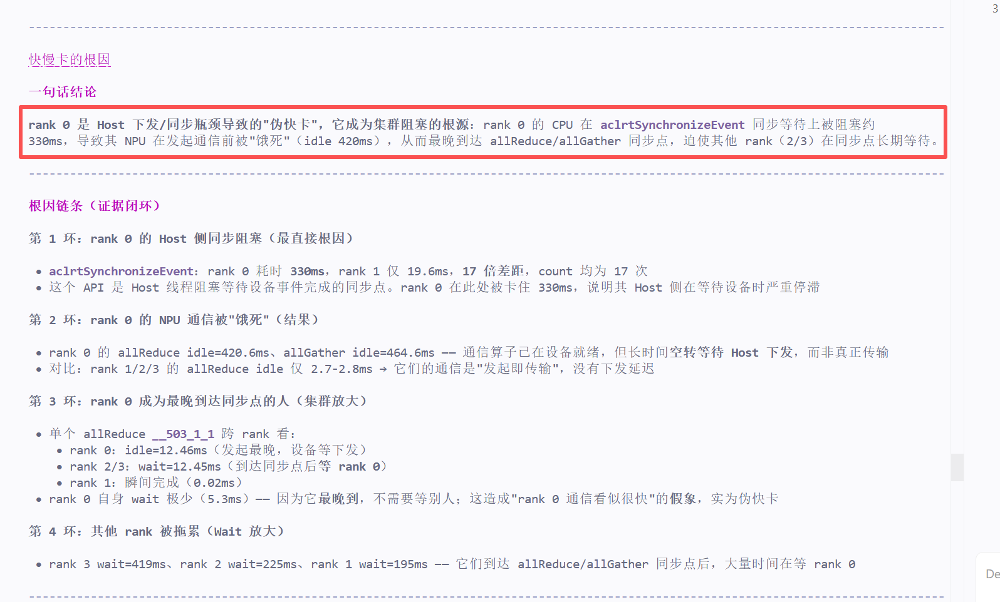
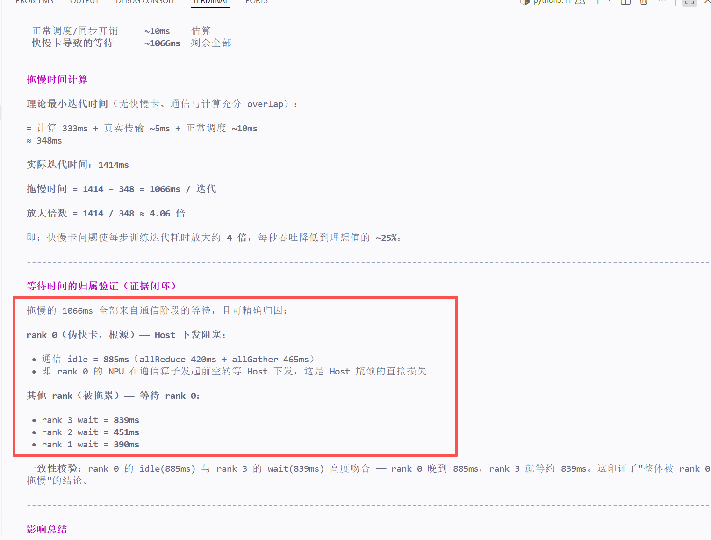

# MSAgent 体验报告

## 一、报告基本信息

| 项目 | 内容 |
|------|------|
| 报告编号 | （待填写） |
| 体验日期 | 2026-08-13 |
| Agent版本 | （待填写，如 msprof-analyze 8.5.2 / ascend-cluster-fast-slow-rank-detector） |
| Profiling数据来源 | `/workspace/user_data/df536040f370_*_ascend_pt`（4 rank 集群 Text 数据）+ `cluster_analysis_output/cluster_analysis.db` |
| 测试目标 | 验证 MSAgent 对 Ascend 集群 Profiling 数据中"快慢卡/负载不均衡/集群瓶颈"问题的自动诊断能力 |

---

## 二、交互记录

### 第 1 轮交互

| 项目 | 内容 |
|------|------|
| 输入 Prompt | 分析给定集群 Profiling 数据中的快慢卡情况 |
| Agent 输出（文字摘要） | 定位为 4 卡 DP 纯数据并行（megatron-lm，tp/pp/ep=1）。宏观上计算侧完全均衡（332-335ms），通信不对称（rank 0/3 约 445ms，rank 1 仅 203ms）。深入通信 wait/idle 分布 + Host API 对比后，判定 **rank 0 是慢卡（Host 下发瓶颈型"伪快卡"）**：aclrtSynchronizeEvent 阻塞 330ms（rank 1 仅 19.6ms，17 倍差距），导致 rank 0 NPU 通信前空转（idle 420ms），最晚到达 allReduce 同步点，拖累 rank 2/3 长期等待。给出 P0/P1/P2 调优建议。 |
| **输出截图** |  |
| 是否符合预期 | ✅️是　□ 否 |
| 评价 |  |

### 第 2 轮交互

| 项目 | 内容 |
|------|------|
| 输入 Prompt | 造成快慢卡的原因是什么 |
| Agent 输出（文字摘要） | 给出闭环根因链条：第 1 环 Host 侧同步阻塞（aclrtSynchronizeEvent 330ms）→ 第 2 环 NPU 通信被"饿死"（allReduce idle=420.6ms、allGather idle=464.6ms，对比其他 rank 仅 2.7ms）→ 第 3 环 rank 0 成为最晚到达同步点者（单算子跨 rank：rank 0 idle=12.46ms，rank 2/3 wait=12.45ms）。一句话结论：rank 0 是 Host 下发/同步瓶颈导致的"伪快卡"，为集群阻塞根源。 |
| **输出截图** |  |
| 是否符合预期 | ✅️是　□ 否 |
| 评价 |  |

### 第 3 轮交互

| 项目 | 内容 |
|------|------|
| 输入 Prompt | 评估快慢卡问题造成的影响，拖慢了多少时间 |
| Agent 输出（文字摘要） | 由于是同步训练（4 卡 DP 同步），整体迭代耗时被最慢的卡（rank 0）决定。各 rank 实际迭代耗时一致 ≈ 1414ms。 |
| **输出截图** |  |
| 是否符合预期 | ✅️是　□ 否 |
| 评价 |  |

---

## 三、多轮交互整体评价

| 评价维度 | 评分（1~5） | 说明 |
|----------|-------------|------|
| 问题理解准确性 | 5 | 准确识别为集群快慢卡场景并自动匹配 ascend-cluster-fast-slow-rank-detector 技能，无跑偏 |
| 数据分析深度 | 5 | 从宏观（ClusterStepTraceTime）→ 微观（通信 wait/idle 分布）→ Host API（aclrtSynchronizeEvent）→ advisor 多层级下钻 |
| 证据链条完整性 | 5 | 宏观判定、通信跨 rank 时序、API 对比、advisor 四方证据交叉验证，根因闭环完整 |
| 优化建议实用性 | 4 | P0/P1/P2 分级明确、可执行，但部分建议（如 ZeRO 调整、字节对齐）落地依赖外部条件 |
| 多轮对话连贯性 | 5 | 第 2 轮追问根因时基于既有证据补充下钻，结论延续一致，无重复分析 |
| 响应速度与稳定性 | 3 | 分析过程稳定无中断，但 msprof-analyze（43s）与对比脚本（18s）多次执行，整体耗时偏长 |
| 整体满意度 | 4 | 结论准确、证据充分，主要扣分在响应耗时与技能判定边界问题 |

---

## 四、问题与改进建议

### 发现的问题

1. 宏观"伪快卡"启发式判据（Free>10% 且 Comm 短）在本场景失效：4 卡 Free 普遍占 45%-62%，技能预设判据无法直接收敛，需中途调整分析策略，判定门槛缺少"全体 Free 偏高"场景的兜底规则。
2. `msprof-analyze cluster` 生成的 db 未产出技能预期的 slow_rank / slow_link / hccl_sum 表（执行时出现 ERROR no such table），技能预期表名与实际工具链输出不一致，需人工降级处理。
3. 分析初期在"rank 0 通信慢卡"与"rank 1 伪快卡"两种解读间出现反复，收敛依赖多轮数据交叉验证，首轮结论前证据组织较慢。

### 改进建议

1. 对慢卡 rank 0 补充 with_stack 采集，定位 aclrtSynchronizeEvent 330ms 阻塞的具体代码位置，将建议从"排查方向"落到"代码行"。
2. 技能判定逻辑增加多维度组合判据（如通信 wait/idle 占比、aclrtSynchronizeEvent 耗时比值），避免单一 Free 占比启发式在异常场景失效。
3. 与 msprof-analyze 工具链版本对齐表名与能力清单，缺失表时自动降级并提示，减少分析中的 ERROR 与人工补步。
