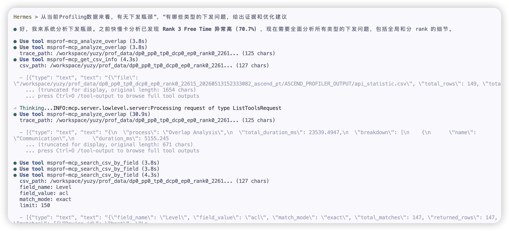
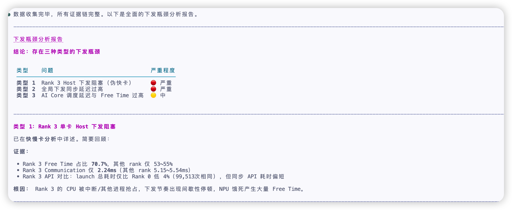
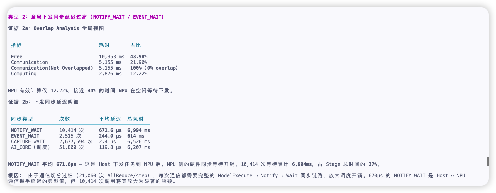
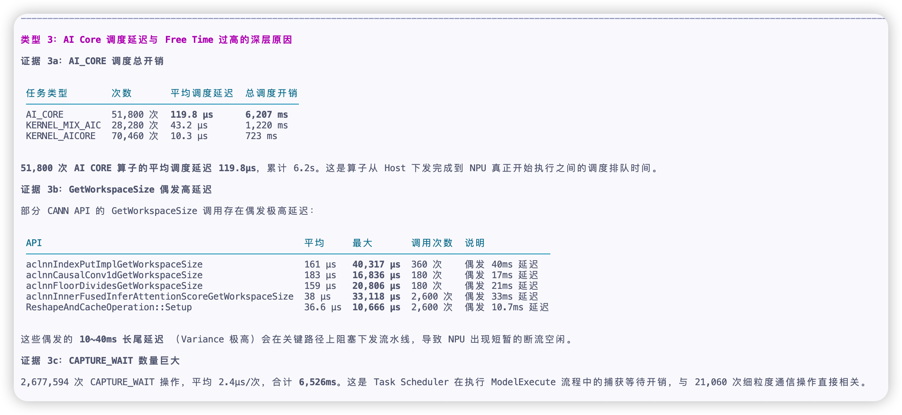
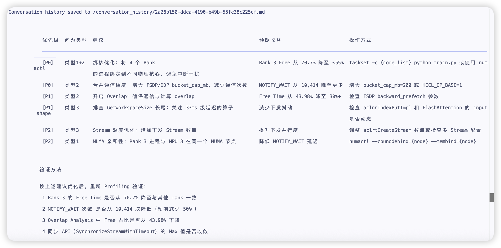

# MeetUp 众测截图及 Issue/PR 信息记录

## 一、基本信息

| 项目 | 内容 |
|------|------|
| 开发者ID | 于智远 |
| 任务编号 | MS-MEETUP-20260624-于智远-01 |
| 体验报告 | MeetUp-01-于智远-msagent性能体验报告.md |

## 二、截图记录

| 截图编号 | 内容 | 状态 |
|----------|------|------|
| IMG-01 | 下发调度分析Prompt及数据分析过程 | 已插入 |
| IMG-02 | 三类下发瓶颈结论 | 已插入 |
| IMG-03 | Overlap及下发同步延迟明细 | 已插入 |
| IMG-04 | AI Core调度延迟及长尾分析 | 已插入 |
| IMG-05 | 优化建议及验证方法 | 已插入 |

## 三、Issue信息

| 序号 | Issue说明 | Issue链接 | 状态 |
|------|-----------|-----------|------|
| 1 | [MeetUp众测][Profiler][下发调度] 建议在下发瓶颈报告中明确同步等待指标口径与因果依据 | https://gitcode.com/Ascend/msagent/issues/110 | 已提交 |

### Issue message

#### 标题

`[MeetUp众测][Profiler][下发调度] 建议在下发瓶颈报告中明确同步等待指标口径与因果依据`

#### 现状问题

在msAgent中输入以下Prompt：

```text
从当前Profiling数据来看，有无下发瓶颈，有哪些类型的下发问题，给出证据和优化建议
```

Agent输出下发瓶颈分析报告，识别出以下三类问题：

1. Rank 3 Host下发阻塞；
2. 全局下发同步延迟过高；
3. AI Core调度延迟与Free Time过高。

报告给出了NOTIFY_WAIT、EVENT_WAIT、CAPTURE_WAIT、AI_CORE调度延迟、同步API和GetWorkspaceSize长尾等数据，并形成“大量小包AllReduce → Notify/Wait同步链路 → NPU Free Time增加”的因果链。

当前输出未明确以下信息：

1. 各指标来自哪个Rank、哪个Step或哪一段采集范围；
2. NOTIFY_WAIT、CAPTURE_WAIT和AI Core调度延迟的具体统计口径；
3. 同步等待累计值与Stage总时间之间是否存在重叠；
4. 细粒度AllReduce次数与各类等待次数之间的对应关系；
5. 根因结论是直接证据还是分析推断。

#### 预期结果

下发瓶颈报告在给出结论时，同时说明指标来源、统计范围、时间单位、是否可能重叠，以及结论的证据类型。对于“小包通信导致同步等待放大”等因果结论，应展示对应关系或标记为待验证推断。

#### 优化建议

1. 在每张指标表中补充Rank、Step、数据文件和时间单位；
2. 说明NOTIFY_WAIT、EVENT_WAIT、CAPTURE_WAIT和AI_CORE调度延迟的指标定义；
3. 对累计耗时说明能否直接相加，以及是否与Free Time、Communication时间重叠；
4. 将报告分为“观测数据、分析推断、优化建议、复测指标”；
5. 对通信次数与等待次数给出可核对的映射关系；
6. 优化后复测时对比Rank 3 Free Time、NOTIFY_WAIT次数、Free占比和同步API最大耗时。

#### 测试环境

- Agent：Hermes
- msAgent版本：v26.0.0
- Profiling数据目录：`/workspace/yuzy/prof_data`
- 测试场景：下发与调度瓶颈分析
- 众测任务：MS-MEETUP-20260624-于智远-01

#### 附件

- 完整对话记录：

```
Hermes > 从当前Profiling数据来看，有无下发瓶颈”，“有哪些类型的下发问题，给出证据和优化建议                                                                                

● 好，我来系统分析下发瓶颈。之前快慢卡分析已发现 Rank 3 Free Time 异常高（70.7%），现在需要全面分析所有类型的下发问题，包括全局和分 rank 的细节。                         

● Use tool msprof-mcp_analyze_overlap (3.8s)
● Use tool msprof-mcp_analyze_overlap (3.8s)
  trace_path: /workspace/yuzy/prof_data/dp0_pp0_tp0_dcp0_ep0_rank0_2261... (125 chars)
● Use tool msprof-mcp_get_csv_info (4.3s)
  csv_path: /workspace/yuzy/prof_data/dp0_pp0_tp0_dcp0_ep0_rank0_2261... (127 chars)

  - [{"type": "text", "text": "{\"file\": 
\"/workspace/yuzy/prof_data/dp0_pp0_tp0_dcp0_ep0_rank0_22615_20260513152333082_ascend_pt/ASCEND_PROFILER_OUTPUT/api_statistic.csv\", \"total_rows\": 149, \"total_
    ... (truncated for display, original length: 1654 chars)
    ... press Ctrl+O /tool-output to browse full tool outputs

⠴ Thinking...INFO:mcp.server.lowlevel.server:Processing request of type ListToolsRequest
● Use tool msprof-mcp_analyze_overlap (30.9s)
  trace_path: /workspace/yuzy/prof_data/dp0_pp0_tp0_dcp0_ep0_rank0_2261... (125 chars)

  - [{"type": "text", "text": "{\n  \"process\": \"Overlap Analysis\",\n  \"total_duration_ms\": 23539.4947,\n  \"breakdown\": [\n    {\n      \"name\": 
\"Communication\",\n      \"duration_ms\": 5155.245
    ... (truncated for display, original length: 671 chars)
    ... press Ctrl+O /tool-output to browse full tool outputs

● Use tool msprof-mcp_search_csv_by_field (3.8s)
● Use tool msprof-mcp_search_csv_by_field (3.8s)
● Use tool msprof-mcp_search_csv_by_field (4.3s)
  csv_path: /workspace/yuzy/prof_data/dp0_pp0_tp0_dcp0_ep0_rank0_2261... (127 chars)
  field_name: Level
  field_value: acl
  match_mode: exact
  limit: 150

  - [{"type": "text", "text": "{\"field_name\": \"Level\", \"field_value\": \"acl\", \"match_mode\": \"exact\", \"total_matches\": 147, \"returned_rows\": 147, 
\"matches\": [{\"Device_id\": \"host\", \"Le
    ... (truncated for display, original length: 31245 chars)
    ... press Ctrl+O /tool-output to browse full tool outputs

● 现在用 CTE 宏查询下发映射明细，进一步分析调度链路的瓶颈。                                                                                                               

● Use tool msprof-mcp_execute_sql (3.7s)
● Use tool msprof-mcp_execute_sql (12.8s)
● Use tool msprof-mcp_execute_sql (13.4s)
  db_path: /workspace/yuzy/prof_data/dp0_pp0_tp0_dcp0_ep0_rank0_2261... (138 chars)
  query: WITH dispatch_view AS ( |     SELECT  |         ROUND(t.e... (986 chars)

  - [{"type": "text", "text": "{\"rows\": [{\"task_type\": \"CAPTURE_WAIT\", \"cnt\": 2677594, \"avg_dispatch_us\": 2.435356420726966, \"avg_cann_us\": NaN, 
\"avg_pytorch_us\": NaN}, {\"task_type\": \"KER
    ... (truncated for display, original length: 3364 chars)
    ... press Ctrl+O /tool-output to browse full tool outputs

● Use tool msprof-mcp_execute_sql (3.8s)
● Use tool msprof-mcp_execute_sql (3.9s)
● Use tool msprof-mcp_execute_sql (3.9s)
● Use tool msprof-mcp_search_csv_by_field (4.5s)
  csv_path: /workspace/yuzy/prof_data/dp0_pp0_tp0_dcp0_ep0_rank0_2261... (127 chars)
  field_name: Level
  field_value: acl
  match_mode: exact
  limit: 150

  - [{"type": "text", "text": "{\"field_name\": \"Level\", \"field_value\": \"acl\", \"match_mode\": \"exact\", \"total_matches\": 147, \"returned_rows\": 147, 
\"matches\": [{\"Device_id\": \"host\", \"Le
    ... (truncated for display, original length: 31245 chars)
    ... press Ctrl+O /tool-output to browse full tool outputs

⠦ Thinking...INFO:mcp.server.lowlevel.server:Processing request of type ListToolsRequest
● Use tool msprof-mcp_execute_sql (10.3s)
  db_path: /workspace/yuzy/prof_data/dp0_pp0_tp0_dcp0_ep0_rank0_2261... (138 chars)
  query: WITH dispatch_view AS ( |     SELECT  |         ROUND(t.e... (980 chars)

  - [{"type": "text", "text": "{\"rows\": [{\"task_type\": \"NOTIFY_WAIT\", \"cnt\": 10414, \"total_dispatch_us\": 6994014.32, \"avg_dispatch_us\": 671.5973036297293}, 
{\"task_type\": \"AI_CORE\", \"cnt\"
    ... (truncated for display, original length: 625 chars)
    ... press Ctrl+O /tool-output to browse full tool outputs

● 数据收集完毕，所有证据链完整。以下是全面的下发瓶颈分析报告。                                                                                                            

  ------------------------------------------------------------------------------------------------------------------------------------------------------------------------

  下发瓶颈分析报告                                                                                                                                                        

  结论：存在三种类型的下发瓶颈                                                                                                                                            

                                                       
   类型    问题                               严重程度 
   ─────────────────────────────────────────────────── 
   类型 1  Rank 3 Host 下发阻塞（伪快卡）     🔴 严重  
   类型 2  全局下发同步延迟过高               🔴 严重  
   类型 3  AI Core 调度延迟与 Free Time 过高  🟡 中    
                                                       

  ------------------------------------------------------------------------------------------------------------------------------------------------------------------------

  类型 1：Rank 3 单卡 Host 下发阻塞                                                                                                                                       

  已在快慢卡分析中详述。简要回顾：                                                                                                                                        

  证据：                                                                                                                                                                  

   • Rank 3 Free Time 占比 70.7%，其他 rank 仅 53~55%                                                                                                                     
   • Rank 3 Communication 仅 2.24ms（其他 rank 5.15~5.54ms）                                                                                                              
   • Rank 3 API 对比：launch 总耗时仅比 Rank 0 低 4%（99,513次相同），但同步 API 耗时偏短                                                                                 

  根因： Rank 3 的 CPU 被中断/其他进程抢占，下发节奏出现间歇性停顿，NPU 饿死产生大量 Free Time。                                                                          

  ------------------------------------------------------------------------------------------------------------------------------------------------------------------------

  类型 2：全局下发同步延迟过高（NOTIFY_WAIT / EVENT_WAIT）                                                                                                                

  证据 2a：Overlap Analysis 全局视图                                                                                                                                      

                                                                
   指标                           耗时       占比               
   ──────────────────────────────────────────────────────────── 
   Free                           10,353 ms  43.98%             
   Communication                  5,155 ms   21.90%             
   Communication(Not Overlapped)  5,155 ms   100%（0% overlap） 
   Computing                      2,876 ms   12.22%             
                                                                

  NPU 有效计算仅 12.22%，接近 44% 的时间 NPU 在空闲等待下发。                                                                                                             

  证据 2b：下发同步延迟明细                                                                                                                                               

                                                     
   同步类型         次数          平均延迟  总耗时   
   ───────────────────────────────────────────────── 
   NOTIFY_WAIT      10,414 次     671.6 μs  6,994 ms 
   EVENT_WAIT       2,515 次      244.0 μs  614 ms   
   CAPTURE_WAIT     2,677,594 次  2.4 μs    6,526 ms 
   AI_CORE（调度）  51,800 次     119.8 μs  6,207 ms 
                                                     

  NOTIFY_WAIT 平均 671.6μs — 这是 Host 下发任务到 NPU 后，NPU 侧的硬件同步等待开销。10,414 次等待累计 6,994ms，占 Stage 总时间的 37%。                                    

  根因： 由于通信切分过细（21,060 次 AllReduce/step），每次通信都需要完整的 ModelExecute → Notify → Wait 同步链路，放大调度开销。670μs 的 NOTIFY_WAIT 是 Host ↔ NPU       
  通信握手延迟的典型值，但 10,414 次调用将其放大为显著的瓶颈。                                                                                                            

  证据 2c：同步 API 耗时对比                                                                                                                                              

                                                                                                                 
   API                                总耗时      次数    平均      最大       说明                              
   ───────────────────────────────────────────────────────────────────────────────────────────────────────────── 
   aclrtSynchronizeStreamWithTimeout  481,867 μs  10,630  45.3 μs   15,021 μs  Stream 同步（部分由小包通信触发） 
   aclrtSynchronizeStream             131,073 μs  901     145.5 μs  6,809 μs   显式 Stream 同步                  
   aclrtSynchronizeEvent              63,706 μs   521     122.3 μs  2,405 μs   Event 同步                        
                                                                                                                 

  这些同步 API 的 Max 值极高（6~15ms），说明存在偶发的长尾同步延迟，进一步恶化 NPU Free Time。                                                                            

  ------------------------------------------------------------------------------------------------------------------------------------------------------------------------

  类型 3：AI Core 调度延迟与 Free Time 过高的深层原因                                                                                                                     

  证据 3a：AI_CORE 调度总开销                                                                                                                                             

                                                       
   任务类型        次数       平均调度延迟  总调度开销 
   ─────────────────────────────────────────────────── 
   AI_CORE         51,800 次  119.8 μs      6,207 ms   
   KERNEL_MIX_AIC  28,280 次  43.2 μs       1,220 ms   
   KERNEL_AICORE   70,460 次  10.3 μs       723 ms     
                                                       

  51,800 次 AI CORE 算子的平均调度延迟 119.8μs，累计 6.2s。这是算子从 Host 下发完成到 NPU 真正开始执行之间的调度排队时间。                                                

  证据 3b：GetWorkspaceSize 偶发高延迟                                                                                                                                    

  部分 CANN API 的 GetWorkspaceSize 调用存在偶发极高延迟：                                                                                                                

                                                                                                      
   API                                                 平均     最大       调用次数  说明             
   ────────────────────────────────────────────────────────────────────────────────────────────────── 
   aclnnIndexPutImplGetWorkspaceSize                   161 μs   40,317 μs  360 次    偶发 40ms 延迟   
   aclnnCausalConv1dGetWorkspaceSize                   183 μs   16,836 μs  180 次    偶发 17ms 延迟   
   aclnnFloorDividesGetWorkspaceSize                   159 μs   20,806 μs  180 次    偶发 21ms 延迟   
   aclnnInnerFusedInferAttentionScoreGetWorkspaceSize  38 μs    33,118 μs  2,600 次  偶发 33ms 延迟   
   ReshapeAndCacheOperation::Setup                     36.6 μs  10,666 μs  2,600 次  偶发 10.7ms 延迟 
                                                                                                      

  这些偶发的 10~40ms 长尾延迟 （Variance 极高）会在关键路径上阻塞下发流水线，导致 NPU 出现短暂的断流空闲。                                                                

  证据 3c：CAPTURE_WAIT 数量巨大                                                                                                                                          

  2,677,594 次 CAPTURE_WAIT 操作，平均 2.4μs/次，合计 6,526ms。这是 Task Scheduler 在执行 ModelExecute 流程中的捕获等待开销，与 21,060 次细粒度通信操作直接相关。         

  ------------------------------------------------------------------------------------------------------------------------------------------------------------------------

  问题关联：下发瓶颈 × 小包通信的恶性循环                                                                                                                                 

  大量小包 AllReduce (21,060次/step, 65.5KB)
          ↓
  每次 AllReduce 都需要：launch → notify → wait 完整链路
          ↓
  NOTIFY_WAIT (671μs×10,414次) + AI_CORE调度(120μs×51,800次) 累计 13.2s
          ↓
  NPU 频繁等待下发 → Free Time 43.98%
          ↓
  Rank 3 CPU 绑核问题加剧 → Free Time 70.7%（拖累全局）

  ------------------------------------------------------------------------------------------------------------------------------------------------------------------------

  优化建议                                                                                                                                                                

                                                                                                                                                                          
   优先级  问题类型  建议                                                       预期收益                        操作方式                                                  
   ────────────────────────────────────────────────────────────────────────────────────────────────────────────────────────────────────────────────────────────────────── 
   [P0]    类型1+2   绑核优化：将 4 个 Rank                                     Rank 3 Free 从 70.7% 降至 ~55%  taskset -c {core_list} python train.py 或使用 numactl     
                     的进程绑定到不同物理核心，避免中断干扰                                                                                                               
   [P0]    类型2     合并通信梯度：增大 FSDP/DDP bucket_cap_mb，减少通信次数    NOTIFY_WAIT 从 10,414 降至更少  增大 bucket_cap_mb=200 或 HCCL_OP_BASE=1                  
   [P1]    类型2     开启 Overlap：确保通信与计算 overlap                       Free Time 从 43.98% 降至 30%+   检查 FSDP backward_prefetch 参数                          
   [P1]    类型3     排查 GetWorkspaceSize 长尾：关注 33ms 级延迟的算子         减少下发抖动                    检查 aclnnIndexPutImpl 和 FlashAttention 的 input shape   
                                                                                                                是否动态                                                  
   [P2]    类型3     Stream 深度优化：增加下发 Stream 数量                      提升下发并行度                  调整 aclrtCreateStream 数量或检查多 Stream 配置           
   [P2]    类型1     NUMA 亲和性：Rank 3 进程与 NPU 3 在同一个 NUMA 节点        降低 NOTIFY_WAIT 延迟           numactl --cpunodebind={node} --membind={node}             
                                                                                                                                                                          

  验证方法                                                                                                                                                                

  按上述建议优化后，重新 Profiling 验证：                                                                                                                                 

   1 Rank 3 的 Free Time 是否从 70.7% 降至与其他 rank 一致                                                                                                                
   2 NOTIFY_WAIT 次数 是否从 10,414 次降低（预期减少 50%+）                                                                                                               
   3 Overlap Analysis 中 Free 占比是否从 43.98% 下降                                                                                                                      
   4 同步 API（SynchronizeStreamWithTimeout）的 Max 值是否收敛                                                                                                            

```


- 对话截图













## 四、PR信息

| 序号 | PR说明 | PR链接 | 状态 |
|------|--------|--------|------|
| 1 | MeetUp众测msAgent下发调度体验报告 | https://gitcode.com/Ascend/msagent/merge_requests/135 | 已提交 |
