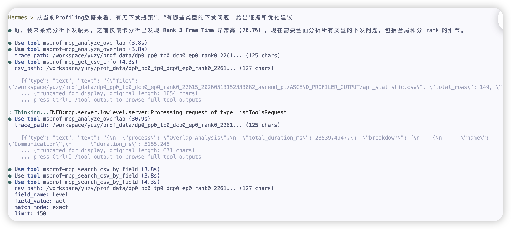
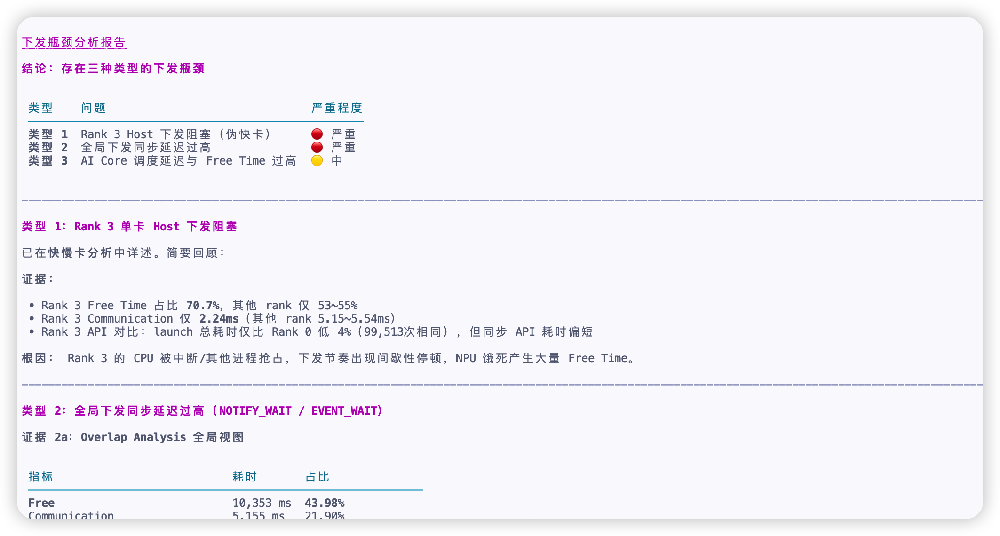

# MeetUp 众测截图及 Issue/PR 信息记录

## 一、基本信息

| 项目 | 内容 |
|------|------|
| 开发者ID | 于智远 |
| 任务编号 | MS-MEETUP-20260624-于智远-01 |
| 体验报告 | MeetUp-01-于智远-msagent性能体验报告.md |

## 二、截图记录

IMG-05：下发调度分析对话截图

IMG-06：下发瓶颈分析结论截图

## 三、Issue信息

| 序号 | Issue说明 | Issue链接 |
|------|-----------|-----------|
| 1 | [MeetUp众测][Profiler][慢卡] 建议在慢 Rank 结论中展示置信度与反证 | https://gitcode.com/Ascend/msagent/issues/107 |
| 2 | [MeetUp众测][Profiler][下发调度] 建议在下发瓶颈报告中明确同步等待指标口径与因果依据 | https://gitcode.com/Ascend/msagent/issues/110 |

## 四、PR信息

| 序号 | PR说明 | PR链接 |
|------|--------|--------|
| 1 | MeetUp众测msAgent性能体验报告 | https://gitcode.com/Ascend/msagent/merge_requests/134 |
