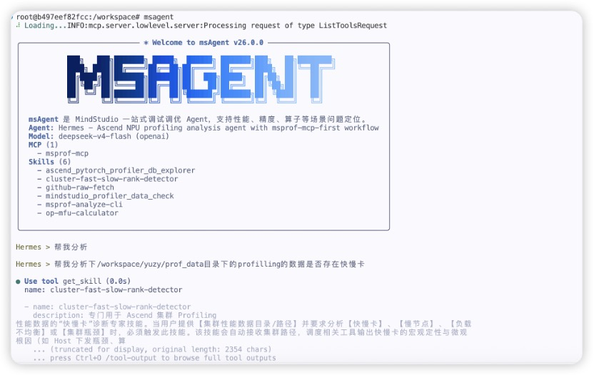
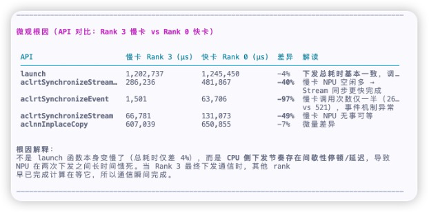
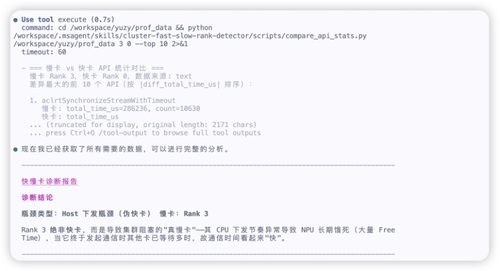
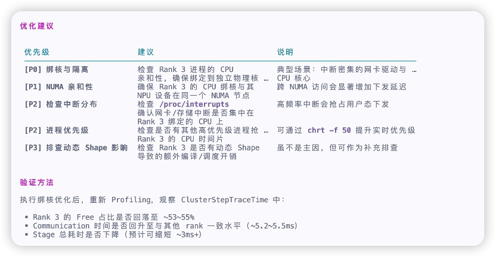

# MeetUp 众测截图及 Issue/PR 信息记录

## 一、基本信息

| 项目 | 内容 |
|------|------|
| 开发者ID | 于智远 |
| 任务编号 | MS-MEETUP-20260624-于智远-01 |
| 体验报告 | MeetUp-01-于智远-msagent性能体验报告.md |

## 二、截图记录









## 三、Issue信息

| 序号 | Issue说明 | Issue链接 | 状态 |
|------|-----------|-----------|------|
| 1 | [MeetUp众测][Profiler][慢卡] 建议在慢 Rank 结论中展示置信度与反证 | https://gitcode.com/Ascend/msagent/issues/107 | 已提交 |

### Issue message

#### 标题

`[MeetUp众测][Profiler][慢卡] 建议在慢 Rank 结论中展示置信度与反证`

#### 现状问题

在msAgent中输入以下Prompt：

```text
帮我分析下/workspace/yuzy/prof_data目录下的profilling的数据是否存在快慢卡
```

Agent判断Rank 3为慢卡，瓶颈类型为Host下发瓶颈，并给出以下证据：

1. Rank 3 Free Time占比为70.7%，其他Rank为53.2%~54.8%；
2. Rank 3 Communication为2.24ms，其他Rank为5.15~5.54ms；
3. 各Rank Computing时间接近；
4. Rank 3与Rank 0的launch总耗时差异较小，但同步API耗时偏短。

报告将Rank 3的CPU下发节奏异常作为根因输出，但未标注结论置信度，也未给出能够反驳该结论的条件或其他可能原因。

#### 预期结果

快慢卡报告在给出根因结论时，同时展示结论置信度、支持证据、反证条件和待验证项，帮助用户区分已确认事实与分析推断。

#### 优化建议

1. 为根因结论增加高、中、低置信度标识；
2. 展示支持证据和可能的反证；
3. 补充其他候选原因及排除方式；
4. 将CPU绑核、NUMA、中断分布等检查项标记为待验证；
5. 复测后根据Free Time、Communication和Stage总耗时更新结论状态。

#### 测试环境

- Agent：Hermes
- msAgent版本：v26.0.0
- Profiling数据目录：`/workspace/yuzy/prof_data`
- 测试场景：快慢卡分析
- 众测任务：MS-MEETUP-20260624-于智远-01

#### 附件

- 完整对话记录

```
root@b497eef82fcc:/workspace# msagent
⠼ Loading...INFO:mcp.server.lowlevel.server:Processing request of type ListToolsRequest

╭──────────────────────────── * Welcome to msAgent v26.0.0 ────────────────────────────╮
│                                                                                      │
│           ███╗   ███╗███████╗ █████╗  ██████╗ ███████╗███╗   ██╗████████╗            │
│           ████╗ ████║██╔════╝██╔══██╗██╔════╝ ██╔════╝████╗  ██║╚══██╔══╝            │
│           ██╔████╔██║███████╗███████║██║  ███╗█████╗  ██╔██╗ ██║   ██║               │
│           ██║╚██╔╝██║╚════██║██╔══██║██║   ██║██╔══╝  ██║╚██╗██║   ██║               │
│           ██║ ╚═╝ ██║███████║██║  ██║╚██████╔╝███████╗██║ ╚████║   ██║               │
│           ╚═╝     ╚═╝╚══════╝╚═╝  ╚═╝ ╚═════╝ ╚══════╝╚═╝  ╚═══╝   ╚═╝               │
│                                                                                      │
│  msAgent 是 MindStudio 一站式调试调优 Agent，支持性能、精度、算子等场景问题定位。    │
│  Agent: Hermes - Ascend NPU profiling analysis agent with msprof-mcp-first workflow  │
│  Model: deepseek-v4-flash (openai)                                                   │
│  MCP (1)                                                                             │
│    - msprof-mcp                                                                      │
│  Skills (6)                                                                          │
│    - ascend_pytorch_profiler_db_explorer                                             │
│    - cluster-fast-slow-rank-detector                                                 │
│    - github-raw-fetch                                                                │
│    - mindstudio_profiler_data_check                                                  │
│    - msprof-analyze-cli                                                              │
│    - op-mfu-calculator                                                               │
│                                                                                      │
╰──────────────────────────────────────────────────────────────────────────────────────╯

Hermes > 你好                                                                                 

● 你好！我是 Hermes，专注于 Ascend NPU 性能分析的助手。                                       

  如果你有 Profiling                                                                          
  数据需要分析，请提供性能数据目录路径，我来帮你定位瓶颈、解释根因，并给出可执行的优化方案。可
  以直接告诉我你的需求！                                                                      

Hermes > 帮我分析下/workspace/yuzy/prof_data目录下的profilling的数据是否存在快慢卡            

● 好的，我先查看一下数据目录的结构，判断数据类型。                                            

● Use tool ls (0.0s)
  path: /workspace/yuzy/prof_data

  - 
['/workspace/yuzy/prof_data/9ffb45716273_22579.async_llm.1778685832187655750.pt.trace.json.gz'
, '/workspace/yuzy/prof_data/cluster_analysis_output/', 
'/workspace/yuzy/prof_data/dp0_pp0_tp0_dcp0_ep0_ra
    ... (truncated for display, original length: 566 chars)
    ... press Ctrl+O /tool-output to browse full tool outputs

● 发现了 4 个 Rank 的 ascend_pt 目录（rank0~rank3），是多卡训练数据。同时还有一个             
  cluster_analysis_output/ 目录。                                                             

  让我先读取快慢卡分析技能，并检查数据情况。                                                  

● Use tool ls (0.0s)
  path: /workspace/yuzy/prof_data/cluster_analysis_output

  - ['/workspace/yuzy/prof_data/cluster_analysis_output/cluster_analysis.db']

● Use tool get_skill (0.0s)
  name: cluster-fast-slow-rank-detector

  - name: cluster-fast-slow-rank-detector
    description: 专门用于 Ascend 集群 Profiling 
性能数据的“快慢卡”诊断专家技能。当用户提供【集群性能数据目录/路径】并要求分析【快慢卡】、【慢
节点】、【负载不均衡】或【集群瓶颈】时，必须触发此技能。该技能会自动接收集群路径，调度相关工具
输出快慢卡的宏观定性与微观根因（如 Host 下发瓶颈、算
    ... (truncated for display, original length: 2354 chars)
    ... press Ctrl+O /tool-output to browse full tool outputs

● Use tool ls (0.0s)
  path: /workspace/yuzy/prof_data/dp0_pp0_tp0_dcp0_ep0_rank0_22615... (86 chars)

  - 
['/workspace/yuzy/prof_data/dp0_pp0_tp0_dcp0_ep0_rank0_22615_20260513152333082_ascend_pt/ASCEN
D_PROFILER_OUTPUT/', 
'/workspace/yuzy/prof_data/dp0_pp0_tp0_dcp0_ep0_rank0_22615_20260513152333082_ascend_
    ... (truncated for display, original length: 673 chars)
    ... press Ctrl+O /tool-output to browse full tool outputs

● 数据是 4卡（rank0~rank3） 的集群 profiling 数据，同时已有 cluster_analysis_output/          
  目录。现在按照 快慢卡诊断流程 开始分析。                                                    

  Step 1：宏观体检 — 执行 msprof-analyze-advisor                                              

● Use tool msprof-mcp_msprof_analyze_advisor (3.8s)
● Use tool msprof-mcp_msprof_analyze_advisor (2971.3s)
  profiler_data_dir: /workspace/yuzy/prof_data
  mode: allERROR:msprof_mcp.tools.msprof_analyze_cmd:Command timeout after 3000 seconds: mspro
● Use tool msprof-mcp_msprof_analyze_advisor (3022.0s)
  profiler_data_dir: /workspace/yuzy/prof_data
  mode: all

  - [{"type": "text", "text": "{\n  \"error\": \"EXECUTION_TIMEOUT\",\n  \"message\": 
\"msprof-analyze command timed out after 3000 seconds\",\n  \"execution_info\": {\n    
\"command\": \"msprof-analyze a
    ... (truncated for display, original length: 415 chars)
    ... press Ctrl+O /tool-output to browse full tool outputs

● Advisor 命令超时（3000s）。让我先利用已有的 cluster_analysis.db，同时直接采集各 Rank        
  的关键性能指标。                                                                            

● Use tool ls (0.0s)
  path: /workspace/yuzy/prof_data/dp0_pp0_tp0_dcp0_ep0_rank1_2261... (109 chars)

  - []

● Use tool ls (0.0s)
  path: /workspace/yuzy/prof_data/dp0_pp0_tp0_dcp0_ep0_rank2_2261... (109 chars)

  - []

● Use tool ls (0.0s)
  path: /workspace/yuzy/prof_data/dp0_pp0_tp0_dcp0_ep0_rank3_2261... (109 chars)

  - []

● Use tool ls (0.0s)
  path: /workspace/yuzy/prof_data/dp0_pp0_tp0_dcp0_ep0_rank0_2261... (109 chars)

  - 
['/workspace/yuzy/prof_data/dp0_pp0_tp0_dcp0_ep0_rank0_22615_20260513152333082_ascend_pt/ASCEN
D_PROFILER_OUTPUT/analyse.done', 
'/workspace/yuzy/prof_data/dp0_pp0_tp0_dcp0_ep0_rank0_22615_2026051315233
    ... (truncated for display, original length: 1580 chars)
    ... press Ctrl+O /tool-output to browse full tool outputs

⠇ Thinking...INFO:mcp.server.lowlevel.server:Processing request of type CallToolRequest
⠇ Thinking...INFO:mcp.server.lowlevel.server:Processing request of type ListToolsRequest
● Use tool msprof-mcp_execute_sql (4.5s)
  db_path: /workspace/yuzy/prof_data/cluster_analysis_output/cluster_analysis.db
  query: SELECT name FROM sqlite_master WHERE type='table' LIMIT 50;

  - [{"type": "text", "text": "{\"rows\": [{\"name\": \"CommunicationGroupMapping\"}, 
{\"name\": \"ClusterCommunicationTime\"}, {\"name\": \"ClusterCommunicationBandwidth\"}, 
{\"name\": \"ClusterCommunica
    ... (truncated for display, original length: 468 chars)
    ... press Ctrl+O /tool-output to browse full tool outputs

● 发现重要问题——只有 Rank0 有完整的 Profiling 数据，Rank1~Rank3 的 ASCEND_PROFILER_OUTPUT     
  目录为空。让我查询已有集群分析 DB 和各 rank 数据。                                          

● Use tool msprof-mcp_execute_sql (0.6s)
  db_path: /workspace/yuzy/prof_data/cluster_analysis_output/cluster_analysis.db
  query: SELECT * FROM ClusterStepTraceTime LIMIT 20;
● Use tool msprof-mcp_execute_sql (0.6s)
  db_path: /workspace/yuzy/prof_data/cluster_analysis_output/cluster_analysis.db
  query: SELECT * FROM ClusterCommunicationTime LIMIT 20;
● Use tool msprof-mcp_execute_sql (0.6s)
  db_path: /workspace/yuzy/prof_data/cluster_analysis_output/cluster_analysis.db
  query: SELECT * FROM ClusterCommunicationBandwidth LIMIT 20;
● Use tool msprof-mcp_execute_sql (0.6s)
  db_path: /workspace/yuzy/prof_data/cluster_analysis_output/cluster_analysis.db
  query: SELECT * FROM ClusterCommunicationMatrix LIMIT 20;
● Use tool msprof-mcp_execute_sql (0.6s)
  db_path: /workspace/yuzy/prof_data/cluster_analysis_output/cluster_analysis.db
  query: SELECT * FROM HostInfo LIMIT 20;
● Use tool msprof-mcp_execute_sql (45.8s)
  db_path: /workspace/yuzy/prof_data/cluster_analysis_output/cluster_analysis.db
  query: SELECT * FROM RankDeviceMap LIMIT 20;

  - [{"type": "text", "text": "{\"rows\": [{\"rankId\": 0, \"deviceId\": 0, \"hostUid\": 
\"9804003020781923495\", \"profilePath\": 
\"/workspace/yuzy/prof_data/dp0_pp0_tp0_dcp0_ep0_rank0_22615_202605131523
    ... (truncated for display, original length: 967 chars)
    ... press Ctrl+O /tool-output to browse full tool outputs

● Use tool msprof-mcp_execute_sql (45.8s)
  db_path: /workspace/yuzy/prof_data/cluster_analysis_output/cluster_analysis.db
  query: SELECT * FROM HostInfo LIMIT 20;

  - [{"type": "text", "text": "{\"rows\": [{\"hostUid\": \"9804003020781923495\", 
\"hostName\": \"9ffb45716273\"}], \"row_count\": 1, \"truncated\": false, \"columns\": 
[\"hostUid\", \"hostName\"], \"summ
    ... (truncated for display, original length: 286 chars)
    ... press Ctrl+O /tool-output to browse full tool outputs

● Use tool msprof-mcp_execute_sql (45.8s)
  db_path: /workspace/yuzy/prof_data/cluster_analysis_output/cluster_analysis.db
  query: SELECT * FROM ClusterCommunicationTime LIMIT 20;

  - [{"type": "text", "text": "{\"rows\": [{\"step\": \"step\", \"rank_id\": 2, 
\"hccl_op_name\": \"hcom_allReduce__503_80_1\", \"group_name\": \"5862276106100383503\", 
\"start_timestamp\": 17786858133434
    ... (truncated for display, original length: 7527 chars)
    ... press Ctrl+O /tool-output to browse full tool outputs

● Use tool msprof-mcp_execute_sql (45.8s)
  db_path: /workspace/yuzy/prof_data/cluster_analysis_output/cluster_analysis.db
  query: SELECT * FROM ClusterStepTraceTime LIMIT 20;

  - [{"type": "text", "text": "{\"rows\": [{\"step\": null, \"type\": \"rank\", \"index\": 
\"2\", \"computing\": 3291017.34, \"communication_not_overlapped\": 5538029.5, \"overlapped\":
0, \"communication
    ... (truncated for display, original length: 1973 chars)
    ... press Ctrl+O /tool-output to browse full tool outputs

● Use tool msprof-mcp_execute_sql (46.0s)
  db_path: /workspace/yuzy/prof_data/cluster_analysis_output/cluster_analysis.db
  query: SELECT * FROM ClusterCommunicationBandwidth LIMIT 20;

  - [{"type": "text", "text": "{\"rows\": [{\"step\": \"step\", \"rank_id\": 2, 
\"hccl_op_name\": \"hcom_allReduce__503_80_1\", \"group_name\": \"5862276106100383503\", 
\"band_type\": \"HCCS\", \"transit_
    ... (truncated for display, original length: 7079 chars)
    ... press Ctrl+O /tool-output to browse full tool outputs

● Use tool msprof-mcp_execute_sql (46.1s)
  db_path: /workspace/yuzy/prof_data/cluster_analysis_output/cluster_analysis.db
  query: SELECT * FROM CommunicationGroupMapping LIMIT 20;

  - [{"type": "text", "text": "{\"rows\": [{\"type\": \"collective\", \"rank_set\": 
\"(0,1,2,3)\", \"group_name\": \"5862276106100383503\", \"group_id\": \"group_name_3\", 
\"pg_name\": \"\"}], \"row_count
    ... (truncated for display, original length: 403 chars)
    ... press Ctrl+O /tool-output to browse full tool outputs

● Use tool msprof-mcp_execute_sql (46.1s)
  db_path: /workspace/yuzy/prof_data/cluster_analysis_output/cluster_analysis.db
  query: SELECT * FROM ClusterCommunicationMatrix LIMIT 20;

  - [{"type": "text", "text": "{\"rows\": [{\"step\": \"step\", \"hccl_op_name\": 
\"allgather-bottom1\", \"group_name\": \"5862276106100383503\", \"src_rank\": 0.0, 
\"dst_rank\": 0.0, \"transport_type\": 
    ... (truncated for display, original length: 6523 chars)
    ... press Ctrl+O /tool-output to browse full tool outputs

● 数据非常清晰！让我补充获取 Rank1~3 的 profiler_info.json 和检查可用文件，然后执行微观下钻。 

● Use tool ls (0.0s)
  path: /workspace/yuzy/prof_data/dp0_pp0_tp2_dcp0_ep2_rank2_22617... (86 chars)

  - 
['/workspace/yuzy/prof_data/dp0_pp0_tp2_dcp0_ep2_rank2_22617_20260513152333082_ascend_pt/ASCEN
D_PROFILER_OUTPUT/', 
'/workspace/yuzy/prof_data/dp0_pp0_tp2_dcp0_ep2_rank2_22617_20260513152333082_ascend_
    ... (truncated for display, original length: 673 chars)
    ... press Ctrl+O /tool-output to browse full tool outputs

● Use tool ls (0.0s)
  path: /workspace/yuzy/prof_data/dp0_pp0_tp3_dcp0_ep3_rank3_22618... (86 chars)

  - 
['/workspace/yuzy/prof_data/dp0_pp0_tp3_dcp0_ep3_rank3_22618_20260513152333082_ascend_pt/ASCEN
D_PROFILER_OUTPUT/', 
'/workspace/yuzy/prof_data/dp0_pp0_tp3_dcp0_ep3_rank3_22618_20260513152333082_ascend_
    ... (truncated for display, original length: 673 chars)
    ... press Ctrl+O /tool-output to browse full tool outputs

● Use tool ls (0.0s)
  path: /workspace/yuzy/prof_data/dp0_pp0_tp1_dcp0_ep1_rank1_22616... (86 chars)

  - 
['/workspace/yuzy/prof_data/dp0_pp0_tp1_dcp0_ep1_rank1_22616_20260513152333082_ascend_pt/ASCEN
D_PROFILER_OUTPUT/', 
'/workspace/yuzy/prof_data/dp0_pp0_tp1_dcp0_ep1_rank1_22616_20260513152333082_ascend_
    ... (truncated for display, original length: 673 chars)
    ... press Ctrl+O /tool-output to browse full tool outputs

⠦ Thinking...INFO:mcp.server.lowlevel.server:Processing request of type CallToolRequest
⠧ Thinking...INFO:mcp.server.lowlevel.server:Processing request of type ListToolsRequest
● Use tool msprof-mcp_execute_sql (4.3s)
  db_path: /workspace/yuzy/prof_data/cluster_analysis_output/cluster_analysis.db
  query: SELECT "rank_id", COUNT(*) as op_count, AVG(elapsed_time)... (190 chars)

  - [{"type": "text", "text": "{\"rows\": [{\"rank_id\": 0, \"op_count\": 21321, 
\"avg_elapsed\": 0.48358387130059727, \"max_elapsed\": 5155.24586, \"total_elapsed\": 
10310.491720000035}, {\"rank_id\": 1,
    ... (truncated for display, original length: 846 chars)
    ... press Ctrl+O /tool-output to browse full tool outputs

● 数据非常清晰。让我检查技能目录下的脚本，执行微观下钻。                                      

● Use tool ls (0.0s)
  path: /workspace/.msagent/skills/cluster-fast-slow-rank-detector/scripts

  - ['/workspace/.msagent/skills/cluster-fast-slow-rank-detector/scripts/__pycache__/', 
'/workspace/.msagent/skills/cluster-fast-slow-rank-detector/scripts/compare_api_stats.py', 
'/workspace/.msagent/skil
    ... (truncated for display, original length: 354 chars)
    ... press Ctrl+O /tool-output to browse full tool outputs

● 让我看看这些脚本的用法，然后尝试执行微观下钻。由于 Rank 3 的 ASCEND_PROFILER_OUTPUT         
  为空，我先检查脚本的自动发现机制。                                                          

● Use tool read_file (0.0s)
  file_path: /workspace/.msagent/skills/cluster-fast-slow-rank-detector... (86 chars)
  limit: 50

  -      1      """
         2      Discover slow/fast rank profiler data paths under a cluster root.
         3      Supports text (op_statistic.csv / api_statistic.csv) and db 
(ascend_pytorch_profiler_{rank}.db).
         4      """
     
    ... (truncated for display, original length: 1901 chars)
    ... press Ctrl+O /tool-output to browse full tool outputs

● Use tool execute (0.7s)
  command: cd /workspace/yuzy/prof_data && python 
/workspace/.msagent/skills/cluster-fast-slow-rank-detector/scripts/compare_api_stats.py 
/workspace/yuzy/prof_data 3 0 --top 10 2>&1
  timeout: 60

  - === 慢卡 vs 快卡 API 统计对比 ===
    慢卡 Rank 3，快卡 Rank 0，数据来源: text
    差异最大的前 10 个 API（按 |diff_total_time_us| 排序）：
    
    1. aclrtSynchronizeStreamWithTimeout
       慢卡: total_time_us=286236, count=10630
       快卡: total_time_us
    ... (truncated for display, original length: 2171 chars)
    ... press Ctrl+O /tool-output to browse full tool outputs

● 现在我已经获取了所有需要的数据，可以进行完整的分析。                                        

  --------------------------------------------------------------------------------------------

  快慢卡诊断报告                                                                              

  诊断结论                                                                                    

  瓶颈类型：Host 下发瓶颈（伪快卡） 慢卡：Rank 3                                              

  Rank 3 绝非快卡，而是导致集群阻塞的"真慢卡"——其 CPU 下发节奏异常导致 NPU 长期饿死（大量 Free
  Time），当它终于发起通信时其他卡已等待多时，故通信时间看起来"快"。                          

  --------------------------------------------------------------------------------------------

  宏观证据（ClusterStepTraceTime）                                                            

                                                                      
   指标                Rank 0      Rank 1      Rank 2      Rank 3     
   ────────────────────────────────────────────────────────────────── 
   Free Time (μs)      10,348,777  10,160,437  10,043,265  13,347,573 
   Free 占比           54.8%       53.8%       53.2%       70.7%      
   Communication (μs)  5,155,245   5,386,635   5,538,029   2,235,131  
   Computing (μs)      3,368,381   3,324,941   3,291,017   3,290,034  
   Stage 总时间 (μs)   18,872,404  18,872,015  18,872,312  18,872,739 
                                                                      

  关键证据链：                                                                                

   1 Free Time 极差巨大：Rank 3 Free Time 占比 70.7%，其他 rank 仅 53~55%，Rank 3 多出 3.1ms+ 
     的空闲等待                                                                               
   2 Communication 异常偏短：Rank 3 通信时间仅 2.24ms，为其他 rank 的 40~43%                  
   3 Computing 均匀一致：各 rank 计算时间差异 < 2.4%，排除计算型慢卡                          
   4 Stage 总时间一致：所有 rank ~18.87s，说明 Rank 3 拖慢了全局                              
   5 通信算子调用次数一致：各 rank 均为 21,321 次，说明通信模式相同                           

  --------------------------------------------------------------------------------------------

  微观根因（API 对比：Rank 3 慢卡 vs Rank 0 快卡）                                            

                                                                                              
   API                      慢卡 Rank 3 (μs)  快卡 Rank 0 (μs)  差异  解读                    
   ────────────────────────────────────────────────────────────────────────────────────────── 
   launch                   1,202,737         1,245,450         -4%   下发总耗时基本一致，调… 
   aclrtSynchronizeStream…  286,236           481,867           -40%  慢卡 NPU 空闲多 →       
                                                                      Stream 同步更快完成     
   aclrtSynchronizeEvent    1,501             63,706            -97%  慢卡调用次数仅一半（26… 
                                                                      vs 521），事件机制异常  
   aclrtSynchronizeStream   66,781            131,073           -49%  慢卡 NPU 无事可等       
   aclnnInplaceCopy         607,039           650,855           -7%   微量差异                
                                                                                              

  根因解释：                                                                                  
  不是 launch 函数本身变慢了（总耗时仅差 4%），而是 CPU 侧下发节奏存在间歇性停顿/延迟，导致   
  NPU 在两次下发之间长时间饿死。当 Rank 3 最终下发通信时，其他 rank                           
  早已完成计算在等它，所以通信瞬间完成。                                                      

  --------------------------------------------------------------------------------------------

  优化建议                                                                                    

                                                                                              
   优先级                    建议                            说明                             
   ────────────────────────────────────────────────────────────────────────────────────────── 
   [P0] 绑核与隔离           检查 Rank 3 进程的 CPU          典型场景：中断密集的网卡驱动与 … 
                             亲和性，确保绑定到独立物理核 …  CPU 核心                         
   [P1] NUMA 亲和性          确保 Rank 3 的 CPU 绑核与其     跨 NUMA 访问会显著增加下发延迟   
                             NPU 设备在同一个 NUMA 节点                                       
   [P2] 检查中断分布         检查 /proc/interrupts           高频率中断会抢占用户态下发       
                             确认网卡/存储中断是否集中在                                      
                             Rank 3 绑定的 CPU 上                                             
   [P2] 进程优先级           检查是否有其他高优先级进程抢 …  可通过 chrt -f 50 提升实时优先级 
                             Rank 3 的 CPU 时间片                                             
   [P3] 排查动态 Shape 影响  检查 Rank 3 是否有动态 Shape    虽不是主因，但可作为补充排查     
                             导致的额外编译/调度开销                                          
                                                                                              

  验证方法                                                                                    

  执行绑核优化后，重新 Profiling，观察 ClusterStepTraceTime 中：                              

   • Rank 3 的 Free 占比是否回落至 ~53~55%                                                    
   • Communication 时间是否回升至与其他 rank 一致水平（~5.2~5.5ms）                           
   • Stage 总耗时是否下降（预计可缩短 ~3ms+）             
```


## 四、PR信息

| 序号 | PR说明 | PR链接 | 状态 |
|------|--------|--------|------|
| 1 | MeetUp众测msAgent快慢卡体验报告 | https://gitcode.com/Ascend/msagent/merge_requests/136 | 已提交 |

