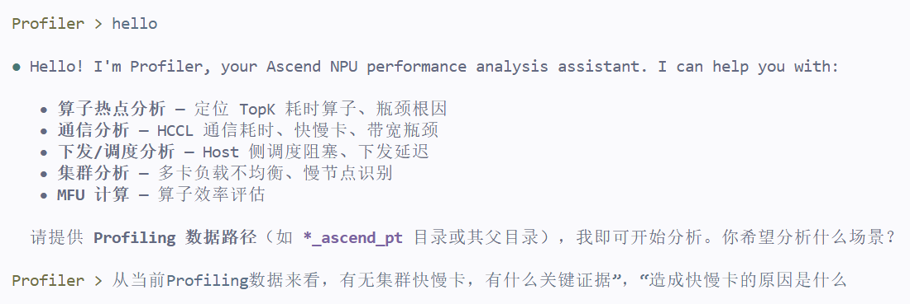
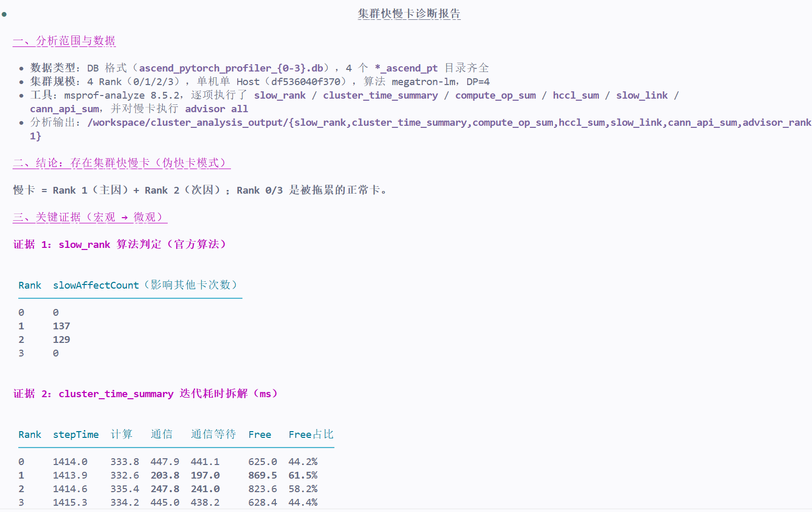
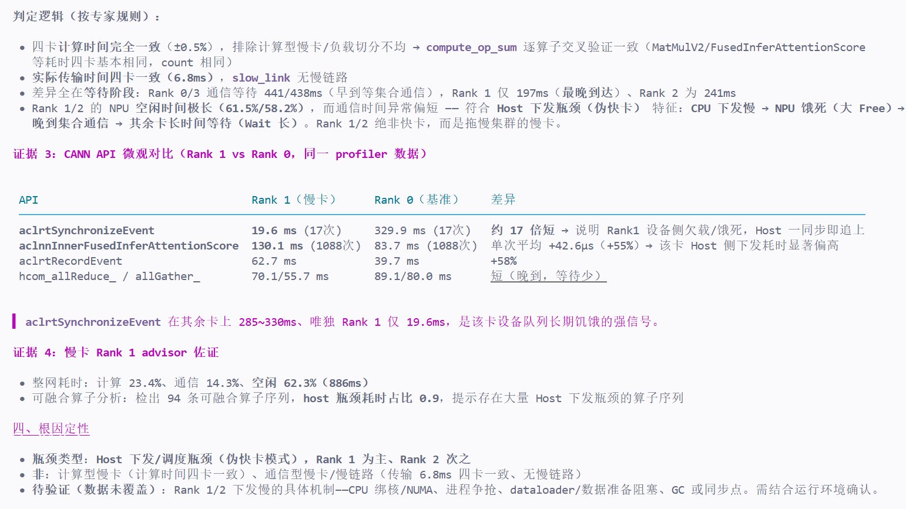
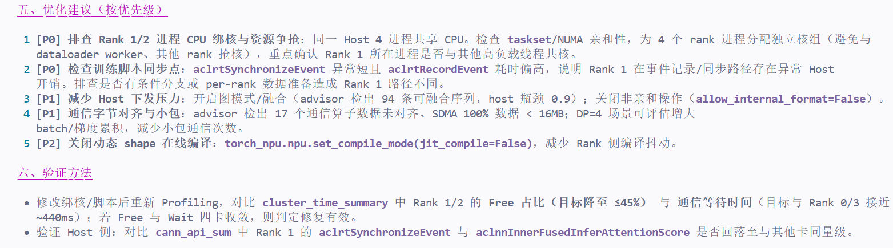
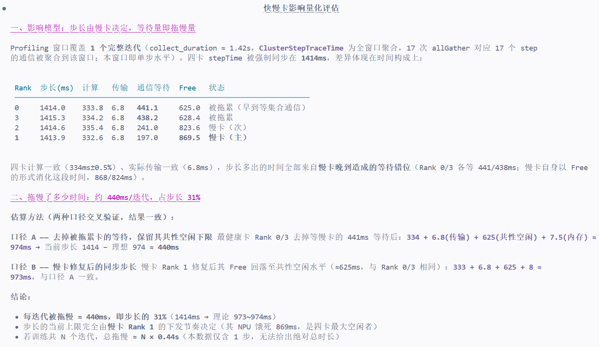
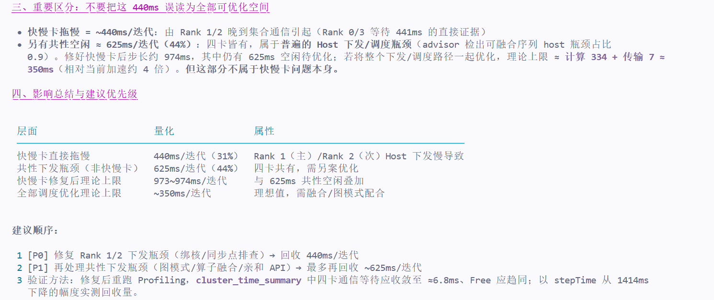
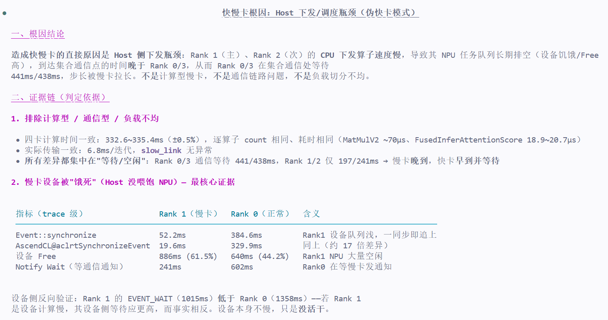
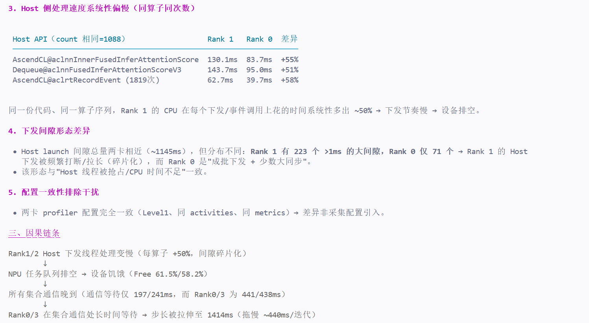
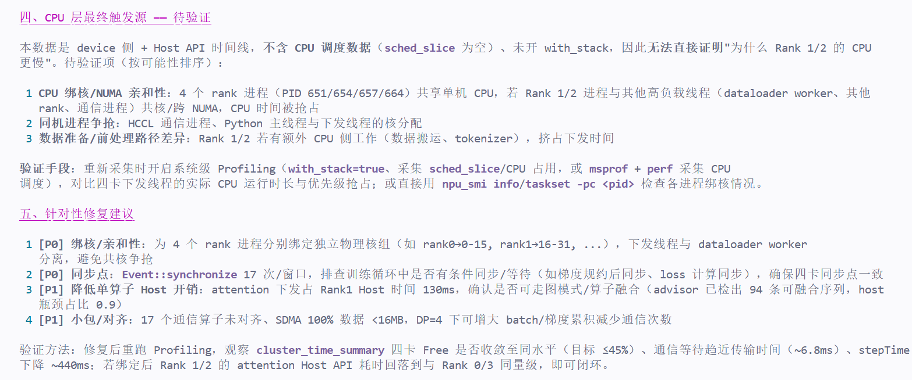

# MSAgent 体验报告
## 一、报告基本信息
| 项目 | 内容 |
|------|------|
| 报告编号 | |
| 体验日期 | 2026-08-19 |
| Agent版本 | v26.1.0a2 |
| Profiling数据来源 | 淬火行动测试 |
| 测试目标 | 测试Agent输出 |

## 二、交互记录
### 第 1 轮交互
| 项目 | 内容 |
|------|------|
| 输入 Prompt | hello  |
| Agent 输出（文字摘要） | Hello! I'm Profiler, your Ascend NPU performance analysis assistant. I can help you with: 算子热点分析 — 定位 TopK 耗时算子、瓶颈根因; 通信分析 — HCCL 通信耗时、快慢卡、带宽瓶颈; 下发/调度分析 — Host 侧调度阻塞、下发延迟; 集群分析 — 多卡负载不均衡、慢节点识别； MFU 计算 — 算子效率评估; 请提供 Profiling 数据路径（如 *_ascend_pt 目录或其父目录），我即可开始分析。你希望分析什么场景？ |
| **输出截图** |  |
| 是否符合预期 | 是 |
| 评价 | |

### 第 2 轮交互

| 项目 | 内容 |
|------|------|
| 输入 Prompt | 从当前Profiling数据来看，有无集群快慢卡，有什么关键证据”，“造成快慢卡的原因是什么 |
| Agent 输出（文字摘要） | 集群快慢卡诊断报告 |
| **输出截图** |  |
| 是否符合预期 | 是 |
| 评价 | 好 |

### 第 3 轮交互

| 项目 | 内容 |
|------|------|
| 输入 Prompt | 评估快慢卡问题造成的影响，拖慢了多少时间 |
| Agent 输出（文字摘要） | 快慢卡影响量化评估 |
| **输出截图** |  |
| 是否符合预期 | 是 |
| 评价 | |

### 第 4 轮交互

| 项目 | 内容 |
|------|------|
| 输入 Prompt | 造成快慢卡的原因是什么 |
| Agent 输出（文字摘要） | 快慢卡根因：Host 下发/调度瓶颈（伪快卡模式） |
| **输出截图** | |
| 是否符合预期 | 是 |
| 评价 | |

---
## 三、多轮交互整体评价
| 评价维度 | 评分（1~5） | 说明 |
|----------|-------------|------|
| 问题理解准确性 | 4 | 能较好理解Prompt含义 |
| 数据分析深度 | 4 | 对数据中的信息能较深入分析 |
| 证据链条完整性 | 4 | 证据链组织较完善 |
| 优化建议实用性 | 4 | 生成的反馈建议有效 |
| 多轮对话连贯性 | 3 | 前后问题的连贯性正常 |
| 响应速度与稳定性 | 3 | 响应速度正常偏慢 |
| 整体满意度 | 4 | 整体使用体验较好 |

---
## 四、问题与改进建议
### 发现的问题
1. 响应思考所用的时间在某些步骤上花费较多

### 改进建议
1. 可以稍微提升模型的反应速度，缩短提出Prompt到生成回复的花费时间。

