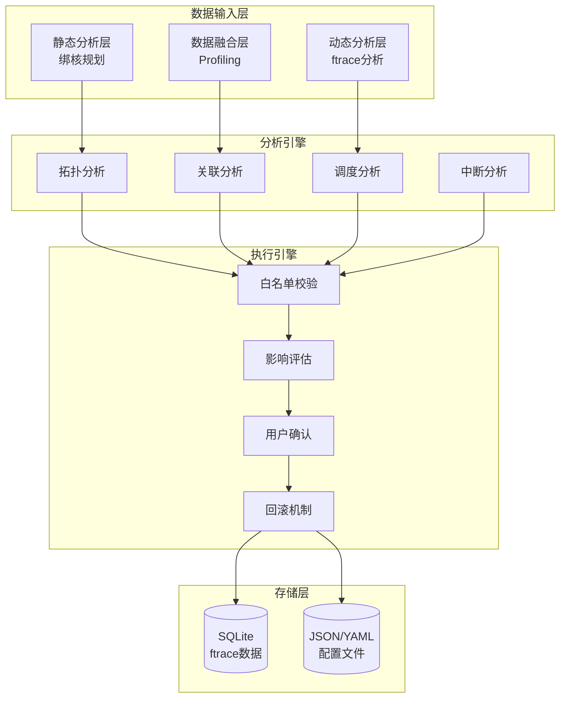
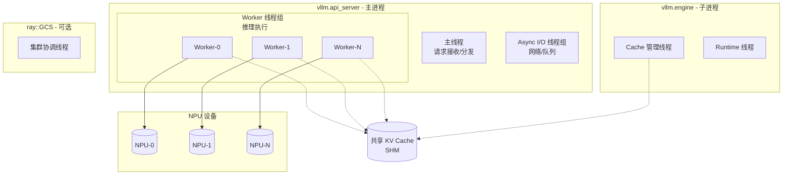
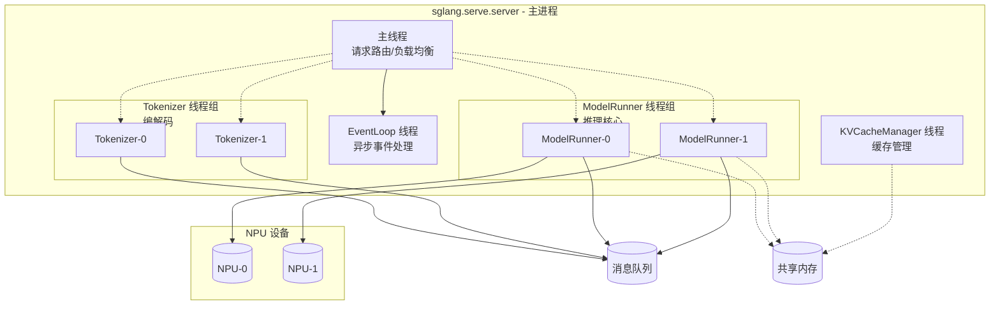
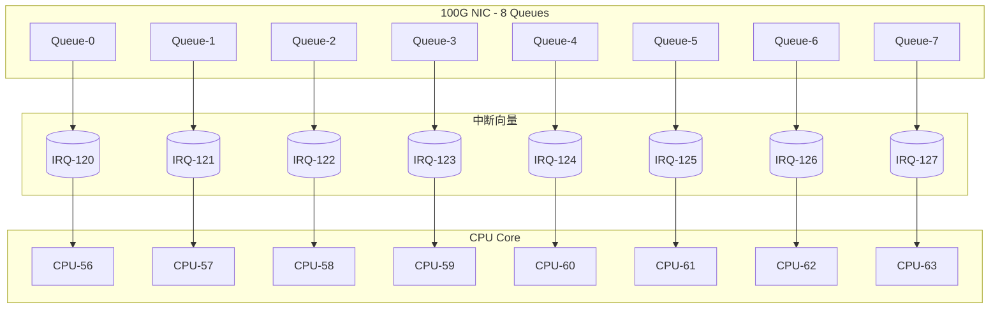
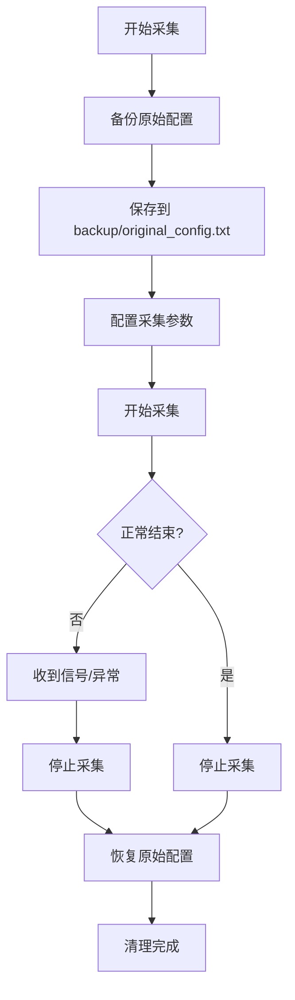
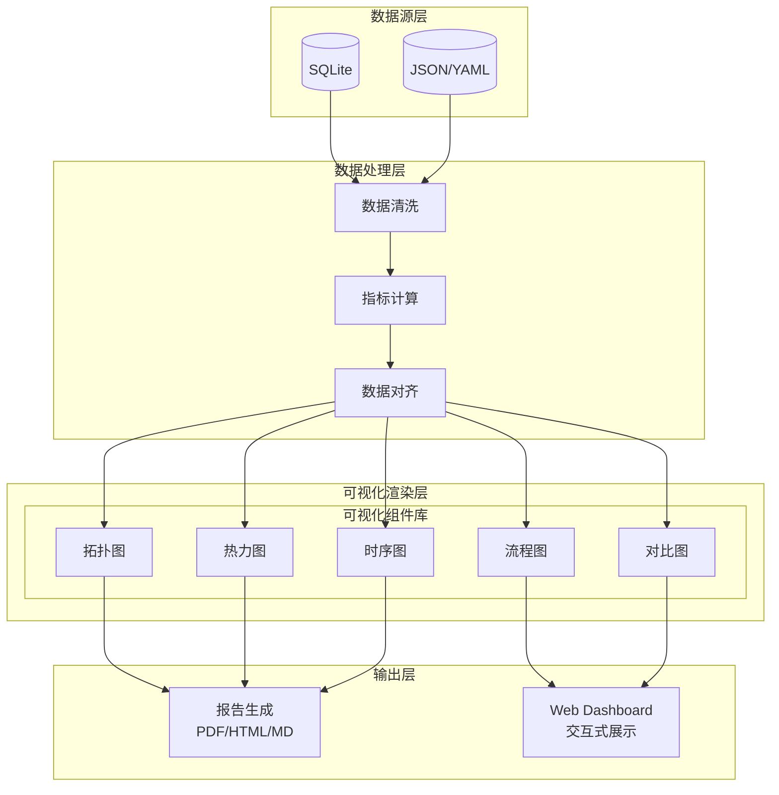

状态 (Status): Draft
作者 (Authors): leo920320
创建日期 (Created): 2026-05-28
更新日期 (Updated): 2026-05-28
相关 Issue/PR: #cpu-tuning-2026

---

# 1. 概述

## 1.1 简介

本提案设计了一套完整的 **CPU 性能分析与调优框架**，旨在为大模型推理和训练场景提供系统化的 Host 侧 CPU 性能优化能力。框架包含三个层次的分析能力：基于硬件拓扑的静态绑核规划、基于 ftrace 的动态调度分析、以及业务侧 Profiling 数据融合，同时提供配置备份恢复和安全执行保障机制。

## 1.2 动机

在大模型推理和训练场景中，CPU 侧性能是整体性能的关键组成部分，与 NPU 侧性能形成互补。当前存在以下痛点：
- **绑核策略盲目**：缺乏基于硬件拓扑和进程关联的科学绑核方案
- **调度干扰严重**：中断、定时器等系统干扰未被有效隔离
- **NUMA 亲和性差**：进程/线程跨 NUMA 访问导致内存带宽瓶颈
- **分析手段不足**：缺乏系统化的 CPU 性能数据采集、存储和分析能力
- **操作风险高**：调优操作缺乏备份、白名单管控和回滚机制

## 1.3 目标

**目标**：
1. 实现基于 CPU/NUMA/NPU 拓扑的静态绑核方案生成
2. 实现基于 ftrace 的动态调度分析和问题定位
3. 支持业务侧 Profiling 数据与系统数据的时间对齐
4. 提供配置备份、安全执行和一键回滚能力

**非目标**：
1. GPU/TPU 等其他硬件的性能调优（本方案专注 CPU）
2. 内核级别的代码修改（仅通过配置和用户态工具调优）
3. 实时自动调优（当前版本为半自动分析方案）

# 2. 用例分析

## 2.1 用例场景

| 用例名称 | 功能点 | 性能指标 | 安全/DFX要求 |
|----------|--------|----------|--------------|
| **静态绑核规划** | 硬件拓扑感知、进程关联分析、NUMA 亲和规划 | 绑核方案生成时间 < 30s | 无安全风险，需可维护 |
| **ftrace 动态采集** | 自定义事件选择、CPU 范围控制、时长配置 | 采集开销 < 5% | 需 root 权限，有安全审计要求 |
| **调度分析** | 调度切换分析、中断干扰分析、定时器影响 | 分析准确率 > 90% | 数据需脱敏处理 |
| **配置备份恢复** | 一键备份、一键恢复、差异对比 | 备份恢复时间 < 10s | 配置文件需加密存储 |
| **安全执行** | 白名单校验、影响评估、用户确认 | 误操作率 = 0 | 需完整操作审计日志 |

## 2.2 约束条件

1. **权限约束**：ftrace 采集和中断配置需要 root 权限
2. **内核版本**：建议 Linux 4.15+（支持完整的 ftrace 功能）
3. **硬件支持**：需支持 NUMA 架构（多 socket 服务器）
4. **时间精度**：依赖 CLOCK_MONOTONIC 时钟，精度微秒级

# 3.方案设计

## 3.1 总体方案

### 3.1.1 架构设计



### 3.1.2 核心流程

**静态绑核规划流程**：
1. 采集 CPU 拓扑信息（`lscpu`、`numactl -H`）
2. 采集 NPU 拓扑信息（`npu-smi info -t topo`）
3. 分析进程/线程关联关系（父子、IPC 通信）
4. 分析中断当前分布（`/proc/interrupts`）
5. 生成初始绑核方案和中断优化建议

**动态 ftrace 分析流程**：
1. 配置采集参数（事件列表、CPU 范围、时长）
2. 执行 ftrace 采集
3. 将原始数据转换为 SQLite 数据库
4. 执行多维度 SQL 分析
5. 输出调度分析报告和优化建议

**安全执行流程**：
1. 接收优化方案
2. 白名单校验
3. 影响范围评估
4. 用户确认
5. 执行操作
6. 结果验证
7. 记录审计日志

### 3.1.3 数据模型

#### 3.1.3.1 硬件拓扑数据模型

```json
{
    "cpu_topology": {
        "sockets": 2,
        "cores_per_socket": 24,
        "threads_per_core": 2,
        "numa_nodes": 4,
        "nodes": [
            {
                "node_id": 0,
                "cpus": [0, 1, 2, 3, 4, 5, 24, 25, 26, 27, 28, 29],
                "memory_size": 65536,
                "memory_free": 48512
            }
        ],
        "clusters": [
            {"cluster_id": 0, "cpus": [0-11]},
            {"cluster_id": 1, "cpus": [12-23]}
        ]
    },
    "npu_topology": {
        "devices": 8,
        "affinities": [
            {"npu_id": 0, "preferred_numa": 0},
            {"npu_id": 1, "preferred_numa": 1}
        ],
        "has_ub_bus": false
    }
}
```

#### 3.1.3.2 进程关联数据模型

```json
{
    "processes": [
        {
            "pid": 1234,
            "comm": "llm_inference",
            "ppid": 1,
            "cpu_affinity": "0-63",
            "threads": [1234, 1235, 1236],
            "numa_preferred": 0,
            "ipc_connections": [{"type": "shm", "peer_pid": 1240}]
        }
    ]
}
```

#### 3.1.3.3 常见 LLM 框架进程/线程关系模型

针对 vLLM、sglang、verl 等常见 LLM 推理框架，预先定义其典型的进程/线程关联关系：

| 框架 | 进程类型 | 线程角色 | 关联关系 | 绑核建议 |
|------|----------|----------|----------|----------|
| **vLLM** | vllm.entrypoints.api_server | 主线程 | 接收请求、调度 | 绑高性能核 |
| | | Worker 线程 | 执行推理计算 | 绑高性能核，与 NPU 亲和 |
| | | Async I/O 线程 | 网络 I/O、队列管理 | 绑普通核 |
| | | Cache 管理线程 | KV Cache 维护 | 绑靠近内存控制器的核 |
| | vllm.engine.async_llm_engine | Engine 进程 | 推理引擎核心 | 与 Worker 线程同 NUMA |
| | ray::GCS | Ray 管理进程 | 集群协调 | 绑管理核 |
| **sglang** | sglang.serve.server:main | 主线程 | 请求分发 | 绑高性能核 |
| | | ModelRunner 线程 | 模型推理 | 绑高性能核，与 NPU 亲和 |
| | | Tokenizer 线程 | 文本编解码 | 绑普通核 |
| | | EventLoop 线程 | 事件循环 | 绑独立核 |
| **verl** | verl.server.Server | 主线程 | 服务管理 | 绑管理核 |
| | | InferenceWorker 线程 | 推理执行 | 绑高性能核 |
| | | BatchManager 线程 | 批处理调度 | 绑高性能核 |
| | | Streamer 线程 | 流式输出 | 绑普通核 |

##### 3.1.3.3.1 vLLM 进程/线程关系详解



**vLLM 关键 IPC 关系**：
- **Worker 线程 ↔ KV Cache**：所有 Worker 共享同一 KV Cache 内存区域
- **主线程 ↔ Worker 线程**：通过队列进行任务分发
- **不同 Worker 线程**：可能共享中间结果，需注意缓存一致性

**vLLM 动态绑核算法**：

绑核方案需根据实际硬件配置动态计算，核心算法如下：

```python
def calculate_vllm_bindings(cpu_topology, npu_topology):
    """
    动态计算 vLLM 绑核方案

    参数:
        cpu_topology: CPU 拓扑信息
            {
                "total_cpus": 64,
                "numa_nodes": [
                    {"node_id": 0, "cpus": [0-31], "memory": 65536},
                    {"node_id": 1, "cpus": [32-63], "memory": 65536}
                ]
            }
        npu_topology: NPU 拓扑信息
            {
                "devices": 8,
                "affinities": [{"npu_id": 0, "preferred_numa": 0}, ...]
            }

    返回:
        绑核方案字典
    """
    bindings = []
    npu_count = npu_topology["devices"]
    numa_nodes = cpu_topology["numa_nodes"]

    for numa in numa_nodes:
        node_id = numa["node_id"]
        cpus_in_node = numa["cpus"]
        total_cpus = len(cpus_in_node)

        # 计算各类线程的 CPU 分配比例
        main_thread_cpu = cpus_in_node[0]
        io_threads_count = min(3, total_cpus // 16)
        worker_threads_ratio = 0.7  # 70% CPU 给 Worker
        cache_threads_ratio = 0.1   # 10% CPU 给 Cache 管理

        # 分配 CPU 范围
        io_start = main_thread_cpu + 1
        io_end = io_start + io_threads_count - 1

        worker_start = io_end + 1
        worker_count = int(total_cpus * worker_threads_ratio)
        worker_end = worker_start + worker_count - 1

        cache_start = worker_end + 1
        cache_count = int(total_cpus * cache_threads_ratio)
        cache_end = cache_start + cache_count - 1

        # 生成绑核配置
        bindings.extend([
            {"role": f"main_thread_numa{node_id}", "cpus": str(main_thread_cpu), "numa": node_id},
            {"role": f"io_threads_numa{node_id}", "cpus": f"{io_start}-{io_end}", "numa": node_id},
            {"role": f"worker_threads_numa{node_id}", "cpus": f"{worker_start}-{worker_end}", "numa": node_id},
            {"role": f"cache_threads_numa{node_id}", "cpus": f"{cache_start}-{cache_end}", "numa": node_id}
        ])

    return bindings
```

**绑核分配原则**：

| 线程类型 | 分配比例 | 分配策略 |
|----------|----------|----------|
| **主线程** | 1 核/NUMA | 每个 NUMA 节点分配 1 核 |
| **I/O 线程** | 3 核/NUMA（最大） | 每 16 核分配 1 核 I/O |
| **Worker 线程** | 70% 剩余 CPU | 优先分配，与 NPU 保持 NUMA 亲和 |
| **Cache 线程** | 10% 剩余 CPU | 靠近内存控制器的核 |
| **预留核** | 20% 剩余 CPU | 用于中断、系统任务等 |

##### 3.1.3.3.2 sglang 进程/线程关系详解



**sglang 关键 IPC 关系**：
- **ModelRunner ↔ Tokenizer**：通过队列传递 token 数据
- **ModelRunner ↔ KVCacheManager**：共享内存访问缓存
- **主线程 ↔ 所有子线程**：协调任务分配

**sglang 动态绑核算法**：

绑核方案需根据实际硬件配置动态计算，核心算法如下：

```python
def calculate_sglang_bindings(cpu_topology, npu_topology):
    """
    动态计算 sglang 绑核方案

    参数:
        cpu_topology: CPU 拓扑信息
        npu_topology: NPU 拓扑信息

    返回:
        绑核方案字典
    """
    bindings = []
    numa_nodes = cpu_topology["numa_nodes"]
    npu_count = npu_topology["devices"]

    for numa in numa_nodes:
        node_id = numa["node_id"]
        cpus_in_node = numa["cpus"]
        total_cpus = len(cpus_in_node)

        # sglang 特有线程分配
        main_thread_cpu = cpus_in_node[0]
        event_loop_cpu = cpus_in_node[1]

        # 根据 NPU 数量确定 ModelRunner 数量
        model_runner_count = min(npu_count // len(numa_nodes), total_cpus // 4)
        tokenizer_count = min(2, model_runner_count)

        # 分配 CPU 范围
        mr_start = event_loop_cpu + 1
        mr_end = mr_start + model_runner_count - 1

        tokenizer_start = mr_end + 1
        tokenizer_end = tokenizer_start + tokenizer_count - 1

        kv_cache_start = tokenizer_end + 1
        kv_cache_count = 1
        kv_cache_end = kv_cache_start + kv_cache_count - 1

        bindings.extend([
            {"role": f"main_thread_numa{node_id}", "cpus": str(main_thread_cpu), "numa": node_id},
            {"role": f"event_loop_numa{node_id}", "cpus": str(event_loop_cpu), "numa": node_id},
            {"role": f"model_runners_numa{node_id}", "cpus": f"{mr_start}-{mr_end}", "numa": node_id},
            {"role": f"tokenizers_numa{node_id}", "cpus": f"{tokenizer_start}-{tokenizer_end}", "numa": node_id},
            {"role": f"kv_cache_manager_numa{node_id}", "cpus": f"{kv_cache_start}-{kv_cache_end}", "numa": node_id}
        ])

    return bindings
```

**绑核分配原则**：

| 线程类型 | 分配规则 | 说明 |
|----------|----------|------|
| **主线程** | 1 核/NUMA | 请求路由和负载均衡 |
| **EventLoop** | 1 核/NUMA | 异步事件处理 |
| **ModelRunner** | 按 NPU 数量动态分配 | 推理核心，与 NPU 一一对应 |
| **Tokenizer** | ModelRunner 数量的 50% | 文本编解码 |
| **KVCacheManager** | 1 核/NUMA | 缓存管理 |
| **预留核** | 剩余 CPU | 系统任务、中断等 |

##### 3.1.3.3.3 通用绑核原则

1. **计算密集型线程**（推理 Worker、ModelRunner）：
   - 绑定到性能核（通常是 CPU 0-11 或类似范围）
   - 与关联的 NPU 设备保持 NUMA 亲和
   - 避免与中断、定时器共享 CPU

2. **I/O 密集型线程**（网络、队列管理）：
   - 绑定到普通核
   - 可与其他 I/O 线程共享 CPU

3. **管理型线程**（主线程、协调线程）：
   - 绑定到独立的管理核
   - 避免与计算线程竞争

4. **缓存管理线程**：
   - 绑定到靠近内存控制器的核
   - 保持 NUMA 本地性

##### 3.1.3.3.4 网络中断绑核优化

**网卡中断绑核策略**：

| 网卡类型 | 中断特点 | 绑核建议 | 理由 |
|----------|----------|----------|------|
| **高性能 NIC**（如 100Gbps） | 中断频率高（>10000/秒） | 绑定到独立核组（如 CPU 56-63） | 避免干扰计算核心 |
| **普通 NIC**（如 10Gbps） | 中断频率中等（1000-10000/秒） | 绑定到共享核组 | 可与其他 I/O 中断共享 |
| **管理网口** | 中断频率低（<1000/秒） | 绑定到管理核 | 低优先级 |

**多队列网卡绑核**：



**关键配置项**：

| 配置项 | 说明 | 建议值 |
|--------|------|--------|
| `irqbalance` | 中断均衡服务 | 关闭（手动绑核时） |
| `RPS/RFS` | 接收端扩展 | 开启，映射到对应 CPU |
| `ethtool -L` | 设置队列数 | 匹配 CPU 核数 |
| `smmp_affinity_list` | 中断绑核 | 手动配置 |

**NIC 中断绑核配置示例**：
```bash
# 关闭 irqbalance
systemctl stop irqbalance
systemctl disable irqbalance

# 配置网卡多队列
ethtool -L eth0 combined 8

# 获取网卡中断号
grep eth0 /proc/interrupts | awk '{print $1}'

# 绑定中断到指定 CPU
echo 56 > /proc/irq/120/smp_affinity_list
echo 57 > /proc/irq/121/smp_affinity_list
```

##### 3.1.3.3.7 ftrace 采集事件类型

基于 MindStudio 的 trace_record.py，支持以下事件类型：

**CPU 调度事件**：

| 事件名 | 说明 |
|--------|------|
| `sched:sched_switch` | 进程调度切换 |
| `sched:sched_wakeup` | 进程唤醒 |
| `sched:sched_waking` | 进程正在唤醒 |
| `sched:sched_wakeup_new` | 新进程唤醒 |
| `sched:sched_migrate_task` | 任务迁移 |
| `sched:sched_stat_runtime` | 进程运行时间统计 |
| `sched:sched_process_fork` | 进程 fork |
| `sched:sched_process_exec` | 进程 exec |
| `sched:sched_process_exit` | 进程退出 |

**中断事件**：

| 事件名 | 说明 |
|--------|------|
| `irq:irq_handler_entry` | 中断处理入口 |
| `irq:irq_handler_exit` | 中断处理出口 |
| `irq:softirq_raise` | 软中断触发 |
| `irq:softirq_entry` | 软中断入口 |
| `irq:softirq_exit` | 软中断出口 |

**锁竞争事件**：

| 事件名 | 说明 |
|--------|------|
| `syscalls:sys_enter_futex` | futex 系统调用进入 |
| `syscalls:sys_exit_futex` | futex 系统调用退出 |

**事件分类说明**：

| 类别 | 默认开启 | 说明 | 性能影响 |
|------|----------|------|----------|
| **调度事件** | 是 | 分析进程调度行为 | 低 |
| **中断事件** | 是 | 分析中断干扰 | 低 |
| **锁竞争事件** | 否 | 分析锁竞争问题 | 中 |

##### 3.1.3.3.8 ftrace 配置备份与恢复

为确保 ftrace 采集不会影响系统原有配置，脚本在采集前后会自动进行配置备份与恢复：

**备份的配置项**：

| 配置项 | 路径 | 说明 |
|--------|------|------|
| `tracing_on` | `/sys/kernel/tracing/tracing_on` | 追踪开关状态 |
| `buffer_size_kb` | `/sys/kernel/tracing/buffer_size_kb` | 缓冲区大小 |
| `tracing_cpumask` | `/sys/kernel/tracing/tracing_cpumask` | CPU 掩码 |
| `trace_clock` | `/sys/kernel/tracing/trace_clock` | 追踪时钟 |
| `current_tracer` | `/sys/kernel/tracing/current_tracer` | 当前追踪器 |
| `set_event` | `/sys/kernel/tracing/set_event` | 已启用事件列表 |
| `events/enable` | `/sys/kernel/tracing/events/enable` | 事件全局开关 |

**恢复机制**：



**异常处理**：

| 异常类型 | 处理方式 | 恢复行为 |
|----------|----------|----------|
| **Ctrl+C 中断** | 捕获 INT 信号 | 停止采集并恢复配置 |
| **TERM 终止信号** | 捕获 TERM 信号 | 停止采集并恢复配置 |
| **HUP 挂起信号** | 捕获 HUP 信号 | 停止采集并恢复配置 |
| **QUIT 退出信号** | 捕获 QUIT 信号 | 停止采集并恢复配置 |
| **权限不足** | 启动前检查 | 退出并提示错误 |
| **debugfs 未挂载** | 自动尝试挂载 | 挂载失败则退出 |
| **追踪目录不存在** | 启动前检查 | 退出并提示错误 |
| **数据丢失** | 采集后检查 | 输出警告信息 |

**信号处理流程**：

```bash
# 信号捕获配置
trap 'cleanup 1' INT TERM HUP QUIT

# 清理函数
cleanup() {
    # 1. 如果正在采集，先停止
    if [ $COLLECTING -eq 1 ]; then
        echo 0 > "$TRACE_ROOT/tracing_on"
    fi

    # 2. 恢复原始配置
    restore_original_config

    # 3. 退出
    exit $1
}
```

**数据完整性检查**：

采集完成后会检查是否有数据丢失：

```bash
# 检查 per_cpu 统计
total_lost=0
for cpu_dir in "$TRACE_ROOT/per_cpu"/cpu*; do
    if [ -f "$cpu_dir/stats" ]; then
        lost=$(grep -E "overrun|dropped events" "$cpu_dir/stats" | awk '{sum+=$1} END {print sum}')
        total_lost=$((total_lost + lost))
    fi
done

if [ $total_lost -gt 0 ]; then
    echo "警告: 检测到 $total_lost 个丢失的事件"
    echo "建议: 增大缓冲区大小 (--buffer-size 参数)"
fi
```

# 配置 RPS/RFS
echo ffffffff > /sys/class/net/eth0/queues/rx-0/rps_cpus
```

##### 3.1.3.3.5 CPU 片间通信优化

**NUMA 跨节点通信优化**：

```mermaid
flowchart TB
    subgraph NUMA0[NUMA Node 0]
        C0[CPU 0-11]
        M0[(Local Memory\n64GB)]
        NPU0[(NPU-0)]
    end

    subgraph NUMA1[NUMA Node 1]
        C1[CPU 12-23]
        M1[(Local Memory\n64GB)]
        NPU1[(NPU-1)]
    end

    subgraph NUMA2[NUMA Node 2]
        C2[CPU 24-35]
        M2[(Local Memory\n64GB)]
        NPU2[(NPU-2)]
    end

    subgraph NUMA3[NUMA Node 3]
        C3[CPU 36-47]
        M3[(Local Memory\n64GB)]
        NPU3[(NPU-3)]
    end

    linkStyle 0 stroke:#00ff00,stroke-width:2px
    linkStyle 1 stroke:#ff0000,stroke-width:2px
    linkStyle 2 stroke:#00ff00,stroke-width:2px
    linkStyle 3 stroke:#ff0000,stroke-width:2px
    linkStyle 4 stroke:#ffff00,stroke-width:3px
    linkStyle 5 stroke:#ffff00,stroke-width:3px

    C0 -->|Local| M0
    C0 -->|Remote| M1
    C1 -->|Local| M1
    C1 -->|Remote| M0
    C0 -.->|QPI/UPI| C1
    C2 -.->|QPI/UPI| C3
    NUMA0 -.->|Interleave| NUMA1
    NUMA2 -.->|Interleave| NUMA3
```

**片间通信优化策略**：

| 场景 | 优化策略 | 配置方式 |
|------|----------|----------|
| **进程间通信** | 绑定到同一 NUMA 节点 | `numactl --cpunodebind=0 --membind=0` |
| **数据传输** | 使用共享内存 + 同一 NUMA | `shmget` + 绑核 |
| **跨节点访问** | 启用内存 interleaving | `numactl --interleave=all` |
| **HCCL 通信** | 绑定到靠近网卡的 NUMA | 结合 NIC 亲和性 |

**QPI/UPI 带宽优化**：

| 参数 | 说明 | 建议配置 |
|------|------|----------|
| `numa_balancing` | 自动 NUMA 平衡 | 关闭（手动绑核时） |
| `zone_reclaim_mode` | 内存回收策略 | 设置为 1 |
| `transparent_hugepage` | 透明大页 | 启用 always |
| `hugepages` | 预留大页 | 按需配置（如 2048 个 2MB 页） |

**跨 NUMA 通信避免策略**：

1. **数据本地化**：
   - 将相关进程绑定到同一 NUMA 节点
   - 使用 `numactl` 强制内存分配到本地节点

2. **减少跨节点依赖**：
   - 避免进程间频繁的数据交换
   - 使用本地队列代替跨 NUMA 队列

3. **利用高速互联**：
   - 对于必须跨 NUMA 的通信，使用最快的 QPI/UPI 链路
   - 优先使用相邻 NUMA 节点

#### 3.1.3.4 绑核方案数据模型

```json
{
    "version": "1.0",
    "generated_at": "2026-05-28T12:00:00",
    "process_bindings": [
        {
            "pid": 1234,
            "comm": "llm_inference",
            "recommended_cpus": "0-31",
            "recommended_numa": 0,
            "reason": "核心计算进程，绑定到性能核"
        }
    ],
    "irq_bindings": [
        {
            "irq": 45,
            "handler": "eth0",
            "recommended_cpus": "60-63",
            "reason": "网络中断，隔离到专用核"
        }
    ],
    "system_config": {
        "irqbalance_enabled": false,
        "hugepages_enabled": true,
        "transhuge_enabled": true
    }
}
```

## 3.2 技术选型

| 技术/工具 | 选型 | 理由 | 备选方案 | 不选理由 |
|-----------|------|------|----------|----------|
| **数据采集** | ftrace | 内核级追踪，低开销，事件丰富 | perf | 开销较高，不适合长时间采集 |
| **数据存储** | SQLite | 轻量级，无需服务，支持复杂查询 | PostgreSQL | 部署复杂，资源占用高 |
| **脚本语言** | Python 3.x | 生态丰富，数据分析库完善 | Go | 数据分析能力较弱 |
| **配置格式** | YAML/JSON | 人类可读，支持复杂结构 | XML | 冗余度高，解析复杂 |
| **绑核工具** | taskset/numactl | 标准 Linux 工具，兼容性好 | 自定义内核模块 | 风险高，维护成本大 |
| **可视化引擎** | Matplotlib + Plotly | 支持静态/交互式图表，生态成熟 | D3.js | 需要前端开发，复杂度高 |
| **图形渲染** | Graphviz | 专业的图形布局引擎，支持 DOT 语言 | NetworkX | 布局算法有限 |
| **Web 展示** | HTML/CSS + Bootstrap | 轻量级，跨平台，无需额外依赖 | React/Vue | 框架复杂，部署成本高 |

## 3.5 可视化分析设计

### 3.5.1 可视化架构



### 3.5.2 可视化组件设计

#### 3.5.2.1 硬件拓扑可视化

**功能描述**：以图形方式展示 CPU/NUMA/NPU 的物理布局和连接关系

**可视化元素**：
- **Socket 层级**：用不同颜色区分物理 CPU
- **NUMA 节点**：用虚线框或背景色区分
- **CPU 核**：用矩形表示，显示核编号
- **NPU 设备**：用特殊图标表示
- **连接关系**：用连线表示 NUMA 亲和性

**输出格式**：
- 静态图：PNG/SVG
- 交互式：HTML (支持悬停显示详情)

**示例输出**：
```
Socket 0                          Socket 1
┌─────────────────┐              ┌─────────────────┐
│   NUMA Node 0   │              │   NUMA Node 2   │
│  ┌───┬───┬───┐  │              │  ┌───┬───┬───┐  │
│  │ 0 │ 1 │ 2 │  │              │  │12 │13 │14 │  │
│  ├───┼───┼───┤  │              │  ├───┼───┼───┤  │
│  │ 3 │ 4 │ 5 │  │              │  │15 │16 │17 │  │
│  └───┴───┴───┘  │              │  └───┴───┴───┘  │
│  NPU: 0,1       │              │  NPU: 4,5       │
└────────┬────────┘              └────────┬────────┘
         │                                 │
         └───────────  UB Bus  ────────────┘
```

#### 3.5.2.2 绑核方案可视化

**功能描述**：展示进程/线程/中断的绑核配置，直观呈现资源分配

**可视化类型**：
- **绑核热力图**：矩阵形式，行=CPU核，列=进程，颜色表示绑定关系
- **绑核流程图**：展示进程组的 NUMA 分配策略
- **资源占用饼图**：展示 CPU 核的使用比例

**绑核热力图示例**：
```
         CPU 0  CPU 1  CPU 2  CPU 3  CPU 4  CPU 5
llm_inf   ████   ████   ████   ████    ---    ---
data_io    ---    ---    ---    ---   ████   ████
interrupt  ---    ---    ---    ---    ---    ---
```

**颜色编码规则**：
| 颜色 | 含义 |
|------|------|
| ████ 绿色 | 强绑定（独占） |
| ▓▓▓▓ 黄色 | 弱绑定（共享） |
| --- 灰色 | 未绑定 |
| ████ 红色 | 冲突/过载 |

#### 3.3.2.3 ftrace 性能分析可视化

**功能描述**：将 ftrace 数据以图表形式呈现，便于分析调度行为

**可视化类型**：

| 图表类型 | 分析维度 | 数据来源 |
|----------|----------|----------|
| **CPU 时间片图** | 每个 CPU 上的进程执行序列 | sched_switch 事件 |
| **调度延迟分布图** | 进程等待调度的时间分布 | sched_wakeup + sched_switch |
| **中断干扰热力图** | 中断在各 CPU 上的分布 | irq_handler_entry/exit |
| **进程状态时序图** | 单个进程的状态变化轨迹 | 全量 sched 事件 |
| **CPU 利用率趋势图** | 各 CPU 核的利用率变化 | 时间窗口聚合 |
| **任务迁移图** | 进程在 NUMA 节点间的迁移 | sched_migrate_task |

**CPU 时间片图设计**：
```
时间 →
CPU 0: [llm_inf ][llm_inf ][interrupt][llm_inf ][llm_inf ]
CPU 1: [llm_inf ][llm_inf ][llm_inf ][llm_inf ][interrupt]
CPU 2: [data_io ][data_io ][data_io ][data_io ][data_io ]
CPU 3: [idle    ][idle    ][idle    ][idle    ][idle    ]
       0        1        2        3        4        5  (ms)
```

**进程状态时序图设计**：
```
时间 →
llm_inf (PID:1234)
  Running ███████████
  Runnable   ▓▓▓
  Waiting        ████████
  Interrupted        ▓▓
          0        1        2        3  (ms)
```

#### 3.3.2.4 性能对比可视化

**功能描述**：展示调优前后的性能指标变化

**可视化类型**：
- **柱状对比图**：调优前后关键指标对比
- **雷达图**：多维度性能指标展示
- **趋势对比图**：调优前后的指标变化趋势

**对比指标**：
| 指标 | 调优前 | 调优后 | 变化率 |
|------|--------|--------|--------|
| CPU 利用率均衡度 | 65% | 92% | +27% |
| 中断干扰率 | 15% | 3% | -12% |
| NUMA 穿越率 | 22% | 5% | -17% |
| 平均调度延迟 | 12us | 4us | -67% |

### 3.5.3 可视化接口设计

#### 3.5.3.1 plot_topology

**接口描述**：绘制硬件拓扑图

**接口原型**：
```python
def plot_topology(topology: dict, output_path: str, interactive: bool = False) -> str
```

**输入/输出参数**：
| 参数名称 | 输入/输出 | 类型 | 描述 |
|----------|-----------|------|------|
| topology | 输入 | dict | 硬件拓扑数据模型 |
| output_path | 输入 | str | 输出文件路径 |
| interactive | 输入 | bool | 是否生成交互式 HTML |
| 返回值 | 输出 | str | 生成的文件路径 |

#### 3.5.3.2 plot_binding_plan

**接口描述**：绘制绑核方案热力图

**接口原型**：
```python
def plot_binding_plan(plan: dict, output_path: str) -> str
```

**输入/输出参数**：
| 参数名称 | 输入/输出 | 类型 | 描述 |
|----------|-----------|------|------|
| plan | 输入 | dict | 绑核方案数据模型 |
| output_path | 输入 | str | 输出文件路径 |
| 返回值 | 输出 | str | 生成的文件路径 |

#### 3.5.3.3 plot_ftrace_analysis

**接口描述**：绘制 ftrace 分析图表

**接口原型**：
```python
def plot_ftrace_analysis(db_path: str, analysis_type: str, output_path: str) -> str
```

**输入/输出参数**：
| 参数名称 | 输入/输出 | 类型 | 描述 | 取值范围 |
|----------|-----------|------|------|----------|
| db_path | 输入 | str | SQLite 数据库路径 | 有效路径 |
| analysis_type | 输入 | str | 分析类型 | "cpu_timeslice", "irq_heatmap", "sched_delay", "process_state" |
| output_path | 输入 | str | 输出文件路径 | 有效路径 |
| 返回值 | 输出 | str | 生成的文件路径 |

#### 3.5.3.4 plot_performance_comparison

**接口描述**：绘制性能对比图

**接口原型**：
```python
def plot_performance_comparison(before: dict, after: dict, output_path: str, chart_type: str = "bar") -> str
```

**输入/输出参数**：
| 参数名称 | 输入/输出 | 类型 | 描述 | 取值范围 |
|----------|-----------|------|------|----------|
| before | 输入 | dict | 调优前指标 | {"cpu_util": 65, "irq_rate": 15, ...} |
| after | 输入 | dict | 调优后指标 | {"cpu_util": 92, "irq_rate": 3, ...} |
| output_path | 输入 | str | 输出文件路径 | 有效路径 |
| chart_type | 输入 | str | 图表类型 | "bar", "radar", "line" |
| 返回值 | 输出 | str | 生成的文件路径 |

#### 3.3.3.5 generate_report

**接口描述**：生成综合分析报告

**接口原型**：
```python
def generate_report(analysis_result: dict, output_path: str, format: str = "html") -> str
```

**输入/输出参数**：
| 参数名称 | 输入/输出 | 类型 | 描述 | 取值范围 |
|----------|-----------|------|------|----------|
| analysis_result | 输入 | dict | 分析结果数据 | 包含所有分析维度 |
| output_path | 输入 | str | 输出目录路径 | 有效路径 |
| format | 输入 | str | 输出格式 | "html", "pdf", "md" |
| 返回值 | 输出 | str | 生成的报告路径 |

### 3.3.4 报告模板设计

**报告结构**：
```
┌─────────────────────────────────────────────────────────┐
│  CPU 性能分析报告                                        │
│  生成时间: 2026-05-28 14:30:00                           │
│  分析时长: 30 秒                                         │
├─────────────────────────────────────────────────────────┤
│  1. 硬件拓扑概览                                        │
│     ├── 拓扑结构图 (可视化)                              │
│     └── 配置摘要表格                                     │
├─────────────────────────────────────────────────────────┤
│  2. 当前绑核状态                                        │
│     ├── 绑核热力图 (可视化)                              │
│     ├── 进程分布统计                                     │
│     └── 中断分布统计                                     │
├─────────────────────────────────────────────────────────┤
│  3. ftrace 性能分析                                     │
│     ├── CPU 时间片图 (可视化)                            │
│     ├── 中断干扰热力图 (可视化)                          │
│     ├── 调度延迟分析                                     │
│     └── 任务迁移分析                                     │
├─────────────────────────────────────────────────────────┤
│  4. 问题诊断与建议                                       │
│     ├── 发现的问题列表                                   │
│     ├── 优化建议                                         │
│     └── 预期收益评估                                     │
├─────────────────────────────────────────────────────────┤
│  5. 推荐绑核方案                                        │
│     ├── 绑核方案热力图 (可视化)                          │
│     ├── 详细配置表                                       │
│     └── 执行命令列表                                     │
└─────────────────────────────────────────────────────────┘
```

## 3.3 安全隐私与DFX设计

### 3.3.1 安全设计

| 安全领域 | 风险点 | 解决方案 |
|----------|--------|----------|
| **权限管理** | ftrace 需 root 权限 | 操作前检查权限，记录操作人 |
| **命令注入** | 用户输入可能包含恶意命令 | 白名单校验，参数化执行 |
| **配置篡改** | 配置文件可能被篡改 | 备份文件校验和，版本管理 |
| **敏感信息** | 进程名可能包含敏感信息 | 日志脱敏处理 |
| **操作审计** | 操作记录不完整 | 完整审计日志，包含时间、操作人、内容、结果 |

### 3.3.2 白名单设计

```json
{
    "allowed_commands": [
        {"pattern": "taskset -p [0-9]+ [0-9,-]+", "description": "设置进程绑核"},
        {"pattern": "numactl --cpunodebind=[0-9,]+ --membind=[0-9,]+", "description": "设置 NUMA 亲和"},
        {"pattern": "echo [0-9,-]+ > /proc/irq/[0-9]+/smp_affinity_list", "description": "设置中断绑核"},
        {"pattern": "systemctl (start|stop|restart) irqbalance", "description": "控制 irqbalance 服务"},
        {"pattern": "echo [0-9]+ > /proc/sys/vm/nr_hugepages", "description": "配置大页"}
    ],
    "blocked_commands": [
        "reboot",
        "shutdown",
        "kill -9",
        "echo c > /proc/sysrq-trigger"
    ]
}
```

### 3.3.3 DFX 设计

| DFX 维度 | 设计要点 |
|----------|----------|
| **兼容性** | 支持 Linux 4.15+，兼容主流发行版（CentOS、Ubuntu、openEuler） |
| **可维护性** | 模块化设计，各组件低耦合，配置与代码分离 |
| **可测试性** | 提供单元测试、集成测试用例，支持 mock 数据 |
| **可靠性** | 操作幂等性设计，失败自动回滚，关键路径重试机制 |
| **可观测性** | 详细日志记录，支持日志级别配置，输出结构化报告 |

## 3.4 编程与调用设计

### 3.4.1 编程模型基本设计

**开发环境**：
- 操作系统：Linux 4.15+
- 编程语言：Python 3.8+
- 依赖库：sqlite3, numpy, pandas, matplotlib
- 系统工具：ftrace, taskset, numactl, npu-smi

**开发约束**：
- 部分功能需要 root 权限
- ftrace 调试文件系统需挂载
- NPU 拓扑信息需要安装 npu-smi 工具

**可验收设计**：
- 功能验收：绑核方案生成成功率 > 99%
- 性能验收：ftrace 采集开销 < 5%
- 安全验收：恶意命令拦截率 = 100%

### 3.4.2 接口定义与设计

#### 3.4.2.1 collect_ftrace

**接口描述**：执行 ftrace 数据采集

**接口原型**：
```python
def collect_ftrace(events: list, cpu_mask: str, duration: int, output_dir: str) -> dict
```

**输入/输出参数**：

| 参数名称 | 输入/输出 | 类型 | 描述 | 取值范围 |
|----------|-----------|------|------|----------|
| events | 输入 | list | 要采集的事件列表 | 参考 ftrace 事件 |
| cpu_mask | 输入 | str | CPU 范围 | "0-63", "0,1,2" |
| duration | 输入 | int | 采集时长（秒） | 1-300 |
| output_dir | 输入 | str | 输出目录 | 有效路径 |
| 返回值 | 输出 | dict | 采集结果 | {"status": "success/failed", "data_path": "...", "error": "..."} |

**异常处理**：
- PermissionError：权限不足，提示需要 root 权限
- ValueError：参数格式错误
- OSError：目录创建失败

**调用参考代码**：
```python
from cpu_tuning.ftrace import collect_ftrace

result = collect_ftrace(
    events=["sched_switch", "sched_wakeup", "irq_handler_entry"],
    cpu_mask="0-63",
    duration=30,
    output_dir="./ftrace_out"
)

if result["status"] == "success":
    print(f"采集完成：{result['data_path']}")
else:
    print(f"采集失败：{result['error']}")
```

#### 3.4.2.2 convert_ftrace_to_sqlite

**接口描述**：将 ftrace 原始数据转换为 SQLite 数据库

**接口原型**：
```python
def convert_ftrace_to_sqlite(input_file: str, output_db: str) -> bool
```

**输入/输出参数**：

| 参数名称 | 输入/输出 | 类型 | 描述 | 取值范围 |
|----------|-----------|------|------|----------|
| input_file | 输入 | str | ftrace 原始文件路径 | 有效文件路径 |
| output_db | 输入 | str | 输出数据库路径 | 有效路径 |
| 返回值 | 输出 | bool | 转换是否成功 | True/False |

**调用参考代码**：
```python
from cpu_tuning.converter import convert_ftrace_to_sqlite

success = convert_ftrace_to_sqlite(
    input_file="./ftrace_out/ftrace_raw.txt",
    output_db="./ftrace_out/analysis.db"
)
```

#### 3.4.2.3 generate_binding_plan

**接口描述**：生成绑核方案

**接口原型**：
```python
def generate_binding_plan(process_info: dict, cpu_topology: dict, npu_topology: dict) -> dict
```

**输入/输出参数**：

| 参数名称 | 输入/输出 | 类型 | 描述 | 取值范围 |
|----------|-----------|------|------|----------|
| process_info | 输入 | dict | 进程信息 | 进程关联数据模型 |
| cpu_topology | 输入 | dict | CPU 拓扑 | 硬件拓扑数据模型 |
| npu_topology | 输入 | dict | NPU 拓扑 | 硬件拓扑数据模型 |
| 返回值 | 输出 | dict | 绑核方案 | 绑核方案数据模型 |

**调用参考代码**：
```python
from cpu_tuning.plan import generate_binding_plan

plan = generate_binding_plan(
    process_info=process_data,
    cpu_topology=cpu_topo,
    npu_topology=npu_topo
)
```

#### 3.4.2.4 execute_plan

**接口描述**：安全执行绑核方案

**接口原型**：
```python
def execute_plan(plan: dict, whitelist: dict, confirm_required: bool = True) -> dict
```

**输入/输出参数**：

| 参数名称 | 输入/输出 | 类型 | 描述 | 取值范围 |
|----------|-----------|------|------|----------|
| plan | 输入 | dict | 绑核方案 | 绑核方案数据模型 |
| whitelist | 输入 | dict | 白名单配置 | 白名单 JSON |
| confirm_required | 输入 | bool | 是否需要用户确认 | True/False |
| 返回值 | 输出 | dict | 执行结果 | {"status": "...", "changes": [...], "error": "..."} |

**调用参考代码**：
```python
from cpu_tuning.executor import execute_plan

result = execute_plan(
    plan=binding_plan,
    whitelist=whitelist_config,
    confirm_required=True
)
```

### 3.5.3 使用说明

#### 3.5.3.1 快速开始

```python
# 1. 初始化
from cpu_tuning import CPUPerformanceTuner

tuner = CPUPerformanceTuner()

# 2. 采集硬件拓扑
topo = tuner.collect_topology()

# 3. 采集进程信息
processes = tuner.collect_process_info(target_pids=[1234, 1235])

# 4. 生成绑核方案
plan = tuner.generate_plan(topo, processes)

# 5. 执行方案（需要确认）
result = tuner.execute(plan)

# 6. 验证效果
metrics = tuner.validate()

# 7. 生成可视化报告
from cpu_tuning.visualization import generate_report
report_path = generate_report(
    analysis_result={"topology": topo, "plan": plan, "metrics": metrics},
    output_path="./report",
    format="html"
)
```

#### 3.5.3.2 配置参数说明

| 参数 | 说明 | 默认值 | 约束 |
|------|------|--------|------|
| ftrace_events | 采集的 ftrace 事件列表 | ["sched_switch", "sched_wakeup", "irq_handler_entry"] | 必须是有效的 ftrace 事件 |
| ftrace_duration | 采集时长（秒） | 30 | 1-300 |
| cpu_mask | CPU 范围 | "0-63" | 有效 CPU 列表 |
| confirm_required | 是否需要用户确认 | True | 生产环境建议开启 |
| backup_enabled | 是否自动备份 | True | 建议始终开启 |
| output_format | 报告输出格式 | "html" | "html", "pdf", "md" |
| interactive_plot | 是否生成交互式图表 | True | True/False |

#### 3.5.3.3 约束和限制

1. ftrace 采集需要 root 权限
2. 绑核操作会影响正在运行的进程
3. 中断绑核需要关闭 irqbalance 服务
4. 大页配置需要系统重启才能完全生效
5. 可视化需要安装 matplotlib、plotly、graphviz 等依赖库

# 4.测试设计

## 4.1 单元测试

| 测试模块 | 测试用例 | 测试方法 |
|----------|----------|----------|
| **拓扑采集** | 正常采集、权限不足、设备不存在 | mock 系统命令返回 |
| **进程分析** | 正常进程、僵尸进程、不存在进程 | 构造测试进程 |
| **方案生成** | 单进程、多进程、IPC 通信进程 | 构造测试数据 |
| **白名单校验** | 合法命令、非法命令、边界情况 | 测试命令匹配 |
| **数据转换** | 正常数据、空文件、格式错误 | 测试文件解析 |

## 4.2 集成测试

| 测试场景 | 测试步骤 | 预期结果 |
|----------|----------|----------|
| **完整绑核流程** | 采集拓扑 → 生成方案 → 执行 → 验证 | 绑核成功，性能提升 |
| **ftrace 分析流程** | 采集 → 转换 → 分析 → 报告 | 分析报告准确 |
| **备份恢复流程** | 备份 → 修改 → 恢复 → 验证 | 配置恢复到初始状态 |
| **权限控制** | 非 root 用户执行 | 拒绝执行并提示 |

## 4.3 端到端测试

| 测试场景 | 测试环境 | 测试指标 |
|----------|----------|----------|
| **绑核效果验证** | 2 socket, 48 core 服务器 | CPU 利用率均衡度提升 > 20% |
| **中断隔离效果** | 配置中断绑核后 | 中断对业务影响降低 > 30% |
| **ftrace 采集开销** | 30s 采集 | 开销 < 5% |
| **方案生成时间** | 100 进程 | < 30s |

# 5.缺点和风险

## 5.1 潜在风险

| 风险类型 | 风险描述 | 影响 | 应对措施 |
|----------|----------|------|----------|
| **Breaking Change** | 绑核操作可能影响现有业务 | 高 | 执行前备份，支持回滚 |
| **性能回退** | 绑核方案不合理可能导致性能下降 | 中 | 执行后验证，自动回滚 |
| **复杂度提升** | 框架引入多个组件 | 中 | 模块化设计，文档完善 |
| **安全问题** | root 权限操作存在风险 | 高 | 白名单、审计日志、权限检查 |
| **兼容性** | 不同内核版本 ftrace 事件不同 | 中 | 版本检测，事件适配 |

## 5.2 实现成本

| 维度 | 估算 |
|------|------|
| 代码量 | ~8000 行 Python |
| 测试用例 | ~200 个 |
| 文档 | ~50 页 |
| 人力投入 | 2-3 人月 |

## 5.3 迁移方案

- **旧版本配置**：支持导入旧的绑核配置文件
- **回滚机制**：支持一键恢复到系统默认状态
- **渐进式部署**：先在测试环境验证，再灰度上线

# 6.现有技术

| 项目 | 类似功能 | 差异 |
|------|----------|------|
| **tuna** | CPU 绑核和中断优化 | 命令行工具，无自动化分析 |
| **numactl** | NUMA 亲和性设置 | 底层工具，无整体方案 |
| **irqbalance** | 中断均衡 | 自动均衡，无手动绑核 |
| **perf** | 性能分析 | 开销较高，不适合长时间采集 |
| **BCC** | 内核追踪 | 需要编译内核模块 |

本方案的优势在于：
1. 系统化的三层分析能力
2. 安全执行和回滚机制
3. 数据持久化和复杂查询支持
4. 与 NPU 拓扑的协同分析

# 7.未解决问题

| 问题 | 状态 | 说明 |
|------|------|------|
| **动态自动调优** | 待讨论 | 是否需要支持基于反馈的自动调优 |
| **实时监控** | 待讨论 | 是否需要支持 Prometheus 等监控集成 |
| **容器环境支持** | 待讨论 | 容器环境下的绑核策略 |
| **多租户隔离** | 待讨论 | 多用户场景下的资源隔离 |
| **AI 辅助分析** | 待讨论 | 是否引入 ML 模型进行智能分析 |

---

## 附录

### 参考资料链接
1. Linux ftrace Documentation: https://www.kernel.org/doc/html/latest/trace/ftrace.html
2. NUMA Architecture: https://www.kernel.org/doc/html/latest/vm/numa.html
3. npu-smi User Guide: https://support.huawei.com/enterprise
4. Linux Performance Analysis: https://github.com/brendangregg/perf-tools

### 术语表

| 术语 | 定义 |
|------|------|
| **NUMA** | Non-Uniform Memory Access，非均匀内存访问架构 |
| **ftrace** | Linux 内核提供的函数追踪框架 |
| **绑核** | 将进程或线程绑定到特定的 CPU 核运行 |
| **中断亲和** | 将中断请求路由到特定的 CPU 核 |
| **IPC** | Inter-Process Communication，进程间通信 |

### 文档更新计划

| 时间 | 版本 | 更新内容 |
|------|------|----------|
| 2026-06-01 | 0.2 | 补充接口详细设计 |
| 2026-06-15 | 0.3 | 补充测试用例 |
| 2026-07-01 | 1.0 | 正式版，包含实现细节 |
