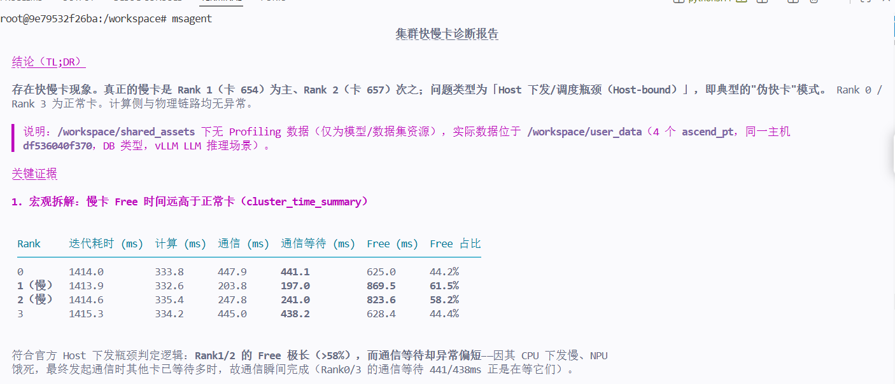
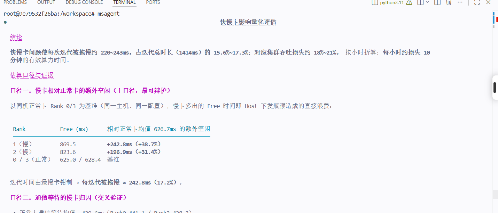
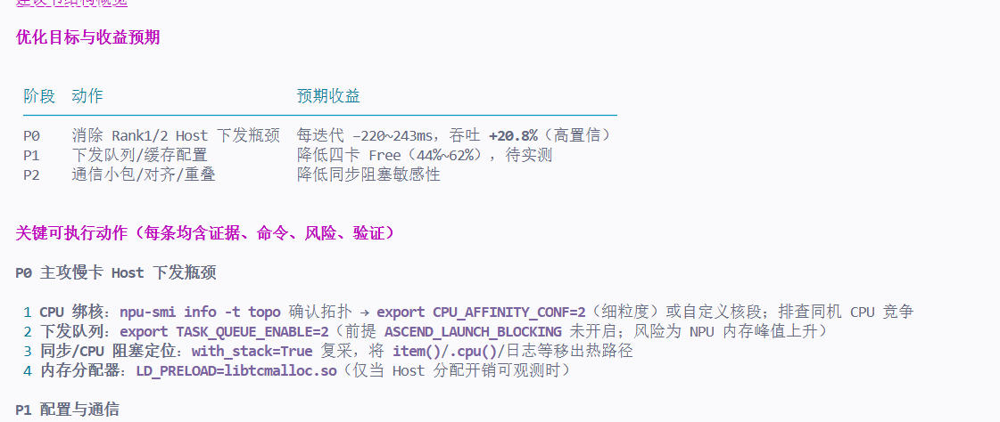

# MSAgent 体验报告
## 一、报告基本信息
| 项目 | 内容 |
|------|------|
| 报告编号 | |
| 体验日期 | |
| Agent版本 | |
| Profiling数据来源 | |
| 测试目标 | |

---

## 二、交互记录
### 第 1 轮交互
| 项目 | 内容 |
|------|------|
| 输入 Prompt | | @user_data/ 从当前Profiling数据来看，有无集群快慢卡，有什么关键证据   
| Agent 输出（文字摘要） | |
存在快慢卡现象。真正的慢卡是 Rank 1（卡 654）为主、Rank 2（卡 657）次之；问题类型为「Host 下发/调度瓶颈（Host-bound）」，即典型的"伪快卡"模式。 Rank 0 / 
  Rank 3 为正常卡。计算侧与物理链路均无异常。                                                                                                              

  ▌ 说明：/workspace/shared_assets 下无 Profiling 数据（仅为模型/数据集资源），实际数据位于 /workspace/user_data（4 个 ascend_pt，同一主机               
  ▌ df536040f370，DB 类型，vLLM LLM 推理场景）。                                                                                                         

  关键证据                                                                                                                                                 

  1. 宏观拆解：慢卡 Free 时间远高于正常卡（cluster_time_summary）                                                                                          

                                                                                     
   Rank     迭代耗时 (ms)  计算 (ms)  通信 (ms)  通信等待 (ms)  Free (ms)  Free 占比 
   ───────────────────────────────────────────────────────────────────────────────── 
   0        1414.0         333.8      447.9      441.1          625.0      44.2%     
   1（慢）  1413.9         332.6      203.8      197.0          869.5      61.5%     
   2（慢）  1414.6         335.4      247.8      241.0          823.6      58.2%     
   3        1415.3         334.2      445.0      438.2          628.4      44.4%     
                                                                                     

  符合官方 Host 下发瓶颈判定逻辑：Rank1/2 的 Free 极长（>58%），而通信等待却异常偏短——因其 CPU 下发慢、NPU                                                 
  饿死，最终发起通信时其他卡已等待多时，故通信瞬间完成（Rank0/3 的通信等待 441/438ms 正是在等它们）。                                                      

  2. 慢卡识别（slow_rank）                                                                                                                                 

   • Rank 1：slowAffectCount = 137 次（影响其他卡最多）                                                                                                    
   • Rank 2：slowAffectCount = 129 次                                                                                                                      

  3. 根因方向：全部通信瓶颈均为 Host-bound（communication_bottleneck）                                                                                     

  10/10 条瓶颈 reason 均为 [Host-bound]，slowRankId = 1 或 2，例如：                                                                                       

   • node@launch 算子 start-time 偏差最大 186.3ms / 118.5ms / 100.7ms（hcom_allReduce__503_105/55/41_1）                                                   
   • aten::view start-time 偏差 20.5ms、aten::copy 13.5ms                                                                                                  

  即慢卡的 Host 侧算子启动时刻显著晚于其他卡，导致通信同步点被拖住。                                                                                       

  4. 空闲原因（free_analysis）                                                                                                                             

   • Rank 1 出现全集群最大下发间隙："Abnormal CANN layer: long time between two node@launch 19.7ms"                                                        
   • Rank 2 出现 "Idle Pytorch layer: no task dispatched"（Host 侧长时间未下发任务）                                                                       

  5. 下发/同步 API 对比（compare_api_stats，慢卡 Rank1 vs 快卡 Rank0）                                                                                     

   • aclrtSynchronizeEvent：慢卡 19.6ms vs 快卡 329.9ms（ratio 0.059）——慢卡在同步点几乎无需等待（因为它最后到达）                                         
   • launch：慢卡 276.8ms（占比 26.8%）为四卡最高 vs 快卡 259.5ms（20.1%）                                                                                 
   • aclnnInnerFusedInferAttentionScore（CPU 侧）：慢卡 130.1ms vs 快卡 83.7ms（ratio 1.55）                                                               

  6. 排除项：计算侧完全均匀，排除计算型慢卡/负载不均                                                                                                       

   • compare_op_stats（Rank1 vs Rank0）：所有算子 count 完全一致，耗时 ratio 均在 0.96~1.04（MatMulV2 主算子 diff 仅 0.24us）                              
   • 链路无异常：communicationTransmitStageTime 四卡完全一致（6.811ms）                                                                                    

  7. 慢链路标记（slow_link）本质是 Rank 偏移而非物理链路                                                                                                   

   • hcom_allReduce_4_81920 offsetRatio 3.19、hcom_allGather_4_151936 offsetRatio 3.08，maxRank=minRank=1——偏移集中在 Rank1，非链路带宽问题。              

  8. Rank1 advisor 补充                                                                                                                                    

   • 大量 host 瓶颈算子序列（如序列总耗时 314ms，其中算子执行仅 48ms，gap ≈266ms）                                                                         
   • 100% 通信为 <16MB 小包；17 个通信算子字节未对齐                                                                                                       

  影响                                                                                                                                                     

  每次迭代耗时 1414ms 由慢卡 Rank1/2 的下发延迟决定，Rank0/3 在每个 AllReduce/AllGather 同步点被拖住等待（通信等待 441ms/438ms），集群吞吐被 Rank1/2 钳制。

  建议                                                                                                                                                     

   1 [P0] 排查 Rank1/2 的 Host 下发线程调度：检查这两卡的 CPU 绑核/NUMA 亲和性、下发线程优先级；确认是否与其他进程争抢 CPU（同机 4 卡若共宿主 CPU          
     超卖，会导致下发间隙 100~186ms 的抖动）。                                                                                                             
   2 [P0] 定位 PyTorch 层 start-time 延迟来源：node@launch 间隙 19.7ms + aten::view/aten::copy 启动偏差，建议开启 with_stack 采集调用栈，定位是            
     GC/锁、数据准备、采样同步还是 tokenizer 阻塞。                                                                                                        
   3 [P1] 优化下发侧配置：按 advisor 建议设置 export                                                                                                       
     ACLNN_CACHE_LIMIT=100、HOST_CACHE_CAPACITY=20、PYTORCH_NPU_ALLOC_CONF=expandable_segments:True，缓解动态 shape/缓存导致的 Host 侧耗时。               
   4 [P1] 通信小包与字节对齐：100% 通信数据 <16MB 且 17 个算子未对齐，评估增大 batch/sequence 粒度，减少 AllGather/AllReduce 次数。                        
   5 [P2] 动态 shape 算子：advisor 检出动态 shape 算子，若属在线编译抖动可评估                                                                             
     torch_npu.npu.set_compile_mode(jit_compile=False)（需确认对推理性能的影响）。
| **输出截图** | |
| 是否符合预期 | |是
| 评价 | |可以

### 第 2 轮交互

| 项目 | 内容 |
|------|------|
| 输入 Prompt | 评估快慢卡问题造成的影响，拖慢了多少时间 |
| Agent 输出（文字摘要） |快慢卡问题使每次迭代被拖慢约 220~243ms，占迭代总时长（1414ms）的 15.6%~17.3%；对应集群吞吐损失约 18%~21%。 按小时折算：每小时约损失 10                   
  分钟的有效算力时间。     |
| **输出截图** |  |
| 是否符合预期 |是 |
| 评价 | good |

### 第 3 轮交互

| 项目 | 内容 |
|------|------|
| 输入 Prompt | 帮我生成一份完整的优化建议|
| Agent 输出（文字摘要） | 基于当前证据生成完整优化建议前，先补充调度与 CPU 亲和性的专家规则，确保建议可执行|
| **输出截图** |  |
| 是否符合预期 | 是|
| 评价 | good|

---

## 三、多轮交互整体评价
| 评价维度 | 评分（1~5） | 说明 |
|----------|-------------|------|
| 问题理解准确性 | 5 | |
| 数据分析深度 | 4| |
| 证据链条完整性 |5 | |
| 优化建议实用性 | 5| |
| 多轮对话连贯性 | 5| |
| 响应速度与稳定性 |4 | |
| 整体满意度 | 5| |

---
## 四、问题与改进建议
### 发现的问题
1. 
2. 
3. 
### 改进建议
1. 
2. 
3. 