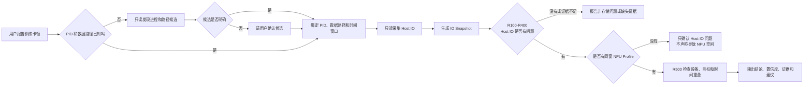
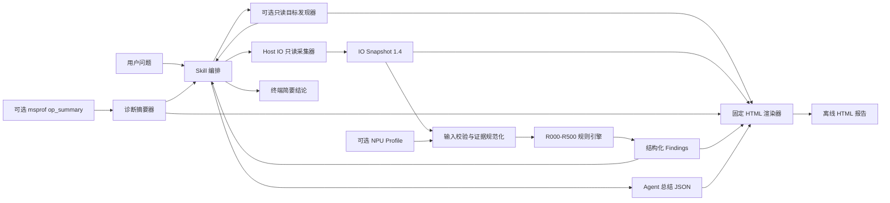

# MindStudio Storage Analysis Skill 设计方案

## 0. 先用通俗语言看懂

### 0.1 它到底解决什么问题

训练或推理变慢、NPU 利用率下降时，大家很容易先怀疑“磁盘太慢”。但下面这些现象看起来都像存储问题，实际原因可能完全不同：

- 数据确实没有及时从本地盘或 NFS 读出来；
- CPU 正忙于图片解码，磁盘其实是空闲的；
- 多个 DataLoader worker 或多个训练任务在争抢同一块盘；
- 通信、算子或任务下发导致 NPU 等待，与存储无关；
- Host IO 有压力，但尚未影响到 NPU。

这个 Skill 的作用不是看到“NPU 利用率低”就猜磁盘有问题，而是依次回答两个问题：

1. **Host 侧是否真的存在存储或 IO 瓶颈？**
2. **如果存在，这个瓶颈是否真的传导成了 NPU 等待？**

第二个问题不会根据第一个问题自动成立。两者必须分别取证。

### 0.2 可以把它理解成“导航员 + 采集员 + 裁判 + 报告生成员 + 解说员”

| 角色 | 由谁负责 | 做什么 |
| --- | --- | --- |
| 导航员 | `discover_io_target.py` | 在 PID 或数据路径未知时，只读寻找候选目标，并说明推荐依据 |
| 采集员 | `collect_io_snapshot.py` | 在 workload 运行期间，只读采集磁盘、NFS、进程、挂载和内存等事实 |
| 裁判 | `analyze_io_snapshot.py` | 使用固定规则判断本地盘、NFS、小文件、进程竞争和 NPU 传导问题 |
| 侧面观察员 | `summarize_msprof.py` | 摘要 NPU 算子记录中的辅助线索，但不单独证明 NPU 空闲 |
| 报告生成员 | `render_io_report.py` | 把四类结构化产物和 Agent 总结合成一个离线 HTML，不重新判断规则 |
| 解说员 | Agent + `SKILL.md` | 理解用户问题、调用脚本，并把结构化结果解释成人能看懂的报告 |

这样设计的关键原因是：大模型擅长理解问题和解释结果，但不适合临时发明阈值；程序擅长稳定地采集、校验和计算，但不知道用户真正关心什么。把两者分开后，同一份数据会得到可复现的规则结果，同时仍能以自然语言交互。

### 0.3 一次诊断是怎样完成的

假设用户说：

> 训练时 NPU 利用率周期性下降，我不知道是哪个进程，也不知道它从哪里读数据，帮我看看是不是存储问题。

Skill 会执行下面这条链路：



具体来说：

1. 如果 PID 或路径未知，先只读寻找候选；候选相近时让用户确认，不替用户猜。
2. 用 PID 确认“哪个训练进程”，用路径确认“它访问哪份数据”。
3. 在 workload 活跃的同一时间段采集 IO，而不是拿其他时刻的系统状态拼接。
4. 把采集事实保存成版本化的 `io_snapshot.json`，便于复查和重放。
5. 用 R100-R400 判断 Host 侧属于本地盘、NFS、小文件还是进程竞争问题。
6. 只有存在可信的 Host IO 问题时，才进入 R500。
7. R500 再检查 NPU profile 是否来自同一 workload、同一设备和重叠时间窗口。
8. 输出 `findings.json`，Agent 再将它解释为结论、证据、缺失项和建议。
9. Agent 把这份解释写入小型 `agent_report.json`，固定渲染器再把全部产物合成 `io_report.html`；终端仍同时返回简要结论。

### 0.4 R100-R500 分别在问什么

| 规则 | 用一句话理解 | 典型证据 |
| --- | --- | --- |
| R000 | 现有数据够不够、靠不靠谱？ | 工具缺失、权限不足、格式错误、采样过短 |
| R100 | 本地磁盘或块设备是否承压？ | 吞吐、IOPS、利用率、await、队列及持续时间 |
| R200 | NFS 是否真的慢？ | 当前窗口的 RTT、execute、重传、major timeout |
| R300 | 是否被小文件和远程元数据访问拖慢？ | NFS 元数据操作延迟、IO 粒度和访问模式 |
| R400 | 是否有多个进程在争抢同一存储后端？ | PID 活跃度、打开路径、挂载点、后端设备和共同时间窗口 |
| R500 | 已确认的 Host IO 问题是否导致 NPU 等待？ | 目标级 Host IO 证据与同窗 profiler 空闲证据 |

这里最重要的是规则之间的关系：

- R100-R400 负责建立 **Host IO 压力链**；
- R500 负责建立独立的 **NPU 传导链**；
- R400 需要复用 R100 找到的受压设备；
- R500 必须建立在已确认的 R100-R400 结果之上；
- R000 发现证据有缺口时，系统应降低置信度，而不是把“没采到”解释成“没问题”。

### 0.5 最终能得到什么结论

这个 Skill 不是简单返回“有瓶颈/没瓶颈”，而是区分以下层次：

| 结论示例 | 它真正表达的含义 |
| --- | --- |
| 本地盘存在持续高 await 和队列压力 | Host IO 问题成立，但还没有证明影响 NPU |
| NFS 当前窗口出现高 execute 延迟和重传 | NFS 问题有直接证据，不是仅凭挂载类型猜测 |
| 多个活跃 PID 映射到同一受压设备 | 存在进程或 worker IO 竞争证据 |
| Host IO 有压力，但缺少同窗 profiler | 只能确认 Host 问题，不能归因 NPU 空闲 |
| Host IO 与设备空闲在目标和时间上重叠 | 可以报告存储向 NPU 传导的候选结论 |
| provider 失败或证据时间不重叠 | 报告证据不足，并指出需要补采什么 |

每个结论都会附带严重度、置信度、证据字段、缺失证据和建议的下一步检查。也就是说，用户不仅能看到结论，还能知道“为什么这样判断”和“还缺什么”。

### 0.6 它刻意不做什么

- 不把一次 `npu-smi` 低利用率直接解释为存储问题；
- 不把 `mte2_ratio` 高直接解释为 Host IO 问题；
- 不把工具缺失、解析失败或没有权限解释为系统健康；
- 不把不同 workload、设备或时间窗口的数据强行拼成因果链；
- 不自动执行 remount、readahead、服务重启或合成压测；
- 在任何确认下都不执行 `drop_caches`；
- 对非 NFS 网络文件系统只做识别和交接，没有专用证据时不自动下高置信结论。

一句话总结：**它先证明 Host 存储确实有问题，再证明这个问题是否影响 NPU；证明不了的部分会明确写成证据缺口，而不是猜。**

## 1. 项目概述

`mindstudio-storage-analysis` 是面向 Ascend NPU 训练和推理节点的存储性能诊断 Skill。它用于判断数据集读取、DataLoader、Checkpoint、NFS、小文件访问或多进程竞争是否形成 Host IO 瓶颈，并进一步判断该瓶颈是否可能传导为 NPU 空闲。

该 Skill 不是单纯依赖大模型经验给出结论，而是采用“Agent 编排 + 只读采集 + 标准化快照 + 确定性规则分析”的实现方式。大模型负责理解用户意图、组织执行流程和解释结果；生产脚本负责数据采集、校验和规则计算，从而减少主观判断和不可复现结论。

核心设计原则如下：

- **只读优先**：默认只采集系统状态，不自动修改挂载、缓存、调度器或块设备参数。
- **证据驱动**：结论必须对应具体指标、目标对象和采集时间窗口。
- **目标绑定**：尽量通过 PID 和数据路径把系统指标绑定到实际工作负载。
- **确定性分析**：相同输入产生相同规则结果，不让大模型临时发明阈值。
- **Host 与 NPU 分链判断**：先确认 Host IO 问题，再独立验证是否传导到 NPU。
- **保守降级**：数据缺失、格式异常、时间不重叠时降低置信度，而不是误报健康或高风险问题。

## 2. 实际模块划分

从当前生产代码看，Skill 可以分为九个模块。

| 模块 | 对应文件 | 主要职责 |
| --- | --- | --- |
| Skill 编排模块 | `SKILL.md` | 定义触发场景、排除场景、执行流程、结果解释方式和安全约束 |
| Agent 展示模块 | `agents/openai.yaml` | 提供 Skill 名称、简介和默认调用提示 |
| 目标发现模块 | `scripts/discover_io_target.py` | 在有界时间内只读发现训练进程和数据路径候选，并输出推荐依据 |
| Host IO 采集模块 | `scripts/collect_io_snapshot.py` | 在指定窗口内只读采集磁盘、进程、挂载、NFS、内存等信息 |
| 数据契约模块 | 采集脚本中的 Pydantic 模型、`references/io_snapshot_schema.md` | 定义 IO Snapshot 结构、版本和 provider 状态语义 |
| 确定性分析模块 | `scripts/analyze_io_snapshot.py` | 校验输入并执行 R000-R500 规则，生成结构化 Findings |
| NPU Profile 辅助模块 | `scripts/summarize_msprof.py` | 从 `msprof op_summary` 提取非认证诊断摘要，避免把代理指标误当成 NPU 空闲证据 |
| HTML 报告模块 | `scripts/render_io_report.py`、`assets/io_report_template.html` | 将原始产物和 Agent 解释确定性地渲染为一个离线 HTML |
| 领域知识模块 | `references/collection_guide.md`、`references/failure_handbook.md` | 提供采集规范、根因解释、常见误判和处置建议 |

其中，真正执行诊断的核心是 Host IO 采集模块、数据契约模块和确定性分析模块。Skill 编排模块负责让 Agent 正确调用这些能力，领域知识模块负责帮助 Agent 向用户解释结果。

## 3. 总体架构



架构中有两条相互独立的证据链：

1. **Host IO 压力链**：由磁盘、NFS、元数据和进程竞争证据构成，对应 R100-R400。
2. **NPU 传导链**：由同一工作负载、同一设备和重叠时间窗口内的 profiler 证据构成，对应 R500。

只有 Host IO 问题已经成立，并且 NPU 侧存在可信的同窗空闲证据时，才能判断“存储问题可能导致 NPU 等待”。仅看到 NPU 利用率低，不能直接归因于存储。

## 4. Skill 编排模块

`SKILL.md` 是 Agent 的操作协议，主要承担以下职责：

- 判断请求是否属于存储分析范围。
- 区分 DataLoader、Checkpoint、NFS、小文件和多进程竞争等场景。
- 用户未提供 PID 或数据路径时，先自动发现候选；只有候选不明确时才让用户确认。
- 调用采集器生成 Snapshot，再调用分析器生成 Findings。
- 将规则输出转成用户可读的结论、证据、缺失项和建议。
- 把同一份解释写入 `agent_report.json`，调用固定渲染器生成附加的 HTML 报告，并返回其路径。
- 在 CPU 解码、集合通信、算子内部 MTE2 或 Host 调度已明确为主因时，将问题交给其他专项 Skill。
- 对 remount、readahead、`drop_caches` 等危险操作执行强制安全门禁。

这个模块不直接计算 IO 根因。它负责流程控制，避免大模型绕过采集和规则引擎，仅凭一两个现象下结论。

### 4.1 自动目标发现

`discover_io_target.py` 是采集前的“导航员”，输出 `target_candidates.json`，不输出存储诊断结论，也不会自动启动采集器。

它在默认 3 秒预算内检查有限数量的 `/proc` 信息：进程启动命令、工作目录、打开文件符号链接和挂载关系。它据此给出训练进程候选和数据/checkpoint 路径候选，并为每个候选记录原因。它不读取进程环境变量，不读取数据、配置或 checkpoint 内容，也不递归扫描目录。

选择规则是确定的：无显式输入时，进程需达到 50 分并领先第二名至少 15 分；路径需达到 70 分并领先至少 15 分。否则 `requires_confirmation=true`，Agent 只能把最相关候选交给用户确认。这里的分数仅用于确定“采集谁”，不能说明存储是否异常。

## 5. Host IO 采集模块

采集器接收采样时长以及可选的 PID、数据路径，在同一时间窗口并发采集动态指标，并生成统一的 IO Snapshot。

### 5.1 输入

| 参数 | 是否必需 | 说明 |
| --- | --- | --- |
| `--duration` | 否 | 采集窗口，默认 30 秒，范围 1-86400 秒 |
| `--pid` | 否 | 目标训练或推理进程，用于进程树和 PID 到设备映射 |
| `--path` | 否 | 目标数据集、Checkpoint 或挂载路径，必须为绝对路径 |
| `--out` | 否 | Snapshot 输出路径；未指定时输出到标准输出 |

推荐在真实 workload 运行期间同时提供 `--pid` 和 `--path`，这样分析结果能够绑定目标业务，而不是只反映整机状态。

### 5.2 Provider 子模块

采集器内部按 provider 组织数据源：

| Provider | 数据来源 | 用途 |
| --- | --- | --- |
| `block_devices` | `/proc/diskstats`、sysfs | 获取块设备计数器和采样差值，作为 iostat 缺失时的降级证据 |
| `iostat` | `iostat` JSON 或文本输出 | 获取设备利用率、吞吐、IOPS、await 和队列指标 |
| `pidstat` | `pidstat` JSON 或文本输出 | 获取进程读写速率和活跃进程 |
| `process_io_map` | `/proc/<pid>`、文件描述符、mountinfo | 建立 PID、打开文件、挂载点和后端设备之间的映射 |
| `mounts_provider` | `/proc/*/mountinfo` | 识别文件系统类型、挂载点和挂载源 |
| `nfs` | mountstats、`/proc/net/rpc/nfs` | 获取 NFS RTT、execute、重传、超时和操作统计 |
| `df` | `df` | 获取空间和 inode 使用情况 |
| `memory` | `/proc/meminfo` | 获取内存和 page cache 背景信息 |
| `readahead` / `scheduler` | sysfs、块设备信息 | 记录当前只读配置，供优化建议和回滚预览使用 |

动态 provider 并发执行，以尽量保证采样窗口重叠。静态或低频信息在动态采集结束后补充。

### 5.3 可靠性设计

- 外部命令设置超时、输出大小和资源边界，防止异常命令长期阻塞或产生超大输入。
- JSON 和文本解析都执行严格的有限数值校验，拒绝 `NaN`、`Inf`、溢出和不完整记录。
- 每个 provider 独立记录状态，单个工具缺失不会使整个 Snapshot 失效。
- Snapshot 先写临时文件，通过 Pydantic 回读校验后再原子替换目标文件。
- 采集器不执行写系统状态的命令。

## 6. 数据契约模块

采集器与分析器之间通过版本化的 `IO Snapshot` 解耦。当前 schema 版本为 `1.4`。

Snapshot 顶层包含：

- `schema_version`：契约版本。
- `window`：总体采集开始和结束时间。
- `target`：目标 PID、规范化路径和原始请求路径。
- `host`：主机、内核和平台信息。
- `duration_seconds`：采集时长。
- 各 provider 的原始状态和结构化结果。
- `availability`：缺失、部分可用和失败的数据源汇总。

每个 provider 使用统一的 `ProviderResult` 语义：

| 状态 | 含义 |
| --- | --- |
| `ok` | 成功采集并解析 |
| `missing` | 命令或文件不存在 |
| `permission_denied` | 权限不足 |
| `command_failed` | 命令执行失败 |
| `parse_failed` | 输出存在但无法可靠解析 |
| `empty` | 命令成功但没有可用记录 |
| `unsupported` | 当前平台或工具不支持 |

明确区分这些状态很重要。例如，`unsupported` 或 `parse_failed` 不能被分析器解释为“系统健康”。

## 7. 确定性分析模块

分析器负责资源限制检查、schema 校验、数据规范化、时间窗口校验、目标身份校验和规则执行。它支持运行全部规则，也支持单独运行某个规则。

### 7.1 分析流程

1. 限制输入文件大小、嵌套深度和容器规模。
2. 校验 Snapshot 主版本和顶层字段。
3. 规范化设备名、路径、挂载身份、PID 身份和数值字段。
4. 检查 provider 状态、采样数量和证据时间窗口。
5. 依次执行 R100、R200、R300、R400。
6. 汇总已确认的 Host IO 问题，执行 R500 传导分析。
7. 输出 Findings、校验错误和摘要。

R400 依赖 R100 的受压设备集合；R500 依赖 R100-R400 中已经确认的 Host IO 证据。因此规则执行顺序是设计的一部分。

### 7.2 规则体系

| 规则 | 诊断对象 | 主要证据 |
| --- | --- | --- |
| R000 | 信息不足或证据异常 | provider 状态、schema、采样窗口、校验错误 |
| R100 | 本地块设备压力 | 利用率、吞吐、IOPS、await、队列、持续采样 |
| R200 | NFS 性能问题 | 当前窗口内的 RTT、execute、重传、major timeout |
| R300 | 小文件或远程元数据压力 | NFS 元数据操作延迟、IO 粒度和访问特征 |
| R400 | 多 rank、多 worker 或多实例竞争 | 活跃 PID、同一后端设备、文件路径、进程身份和公共时间窗口 |
| R500 | Host IO 向 NPU 空闲传导 | 已确认的目标级 Host IO 问题、profiler 空闲指标、设备身份和时间重叠 |

### 7.3 Finding 输出

每条 Finding 以结构化 JSON 表示，主要包括：

- `rule_id`：规则编号。
- `severity`：问题严重程度。
- `confidence`：证据置信度。
- `summary`：规则结论。
- `evidence_fields`：支撑结论的字段和指标。
- `missing_evidence`：仍缺少的关键证据。
- `recommended_next_checks`：下一步只读检查或优化验证建议。

这种输出既适合 Agent 解释，也可以被其他程序消费。

## 8. NPU Profile 辅助模块

R500 的难点是区分“Host IO 有压力”和“Host IO 确实导致 NPU 等待”。因此 NPU 证据不能只使用某个时刻的 `npu-smi` 利用率，也不能把 `op_summary` 中导出任务之间的间隔直接当成设备空闲。

`summarize_msprof.py` 只负责读取 `msprof op_summary`，生成以下诊断代理：

- 导出任务时间范围。
- 合并后的任务持续时间。
- task gap proxy 百分比。
- 各 MTE2 ratio 列的样本数量、最小值、最大值和算术平均值。

这些字段被明确标记为 **non-certifying diagnostics**，不能直接作为 R500 的高置信证据。可用于 R500 的正式 profile 输入需要包含：

- 真实 profiler timeline 或数据库产生的 `device_free_percent`。
- 明确的设备号和 artifact 标识。
- 与 Snapshot 重叠的 `profile_window`。
- 指标级 provenance 和提取方法。
- 与目标 PID 或路径绑定的 Host 证据。

当前 JSON profile 由外部提供，Skill 尚未直接校验底层 profiler artifact，因此 R500 正向结论最高限制为中等置信度。这是有意保留的生产安全边界。

## 9. 输入与输出

### 9.1 用户层输入

典型输入是自然语言问题，例如：

> 训练时 NPU 利用率周期性下降，数据在 `/data/train`，主进程 PID 是 12345，请检查是不是存储瓶颈。

如果用户没有提供 PID 或路径，Agent 先执行：

```bash
python3 scripts/discover_io_target.py --output target_candidates.json
```

候选唯一且证据充分时，Agent 使用 `recommendation.preview_command`；候选相近时，Agent 展示最相关候选及原因，让用户确认后再采集。用户已明确提供 PID 和路径时，直接跳过这一步。

Agent 将已确认目标转换为采集参数，并在 workload 活跃窗口执行：

```bash
python3 scripts/collect_io_snapshot.py \
  --duration 30 \
  --pid 12345 \
  --path /data/train \
  --out io_snapshot.json
```

随后执行：

```bash
python3 scripts/analyze_io_snapshot.py \
  io_snapshot.json \
  --mode all \
  --output findings.json
```

如果有同一窗口的可信 NPU profile，则通过 `--profile` 一并分析。

Agent 将终端中使用的总结和建议写成 `agent_report.json` 后，再调用固定渲染器：

```bash
python3 scripts/render_io_report.py \
  --snapshot io_snapshot.json \
  --findings findings.json \
  --targets target_candidates.json \
  --msprof op_summary_diagnostics.json \
  --agent-report agent_report.json \
  --output io_report.html
```

没有执行目标发现或 msprof 摘要时，省略对应的可选参数即可。

### 9.2 系统层输出

系统可以产生四类脚本产物、一个 Agent 解释文件和一个最终展示文件：

1. `target_candidates.json`：可选；候选 PID、路径、证据、限制和是否需要确认。
2. `io_snapshot.json`：可复查、可归档的采集事实。
3. `findings.json`：R000-R500 的结构化诊断结果。
4. `op_summary_diagnostics.json`：可选；`summarize_msprof.py` 产生的 NPU 侧非认证辅助线索。
5. `agent_report.json`：Agent 写入的通俗总结、建议、依据规则和限制。
6. `io_report.html`：固定渲染器产生的单文件离线报告，包含图标、表格、规则结论和 Agent 解释。

Agent 最终向用户输出：

- 是否发现存储问题。
- 问题属于哪个根因桶。
- 严重度和置信度。
- 对应设备、挂载点、PID、路径和时间窗口。
- 关键证据及缺失证据。
- 安全的下一步检查和优化建议。
- 涉及配置变更时的风险、回滚和验证方案。
- 可直接用浏览器打开的 HTML 报告路径。

HTML 报告不依赖多模态模型。纯语言模型只需读取 JSON、生成受约束的 `agent_report.json`，再调用 `render_io_report.py`；页面结构、图标、表格和样式均由固定模板生成。多模态能力只对模板开发阶段的截图验收有帮助，不是生产运行依赖。报告不加载外部字体、图片、脚本或前端框架，能够离线打开。由于报告可能含主机名、PID 和数据路径，对外分享前仍需人工确认脱敏范围。

## 10. 安全设计

该 Skill 默认是诊断工具，而不是自动调优工具。

- 不自动执行 remount、umount、sysctl、fstab 修改、服务重启或网络存储端配置变更。
- 不在任何确认下执行 `drop_caches`，因为它会影响整机缓存且不存在真正回滚。
- readahead 和 remount 必须先只读记录原值，展示目标、命令、风险、影响范围、回滚和验证方案，再等待用户单独确认。
- 不自动发起 fio、NPU 压测等合成负载。
- 不把权限不足、命令缺失或解析失败解释为健康。
- 不在缺少 profiler 证据时声称存储导致 NPU 空闲。

安全门禁写在 Skill 编排协议中，确保 Agent 在执行任何工具前先向用户展示完整预览。

## 11. 部署形态

生产运行所需目录如下：

```text
mindstudio-storage-analysis/
├── SKILL.md
├── agents/
│   └── openai.yaml
├── requirements.txt
├── scripts/
│   ├── discover_io_target.py
│   ├── collect_io_snapshot.py
│   ├── analyze_io_snapshot.py
│   ├── summarize_msprof.py
│   ├── render_io_report.py
│   ├── _collection/
│   │   ├── common.py
│   │   ├── disk.py
│   │   ├── process.py
│   │   └── filesystem.py
│   └── _analysis/
│       ├── common.py
│       ├── contract.py
│       ├── local.py
│       ├── path_scope.py
│       ├── network.py
│       ├── contention.py
│       └── npu.py
├── assets/
│   └── io_report_template.html
└── references/
    ├── collection_guide.md
    ├── io_snapshot_schema.md
    ├── failure_handbook.md
    └── html_report.md
```

五个顶层脚本是 Agent 可调用的稳定入口；以下划线开头的目录只是内部实现，不增加新的 Agent 步骤。`collect_io_snapshot.py` 负责采集调度，内部模块分别处理通用契约、磁盘、进程和文件系统；`analyze_io_snapshot.py` 负责规则调度，内部模块分别处理通用证据、输入契约、本地盘 R000/R100、网络存储 R200/R300、IO 干扰 R400 和 NPU 传导 R500。重构不得改变 CLI 参数、Snapshot/Findings 格式或规则编号。

运行环境要求：

- Python 3.10 或更高版本。
- `pydantic>=2.7,<3`。
- `PyYAML>=6,<7`。
- Linux `/proc` 和 `/sys` 只读访问能力。
- `iostat`、`pidstat` 为推荐但非强制依赖；缺失时可使用 `/proc/diskstats` 降级采集，但置信度受限。
- NFS 自动确认需要有效的 mountstats 或 NFS 客户端统计。
- R500 需要同一 workload 窗口的 Ascend profiler 数据。

## 12. 方案价值

该设计把大模型擅长的意图理解和报告组织，与程序擅长的采集、校验和确定性计算分离，主要解决以下问题：

- 避免仅凭低 NPU 利用率就把问题错误归因于存储。
- 避免只看平均吞吐而忽略 await、队列、重传和元数据延迟。
- 避免使用不属于目标进程或目标路径的整机指标。
- 避免不同时间窗口的 Host 和 NPU 指标被错误拼接。
- 在工具缺失和权限不足时显式说明证据缺口。
- 对潜在破坏性调优操作提供统一的风险控制和回滚要求。

最终，该 Skill 提供的是一条可复查的诊断链：**用户现象 -> 只读发现并确认目标 -> 目标化只读采集 -> 版本化 Snapshot -> 确定性规则 -> 结构化证据 -> Agent 解释 -> 终端结论 + 离线 HTML 报告**。
