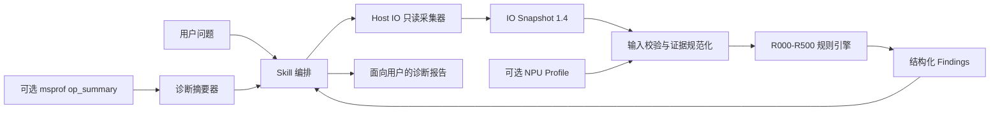

# MindStudio Storage Analysis Skill 设计方案

## 1. 项目概述

`mindstudio-storage-analysis` 是面向 Ascend NPU 训练和推理节点的存储性能诊断 Skill。它用于判断数据集读取、DataLoader、Checkpoint、NFS、小文件访问或多进程竞争是否形成 Host IO 瓶颈，并进一步判断该瓶颈是否可能传导为 NPU 空闲。

该 Skill 不是单纯依赖大模型经验给出结论，而是采用“Agent 编排 + 只读采集 + 标准化快照 + 确定性规则分析”的实现方式。大模型负责理解用户意图、组织执行流程和解释结果；生产脚本负责数据采集、校验和规则计算，从而减少主观判断和不可复现结论。

核心设计原则如下：

- **只读优先**：默认只采集系统状态，不自动修改挂载、缓存、调度器或块设备参数。
- **证据驱动**：结论必须对应具体指标、目标对象和采集时间窗口。
- **目标绑定**：尽量通过 PID 和数据路径把系统指标绑定到实际工作负载。
- **确定性分析**：相同输入产生相同规则结果，不让大模型临时发明阈值。
- **Host 与 NPU 分链判断**：先确认 Host IO 问题，再独立验证是否传导到 NPU。
- **保守降级**：数据缺失、格式异常、时间不重叠时降低置信度，而不是误报健康或高风险问题。

## 2. 实际模块划分

从当前生产代码看，Skill 可以分为七个模块。

| 模块 | 对应文件 | 主要职责 |
| --- | --- | --- |
| Skill 编排模块 | `SKILL.md` | 定义触发场景、排除场景、执行流程、结果解释方式和安全约束 |
| Agent 展示模块 | `agents/openai.yaml` | 提供 Skill 名称、简介和默认调用提示 |
| Host IO 采集模块 | `scripts/collect_io_snapshot.py` | 在指定窗口内只读采集磁盘、进程、挂载、NFS、内存等信息 |
| 数据契约模块 | 采集脚本中的 Pydantic 模型、`references/io_snapshot_schema.md` | 定义 IO Snapshot 结构、版本和 provider 状态语义 |
| 确定性分析模块 | `scripts/analyze_io_snapshot.py` | 校验输入并执行 R000-R500 规则，生成结构化 Findings |
| NPU Profile 辅助模块 | `scripts/summarize_msprof.py` | 从 `msprof op_summary` 提取非认证诊断摘要，避免把代理指标误当成 NPU 空闲证据 |
| 领域知识模块 | `references/collection_guide.md`、`references/failure_handbook.md` | 提供采集规范、根因解释、常见误判和处置建议 |

其中，真正执行诊断的核心是 Host IO 采集模块、数据契约模块和确定性分析模块。Skill 编排模块负责让 Agent 正确调用这些能力，领域知识模块负责帮助 Agent 向用户解释结果。

## 3. 总体架构



架构中有两条相互独立的证据链：

1. **Host IO 压力链**：由磁盘、NFS、元数据和进程竞争证据构成，对应 R100-R400。
2. **NPU 传导链**：由同一工作负载、同一设备和重叠时间窗口内的 profiler 证据构成，对应 R500。

只有 Host IO 问题已经成立，并且 NPU 侧存在可信的同窗空闲证据时，才能判断“存储问题可能导致 NPU 等待”。仅看到 NPU 利用率低，不能直接归因于存储。

## 4. Skill 编排模块

`SKILL.md` 是 Agent 的操作协议，主要承担以下职责：

- 判断请求是否属于存储分析范围。
- 区分 DataLoader、Checkpoint、NFS、小文件和多进程竞争等场景。
- 提示用户提供目标 PID、数据路径和采集时长。
- 调用采集器生成 Snapshot，再调用分析器生成 Findings。
- 将规则输出转成用户可读的结论、证据、缺失项和建议。
- 在 CPU 解码、集合通信、算子内部 MTE2 或 Host 调度已明确为主因时，将问题交给其他专项 Skill。
- 对 remount、readahead、`drop_caches` 等危险操作执行强制安全门禁。

这个模块不直接计算 IO 根因。它负责流程控制，避免大模型绕过采集和规则引擎，仅凭一两个现象下结论。

## 5. Host IO 采集模块

采集器接收采样时长以及可选的 PID、数据路径，在同一时间窗口并发采集动态指标，并生成统一的 IO Snapshot。

### 5.1 输入

| 参数 | 是否必需 | 说明 |
| --- | --- | --- |
| `--duration` | 否 | 采集窗口，默认 30 秒，范围 1-86400 秒 |
| `--pid` | 否 | 目标训练或推理进程，用于进程树和 PID 到设备映射 |
| `--path` | 否 | 目标数据集、Checkpoint 或挂载路径，必须为绝对路径 |
| `--out` | 否 | Snapshot 输出路径；未指定时输出到标准输出 |

推荐在真实 workload 运行期间同时提供 `--pid` 和 `--path`，这样分析结果能够绑定目标业务，而不是只反映整机状态。

### 5.2 Provider 子模块

采集器内部按 provider 组织数据源：

| Provider | 数据来源 | 用途 |
| --- | --- | --- |
| `block_devices` | `/proc/diskstats`、sysfs | 获取块设备计数器和采样差值，作为 iostat 缺失时的降级证据 |
| `iostat` | `iostat` JSON 或文本输出 | 获取设备利用率、吞吐、IOPS、await 和队列指标 |
| `pidstat` | `pidstat` JSON 或文本输出 | 获取进程读写速率和活跃进程 |
| `process_io_map` | `/proc/<pid>`、文件描述符、mountinfo | 建立 PID、打开文件、挂载点和后端设备之间的映射 |
| `mounts_provider` | `/proc/*/mountinfo` | 识别文件系统类型、挂载点和挂载源 |
| `nfs` | mountstats、`/proc/net/rpc/nfs` | 获取 NFS RTT、execute、重传、超时和操作统计 |
| `df` | `df` | 获取空间和 inode 使用情况 |
| `memory` | `/proc/meminfo` | 获取内存和 page cache 背景信息 |
| `readahead` / `scheduler` | sysfs、块设备信息 | 记录当前只读配置，供优化建议和回滚预览使用 |

动态 provider 并发执行，以尽量保证采样窗口重叠。静态或低频信息在动态采集结束后补充。

### 5.3 可靠性设计

- 外部命令设置超时、输出大小和资源边界，防止异常命令长期阻塞或产生超大输入。
- JSON 和文本解析都执行严格的有限数值校验，拒绝 `NaN`、`Inf`、溢出和不完整记录。
- 每个 provider 独立记录状态，单个工具缺失不会使整个 Snapshot 失效。
- Snapshot 先写临时文件，通过 Pydantic 回读校验后再原子替换目标文件。
- 采集器不执行写系统状态的命令。

## 6. 数据契约模块

采集器与分析器之间通过版本化的 `IO Snapshot` 解耦。当前 schema 版本为 `1.4`。

Snapshot 顶层包含：

- `schema_version`：契约版本。
- `window`：总体采集开始和结束时间。
- `target`：目标 PID、规范化路径和原始请求路径。
- `host`：主机、内核和平台信息。
- `duration_seconds`：采集时长。
- 各 provider 的原始状态和结构化结果。
- `availability`：缺失、部分可用和失败的数据源汇总。

每个 provider 使用统一的 `ProviderResult` 语义：

| 状态 | 含义 |
| --- | --- |
| `ok` | 成功采集并解析 |
| `missing` | 命令或文件不存在 |
| `permission_denied` | 权限不足 |
| `command_failed` | 命令执行失败 |
| `parse_failed` | 输出存在但无法可靠解析 |
| `empty` | 命令成功但没有可用记录 |
| `unsupported` | 当前平台或工具不支持 |

明确区分这些状态很重要。例如，`unsupported` 或 `parse_failed` 不能被分析器解释为“系统健康”。

## 7. 确定性分析模块

分析器负责资源限制检查、schema 校验、数据规范化、时间窗口校验、目标身份校验和规则执行。它支持运行全部规则，也支持单独运行某个规则。

### 7.1 分析流程

1. 限制输入文件大小、嵌套深度和容器规模。
2. 校验 Snapshot 主版本和顶层字段。
3. 规范化设备名、路径、挂载身份、PID 身份和数值字段。
4. 检查 provider 状态、采样数量和证据时间窗口。
5. 依次执行 R100、R200、R300、R400。
6. 汇总已确认的 Host IO 问题，执行 R500 传导分析。
7. 输出 Findings、校验错误和摘要。

R400 依赖 R100 的受压设备集合；R500 依赖 R100-R400 中已经确认的 Host IO 证据。因此规则执行顺序是设计的一部分。

### 7.2 规则体系

| 规则 | 诊断对象 | 主要证据 |
| --- | --- | --- |
| R000 | 信息不足或证据异常 | provider 状态、schema、采样窗口、校验错误 |
| R100 | 本地块设备压力 | 利用率、吞吐、IOPS、await、队列、持续采样 |
| R200 | NFS 性能问题 | 当前窗口内的 RTT、execute、重传、major timeout |
| R300 | 小文件或远程元数据压力 | NFS 元数据操作延迟、IO 粒度和访问特征 |
| R400 | 多 rank、多 worker 或多实例竞争 | 活跃 PID、同一后端设备、文件路径、进程身份和公共时间窗口 |
| R500 | Host IO 向 NPU 空闲传导 | 已确认的目标级 Host IO 问题、profiler 空闲指标、设备身份和时间重叠 |

### 7.3 Finding 输出

每条 Finding 以结构化 JSON 表示，主要包括：

- `rule_id`：规则编号。
- `severity`：问题严重程度。
- `confidence`：证据置信度。
- `summary`：规则结论。
- `evidence_fields`：支撑结论的字段和指标。
- `missing_evidence`：仍缺少的关键证据。
- `recommended_next_checks`：下一步只读检查或优化验证建议。

这种输出既适合 Agent 解释，也可以被其他程序消费。

## 8. NPU Profile 辅助模块

R500 的难点是区分“Host IO 有压力”和“Host IO 确实导致 NPU 等待”。因此 NPU 证据不能只使用某个时刻的 `npu-smi` 利用率，也不能把 `op_summary` 中导出任务之间的间隔直接当成设备空闲。

`summarize_msprof.py` 只负责读取 `msprof op_summary`，生成以下诊断代理：

- 导出任务时间范围。
- 合并后的任务持续时间。
- task gap proxy 百分比。
- 各 MTE2 ratio 列的样本数量、最小值、最大值和算术平均值。

这些字段被明确标记为 **non-certifying diagnostics**，不能直接作为 R500 的高置信证据。可用于 R500 的正式 profile 输入需要包含：

- 真实 profiler timeline 或数据库产生的 `device_free_percent`。
- 明确的设备号和 artifact 标识。
- 与 Snapshot 重叠的 `profile_window`。
- 指标级 provenance 和提取方法。
- 与目标 PID 或路径绑定的 Host 证据。

当前 JSON profile 由外部提供，Skill 尚未直接校验底层 profiler artifact，因此 R500 正向结论最高限制为中等置信度。这是有意保留的生产安全边界。

## 9. 输入与输出

### 9.1 用户层输入

典型输入是自然语言问题，例如：

> 训练时 NPU 利用率周期性下降，数据在 `/data/train`，主进程 PID 是 12345，请检查是不是存储瓶颈。

Agent 将问题转换为采集参数，并在 workload 活跃窗口执行：

```bash
python3 scripts/collect_io_snapshot.py \
  --duration 30 \
  --pid 12345 \
  --path /data/train \
  --out io_snapshot.json
```

随后执行：

```bash
python3 scripts/analyze_io_snapshot.py \
  io_snapshot.json \
  --mode all \
  --output findings.json
```

如果有同一窗口的可信 NPU profile，则通过 `--profile` 一并分析。

### 9.2 系统层输出

系统产生两类核心输出：

1. `io_snapshot.json`：可复查、可归档的采集事实。
2. `findings.json`：R000-R500 的结构化诊断结果。

Agent 最终向用户输出：

- 是否发现存储问题。
- 问题属于哪个根因桶。
- 严重度和置信度。
- 对应设备、挂载点、PID、路径和时间窗口。
- 关键证据及缺失证据。
- 安全的下一步检查和优化建议。
- 涉及配置变更时的风险、回滚和验证方案。

## 10. 安全设计

该 Skill 默认是诊断工具，而不是自动调优工具。

- 不自动执行 remount、umount、sysctl、fstab 修改、服务重启或网络存储端配置变更。
- 不在任何确认下执行 `drop_caches`，因为它会影响整机缓存且不存在真正回滚。
- readahead 和 remount 必须先只读记录原值，展示目标、命令、风险、影响范围、回滚和验证方案，再等待用户单独确认。
- 不自动发起 fio、NPU 压测等合成负载。
- 不把权限不足、命令缺失或解析失败解释为健康。
- 不在缺少 profiler 证据时声称存储导致 NPU 空闲。

安全门禁写在 Skill 编排协议中，确保 Agent 在执行任何工具前先向用户展示完整预览。

## 11. 部署形态

生产运行所需目录如下：

```text
mindstudio-storage-analysis/
├── SKILL.md
├── agents/
│   └── openai.yaml
├── requirements.txt
├── scripts/
│   ├── collect_io_snapshot.py
│   ├── analyze_io_snapshot.py
│   └── summarize_msprof.py
└── references/
    ├── collection_guide.md
    ├── io_snapshot_schema.md
    └── failure_handbook.md
```

运行环境要求：

- Python 3.10 或更高版本。
- `pydantic>=2.7,<3`。
- `PyYAML>=6,<7`。
- Linux `/proc` 和 `/sys` 只读访问能力。
- `iostat`、`pidstat` 为推荐但非强制依赖；缺失时可使用 `/proc/diskstats` 降级采集，但置信度受限。
- NFS 自动确认需要有效的 mountstats 或 NFS 客户端统计。
- R500 需要同一 workload 窗口的 Ascend profiler 数据。

## 12. 方案价值

该设计把大模型擅长的意图理解和报告组织，与程序擅长的采集、校验和确定性计算分离，主要解决以下问题：

- 避免仅凭低 NPU 利用率就把问题错误归因于存储。
- 避免只看平均吞吐而忽略 await、队列、重传和元数据延迟。
- 避免使用不属于目标进程或目标路径的整机指标。
- 避免不同时间窗口的 Host 和 NPU 指标被错误拼接。
- 在工具缺失和权限不足时显式说明证据缺口。
- 对潜在破坏性调优操作提供统一的风险控制和回滚要求。

最终，该 Skill 提供的是一条可复查的诊断链：**用户现象 -> 目标化只读采集 -> 版本化 Snapshot -> 确定性规则 -> 结构化证据 -> 安全处置建议**。
