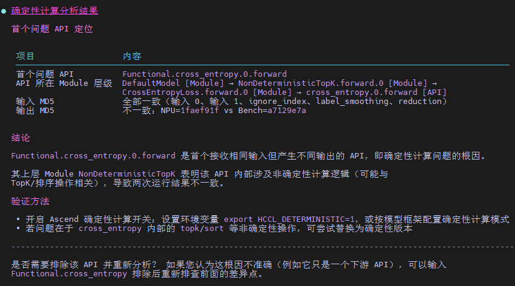
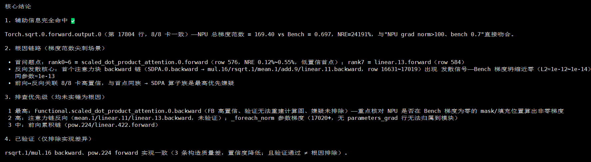

# Accuracy 精度调试

`Accuracy` 是面向 msProbe 模型精度调试的 Agent，负责把复杂精度数据转化为结构化结论、根因分析和可执行优化建议。

## Agent 定位

- 面向单卡、多卡、集群等 Ascend 精度分析场景
- 聚焦dump数据解读与调优建议输出
- 适合RL训推一致性分析，loss/gnorm NaN等问题分析

## 核心能力

- RL训推不一致根因分析
- loss/gnorm NaN问题定位
- 确定性计算问题定位
- loss对不齐问题定位

## 推荐使用方式

- 直接提供 dump 数据目录路径，并说明你想解决的问题
- 如果是集群或多卡问题，尽量同时说明异常现象、涉及 rank 或训练阶段

## 启动方式

```bash
msagent --agent Accuracy
```

源码运行时可使用：

```bash
uv run msagent --agent Accuracy
```

## 前置条件和推荐输入

- 已准备训练侧、推理侧或多次运行的 dump / md5 / msProbe 数据
- 推荐说明问题类型，例如训推不一致、NaN / overflow、确定性计算差异
- 多卡或集群场景建议提供 rank、step、layer、API 名称、异常首次出现位置等线索

示例：

```text
请基于 /path/to/train_dump 和 /path/to/infer_dump 分析训推不一致的首个差异点，并说明可能根因。
```

## 输出预期

Accuracy 通常会输出数据对齐方式、差异定位路径、首个异常点、可能根因和下一步验证建议。若输入数据不足，应明确列出还需要补充的 dump 或上下文。

## 典型使用场景

| 场景             | 示例提示词 | 效果展示 |
|----------------|---|--|
| RL训推不一致分析      | `请基于输入的训练和推理dump数据，分析训推的差异来源，给出可能原因。` |  |
| loss/gnorm NaN溢出分析 | `请基于输入的训练dump数据，分析其中的NaN溢出，找出源卡和根因算子` |  |
| 开启确定性计算、切换软件版本，模型运行两次结果不一致分析 | `请基于输入的md5 dump数据，进行数据比对，寻找比对差异点，给出可能原因。` |  |
| loss对不齐，基于比对结果分析 | `分析比对结果，输出分析报告` |  |

## 当出现分析结果不正确

- 可提供额外的辅助信息，包括相关代码、正确的背景知识等
- 可提出疑问或指出错误，修正Agent的错误观点
- 可提出分析方向、关键点，指导Agent沿相关线索进一步分析
- 示例路径均需替换为本地真实数据路径；依赖 dump 的分析流程需要真实 dump，loss 对不齐分析也可提供 `msProbe compare` 生成的 CSV/XLSX 比对结果

分析示例可参考 [`accuracy_usage_example.md`](../example/accuracy_usage_example.md)。
