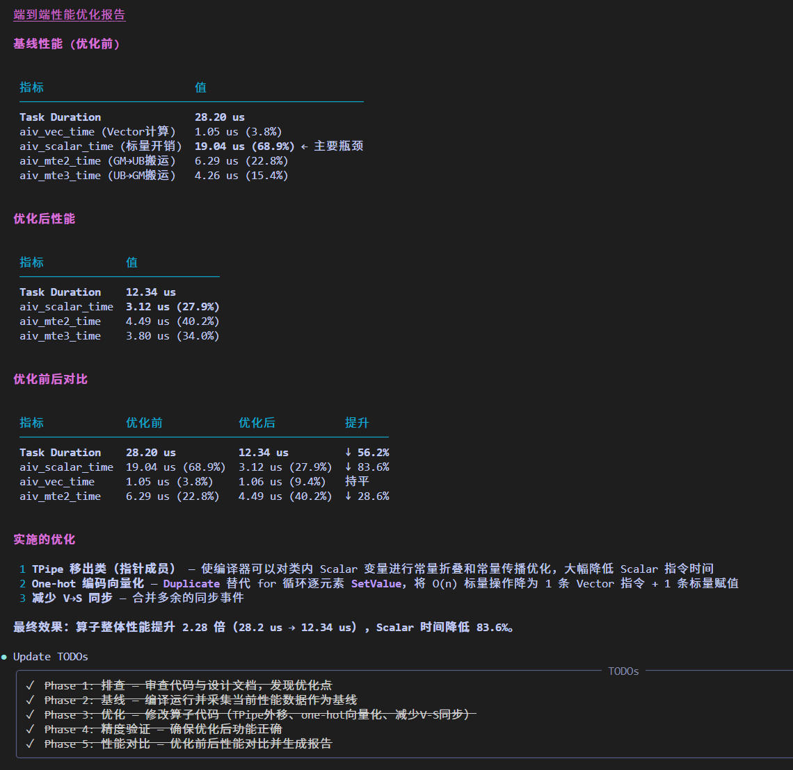

# Operator 算子调优

`Operator` 是面向 Ascend 算子开发性能优化场景的 Agent,负责把复杂算子性能数据优化为结构化、可分析和可执行的优化建议，并提供端到端性能优化的能力

## Agent 定位

- 面向昇腾NPU 单算子开发性能优化场景
- 聚焦算子性能瓶颈定位、优化建议分析与输出
- 聚焦算子性能端到端优化

## 启动方式

```bash
msagent --agent Operator
```

源码运行时：

```bash
uv run msagent --agent Operator
```

## 核心能力

- 算子性能分析报告输出
- MFU 计算、公式说明与结果解释
- 算子性能负载不均衡问题分析
- 算子性能瓶颈分析
- 算子性能端到端一键优化

## 推荐输入

- 算子源码目录和 kernel 文件路径。
- 性能报告、Profiling 结果或 msprof op 数据。
- 目标硬件、Shape、精度和优化目标。

## 预期输出

`Operator` 通常会输出瓶颈分析、优化建议、支撑证据和后续验证步骤。执行命令前，应将示例占位路径替换为真实的本地算子文件。

## 当前边界说明

- 性能结论必须基于真实 Profiling 数据，证据不足时应明确标记待验证项。
- 端到端优化需要可执行的算子目录和 kernel 源码；只有性能数据时，应先完成分析再确定是否修改代码。
- 找不到用户提供的数据路径或必要文件时，应停止执行并请用户确认，不能通过猜测补齐。

## 典型效果展示

| 场景        | 示例提示词                            | 效果展示                                                                        |
|-----------|-----------------------------------|-----------------------------------------------------------------------------|
| 算子端到端性能优化 | `请基于算子目录端到端进行性能优化，算子核函数为xxx.cpp。` |  |
