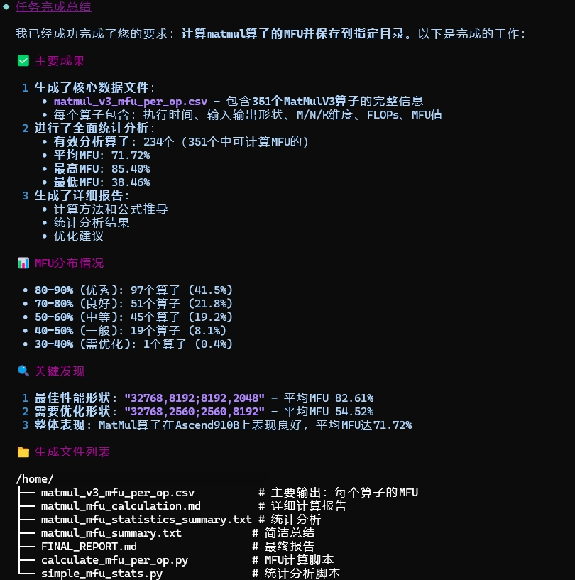
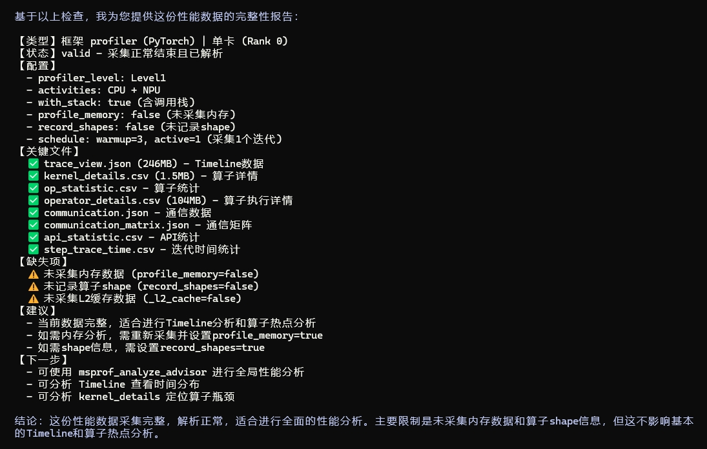
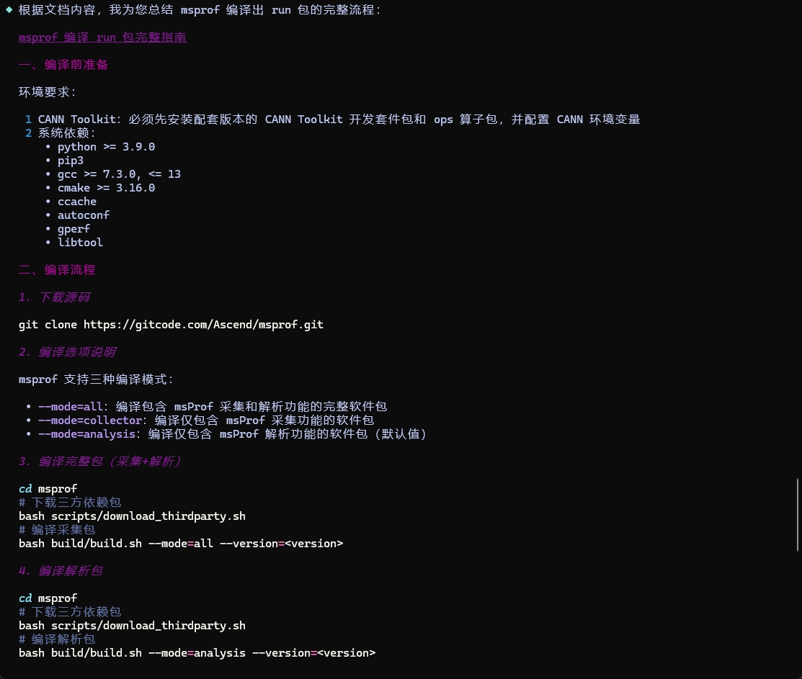

# Profiler 性能调优

`Profiler` 是面向 Ascend Profiling 与性能调优场景的 Agent，负责把复杂性能数据转化为结构化结论、根因分析和可执行优化建议。

## Agent 定位

- 面向单卡、多卡、集群等 Ascend 性能分析场景
- 聚焦 Profiling 数据解读、瓶颈定位与调优建议输出
- 适合快慢卡、慢节点、MFU、通信瓶颈、算子热点、下发调度等问题分析

## 核心能力

- Profiling 数据检查与数据质量确认
- MFU 计算、公式说明与结果解释
- 集群快慢卡、慢节点与负载不均衡分析
- 通信瓶颈、算子热点、Host 下发与调度问题定位
- 基于 DB / CSV / Trace 等交付件做结构化分析与导出

## 推荐使用方式

- 直接提供 Profiling 数据目录路径，并说明你想解决的问题
- 如果是集群或多卡问题，尽量同时说明异常现象、涉及 rank 或训练阶段
- 如果目标是做数据提取或导出，可直接给出 DB / CSV 文件路径和目标格式

## 常见问题的提问与证据核验

### Host 下发与调度

推荐提示词：

```text
请分析 /path/to/profiling/ 中是否存在 Host 下发或调度瓶颈，列出 Device Free、Dequeue、图编译和高频 PyTorch API 等关键证据，并按优先级给出优化建议。
```

建议重点核验：

- Device Free、Computing、Communication 及 Overlapped 占比
- Dequeue、图编译和高频小算子/张量整理耗时
- 优化前后是否基于同一 Step 对比

### 集群慢 Rank

推荐提示词：

```text
请对比 /path/to/cluster_profiling/ 中各 Rank 的 Computing、Communication 和 Free 时间，定位异常 Rank，并同时给出支持证据、反证和结论置信度。
```

建议重点核验：

- 异常 Rank 与其他 Rank 的分项耗时差异
- Computing 是否一致，避免将 Host 等待直接判断为硬件慢卡
- CPU affinity、NUMA、HCCL 以及同一 Step 复测结果

### 通信问题

推荐提示词：

```text
请分析 /path/to/profiling/ 的通信瓶颈，拆分实际传输时间与 Idle/Wait 时间，说明计算通信重叠状态、小通信算子数量和链路带宽是否正常。
```

建议重点核验：

- Communication（Not Overlapped）与 Overlapped 状态
- 实际传输时间和 Idle/Wait 时间
- 小通信算子数量、聚合空间及链路带宽健康度

以上分析建议保留原始指标、阈值和证据来源，避免仅输出根因结论。

## 典型效果展示

| 场景 | 示例提示词 | 效果展示 |
|---|---|---|
| MFU 计算 | `请基于 path/to/kernel_details.csv 计算 matmul 的 MFU（10B3），并说明各项计算依据。` |  |
| 快慢卡诊断 | `请分析 /path/to/cluster_profiling/ 中是否存在快慢卡问题，定位异常 rank，并给出可能原因。` |  |
| profiling 数据检查 | `请分析 /path/to/xxx_ascend_pt/ 数据是否采集正常。` |  |
| msprof 工具使用类咨询 | `msprof 怎么编译出 run 包？` |  |
| DB 自定义内容转 CSV | `基于 ascend_pytorch_profiler_0.db，帮我提取各个算子类型的总耗时并按降序输出到 csv。` |  |
