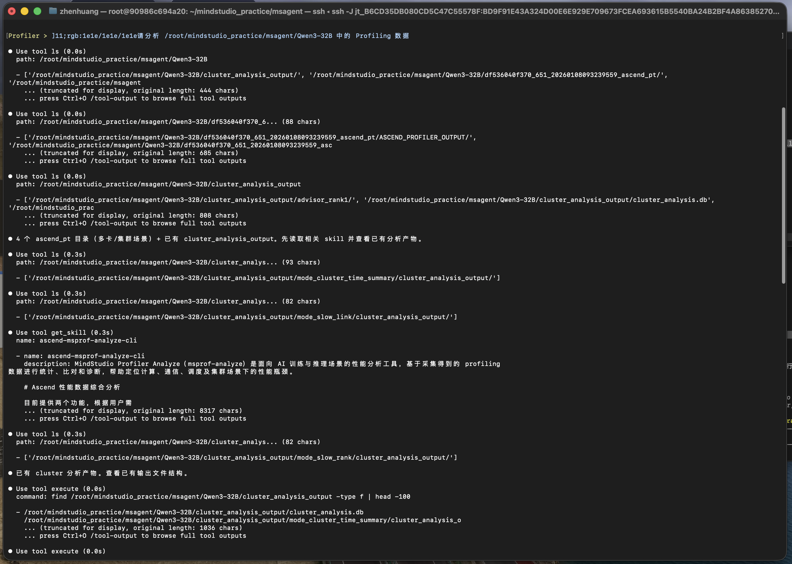
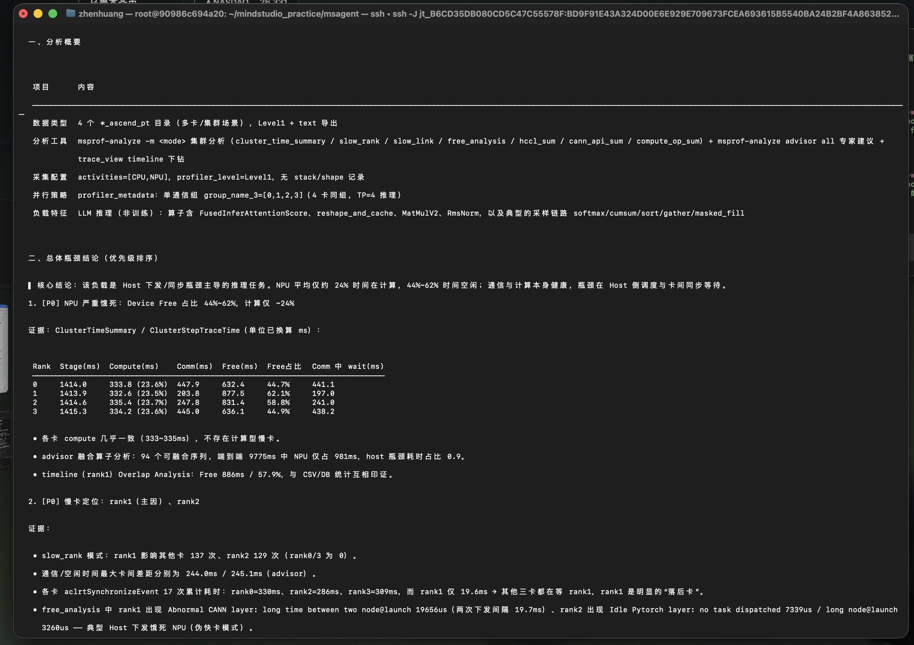
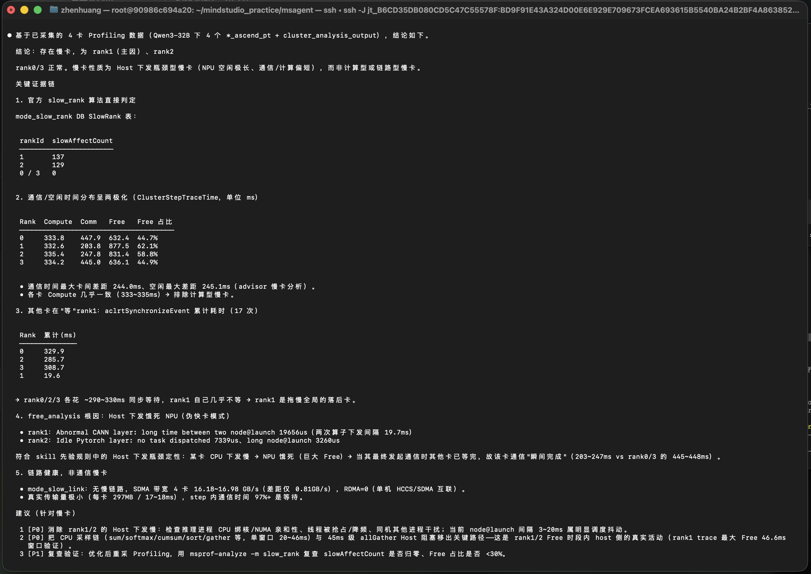
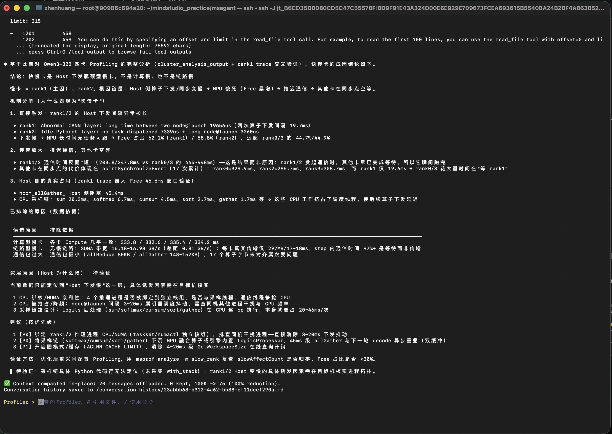
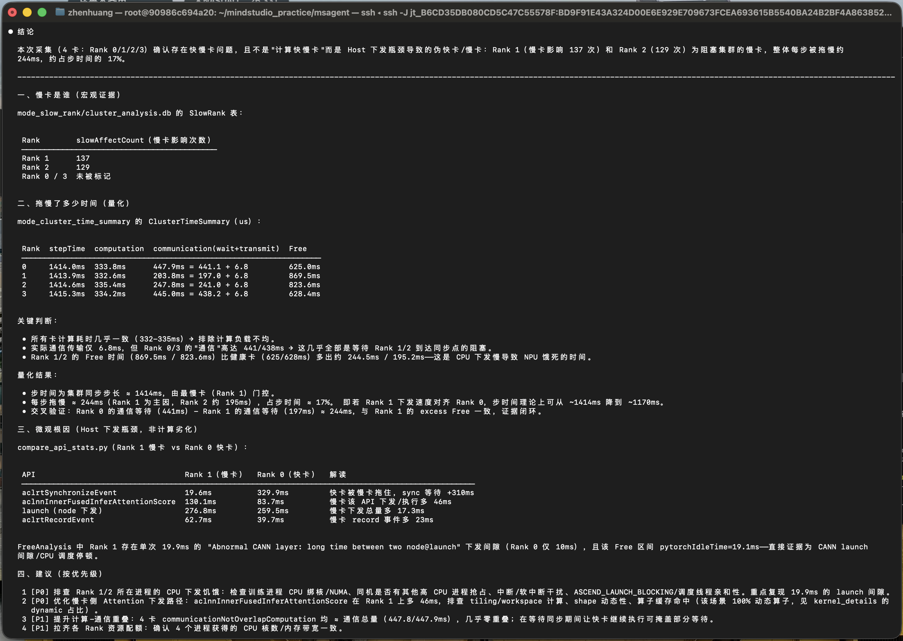

# MSAgent 体验报告

## 一、报告基本信息

| 项目 | 内容 |
|------|------|
| 报告编号 | 淬火行动-20260819-benhz |
| 体验日期 | 2026年8月20日 |
| Agent版本 | msAgent v26.1.0a2 |
| Profiling数据来源 | 镜像 `mind_studio_v4` 中的 `/workspace/shared_assets/QuenchingAction/Toolchain/Other/Qwen3-32B.zip`；实际分析目录为 `/root/mindstudio_practice/msagent/Qwen3-32B` |
| 测试目标 | 依据任务文档完成 msAgent 模型配置，使用 Profiler 分析 Profiling 数据中的下发、调度及集群快慢卡问题，并为后续使用 MindStudio Insight 验证分析结果提供结论。 |

---

## 二、交互记录

### 第 1 轮交互

| 项目 | 内容 |
|------|------|
| 输入 Prompt | `请分析 /root/mindstudio_practice/msagent/Qwen3-32B 中的 Profiling 数据` |
| Agent 输出（文字摘要） | Agent 完成对 4 个 `*_ascend_pt` 目录及 `cluster_analysis_output` 的综合分析，判断该推理任务主要存在 Host 下发/同步瓶颈。四个 Rank 的计算时间约为 332.6～335.4 ms，基本一致；Rank 1/2 的 Free 占比分别为 62.1% 和 58.8%，明显高于 Rank 0/3 的 44.7% 和 44.9%。Agent 初步定位 Rank 1 为主慢卡、Rank 2 为次慢卡，`slowAffectCount` 分别为 137 和 129。Rank 1 Timeline 的 Overlap Analysis 显示累计 Free 约 886 ms、占比约 57.9%。 |
| **输出截图** |   |
| 是否符合预期 | 是 |
| 评价 | Agent 能识别数据目录结构并调用多种分析能力，从计算、通信、Free、慢 Rank 和 Timeline 多个维度形成总体结论，符合预期。 |

### 第 2 轮交互

| 项目 | 内容 |
|------|------|
| 输入 Prompt | `从当前Profiling数据来看，有无集群快慢卡，有什么关键证据？` |
| Agent 输出（文字摘要） | Agent 明确判断存在慢卡：Rank 1 为主慢卡，Rank 2 为次慢卡，Rank 0/3 正常。`slowAffectCount` 分别为 137、129、0、0。四个 Rank 的 Compute 均约为 333～335 ms，排除计算型慢卡；Rank 1/2 的 Free 分别为 877.5 ms（62.1%）和 831.4 ms（58.8%），明显高于 Rank 0/3。Rank 0/2/3 的 `aclrtSynchronizeEvent` 累计等待约 285.7～329.9 ms，而 Rank 1 仅为 19.6 ms，说明其他 Rank 在等待 Rank 1。Rank 1 还出现 19656 μs 的两次算子下发间隙。SDMA 带宽约为 16.18～16.98 GB/s，未发现慢链路。 |
| **输出截图** |  |
| 是否符合预期 | 是 |
| 评价 | Agent 不仅给出慢 Rank 编号，还通过 SlowRank、Compute/Comm/Free、同步等待、下发间隙和链路带宽构成证据链，符合预期。 |

### 第 3 轮交互

| 项目 | 内容 |
|------|------|
| 输入 Prompt | `造成快慢卡的原因是什么？` |
| Agent 输出（文字摘要） | Agent 判断直接原因是 Rank 1/2 的 Host 侧算子下发或同步变慢，使 NPU 长时间无任务可执行、Free 暴增，随后延迟进入通信，导致其他 Rank 在同步点等待。Rank 1 出现 19656 μs（约 19.7 ms）的两次算子下发间隙；Rank 2 出现 7339 μs 的无任务下发和 3260 μs 的长下发间隙。Timeline 中 Rank 1 的最大 Free 切片约为 46.6 ms；`hcom_allGather_` 的 Host 侧阻塞约为 45.4 ms。Agent 排除了计算型慢卡、链路型慢卡和通信包过大，并指出 CPU 绑核/NUMA、CPU 抢占降频及采样链路设计属于需要进一步核实的深层原因。 |
| **输出截图** |  |
| 是否符合预期 | 是 |
| 评价 | Agent 清楚区分了“已证实的直接原因”和“尚待验证的深层原因”，没有把 CPU 绑核或资源竞争等候选项直接当成最终结论，符合预期。 |

### 第 4 轮交互

| 项目 | 内容 |
|------|------|
| 输入 Prompt | `评估快慢卡问题造成的影响，拖慢了多少时间？` |
| Agent 输出（文字摘要） | Agent 确认 Rank 1（影响 137 次）和 Rank 2（影响 129 次）是阻塞集群的慢 Rank。当前集群同步步长约为 1414 ms；Rank 1 相对健康 Rank 的额外 Free 约为 244.5 ms，Rank 2 约为 195.2 ms。以 Rank 1 为主要限制因素，Agent 估算每步被拖慢约 244 ms，约占步时间的 17%；如果 Rank 1 的下发速度与 Rank 0 对齐，步时间理论上可由约 1414 ms 降至约 1170 ms。Rank 0 与 Rank 1 的通信等待差约 244 ms，与 Rank 1 的额外 Free 基本一致，形成交叉验证。 |
| **输出截图** |  |
| 是否符合预期 | 是 |
| 评价 | Agent 给出了当前步长、额外 Free、通信等待差、每步拖慢时间及占比，并通过慢 Rank 侧与受影响 Rank 侧的指标进行交叉验证，结论明确且口径相对保守，符合预期。 |

---

## 三、多轮交互整体评价

| 评价维度 | 评分（1~5） | 说明 |
|----------|-------------|------|
| 问题理解准确性 | 5 | 能正确理解初始分析要求及三个递进的性能问题，并始终围绕当前 Profiling 数据回答。 |
| 数据分析深度 | 5 | 分析覆盖计算时间、通信及等待时间、纯传输时间、Free、Host API 和任务下发间隙。 |
| 证据链条完整性 | 4 | 已形成下发慢、设备空闲和通信等待之间的因果链；当前数据未包含完整调用栈，暂时不能定位到具体 Python 源码行。 |
| 优化建议实用性 | 4 | CPU 绑核、NUMA、Host 竞争、数据加载、GIL/锁和重新采集调用栈等建议均可执行，但仍需逐项验证。 |
| 多轮对话连贯性 | 5 | 四轮回答持续引用前一轮发现的 Rank 1/2 及相关指标，并依次完成现象、证据、根因和影响量化，上下文连贯。 |
| 响应速度与稳定性 | 4 | 四轮分析均正常完成；Mac 终端出现 OSC 11 控制序列显示异常，但未影响核心分析结果。 |
| 整体满意度 | 4 | 能够快速缩小性能问题排查范围并给出量化结论，最终结论仍需通过 MindStudio Insight 人工验证。 |

---

## 四、问题与改进建议

### 发现的问题

1. 在当前 Mac 终端运行 msAgent 时会显示类似 `^[]11;rgb:1e1e/1e1e/1e1e^G` 的 OSC 11 控制序列，部分字符还可能被终端当作命令执行，影响阅读和复制体验。
2. 不同分析表中的 Free 统计口径略有差异：`ClusterStepTraceTime` 中 Rank 1/2 的 Free 为 877.5/831.4 ms，而 `ClusterTimeSummary` 中为 869.5/823.6 ms。如果输出中不明确标注数据表，容易让用户误认为结果前后不一致。
3. 本次 Profiling 数据没有采集完整调用栈。Agent 能确认 Host 下发异常，但无法直接定位到具体 Python 源码行；CPU 绑核、NUMA、CPU 抢占等深层原因仍需要在目标环境中核实。

### 改进建议

1. 增强 Mac 终端兼容性，避免输出无法正确解析的终端颜色查询控制序列，或提供关闭颜色/终端探测的配置项。
2. 输出 Free、通信等指标时同步标注来源表、统计范围和口径；当多个分析表的数值不同，应主动说明差异原因，避免前后结果看似矛盾。
3. 当数据缺少调用栈时，Agent 应主动提示使用 `with_stack=True` 重新采集，并给出可直接执行的采集参数及 MindStudio Insight 验证路径。
