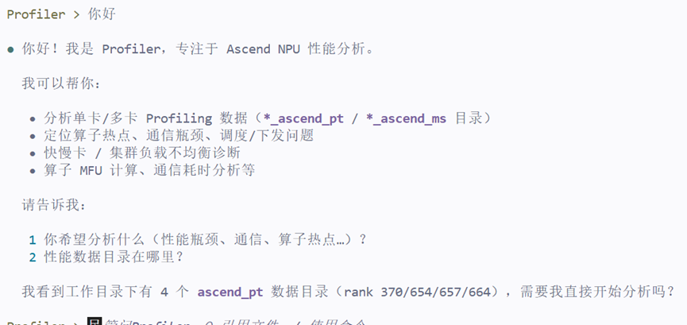
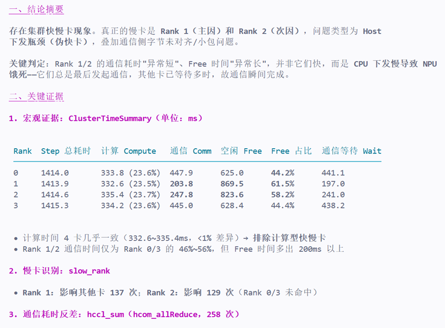
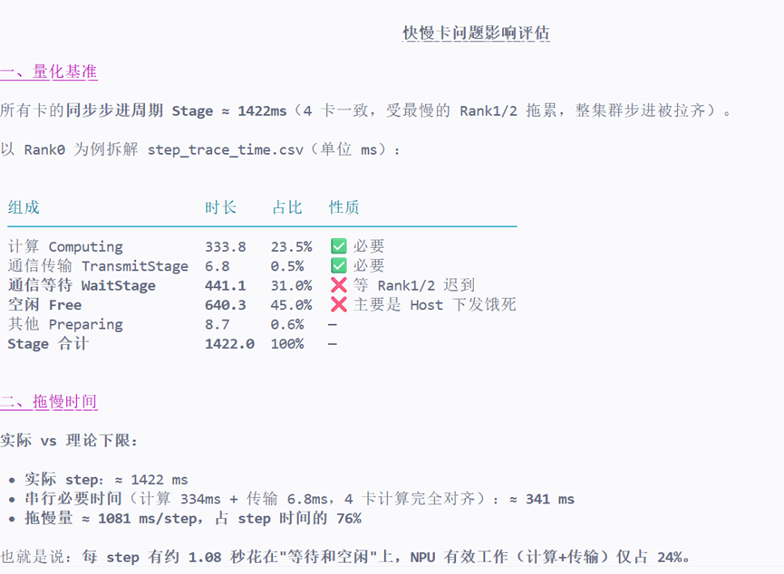
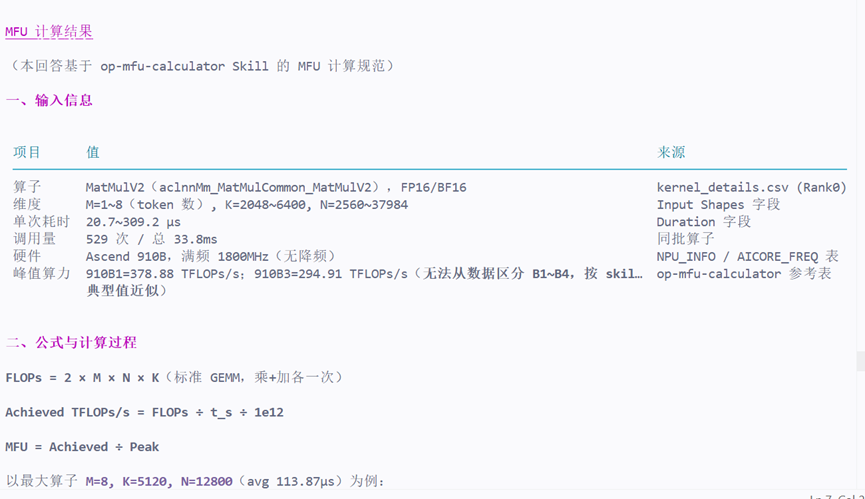

# MSAgent 体验报告

## 一、报告基本信息

| 项目 | 内容 |
|------|------|
| 报告编号 | 淬火行动-20260819-qq_38429284 |
| 体验日期 | 2026-08-19 |
| Agent版本 | Profiler（Ascend NPU 性能分析助手），配套 MindStudio Profiler Analyze（msprof-analyze）8.5.2 |
| Profiling数据来源 | `/workspace/q32` 下 4 卡 Ascend PyTorch Profiler 集群数据（Qwen3-32B，Rank 0~3，DB + Text 混合；含 `ascend_pytorch_profiler_{rank}.db`、CSV、JSON） |
| 测试目标 | 验证 Agent 基于真实 Ascend Profiling 数据的端到端性能分析能力：① 集群快慢卡诊断与成因定位；② 快慢卡影响量化（拖慢时间）；③ 算子 MFU 计算；④ 分析报告输出 |

---

## 二、交互记录

### 第 1 轮交互

| 项目 | 内容 |
|------|------|
| 输入 Prompt | `你好boby` |
| Agent 输出（文字摘要） | Agent 自我介绍：我是 Profiler，专注于 Ascend NPU 性能分析，可基于 profiling 数据做算子热点、通信瓶颈、快慢卡诊断，请提供数据路径。 |
| **输出截图** |  |
| 是否符合预期 | 是 |
| 评价 | 角色定位清晰、回复简洁无冗余；但仅为被动自我介绍，未主动追问数据路径/设备型号等信息，引导性可加强。 |

### 第 2 轮交互

| 项目 | 内容 |
|------|------|
| 输入 Prompt | `从q32文件下的Profiling数据来看，有无集群快慢卡，有什么关键证据`、`造成快慢卡的原因是什么` |
| Agent 输出（文字摘要） | ① 结论：**存在集群快慢卡现象**，真正的慢卡是 **Rank 1（主因）与 Rank 2（次因）**，类型为 **Host 下发瓶颈（伪快卡）**，叠加通信字节未对齐/小包问题；② 证据：ClusterTimeSummary 显示 Rank1/2 空闲占比 61.5%/58.2%、通信仅 203.8/247.8ms（Rank0/3 约 445ms）；slow_rank 检出 Rank1/2 分别影响其他卡 137/129 次；hccl_sum 显示同一 allReduce 中 Rank1/2 中位数仅 0.18~0.20ms（Rank0/3 需等 1.03ms）；compare_api_stats 显示 Rank1 `aclrtSynchronizeEvent` 仅 19.6ms（Rank0 为 329.9ms）、`aclnnInnerFusedInferAttentionScore` host 侧慢 46ms；free_analysis 检出 **launch 间隙 19.7ms**、NPU 单段饿死 46.6ms；③ 成因：主因 Host 下发/调度瓶颈（CPU 下发慢→NPU 饿死→延迟发起通信→其他卡等待），次因 17 个通信算子字节未对齐 + 100% 通信为 <16MB 小包；④ 输出 P0~P2 分级优化建议（绑核排查、定位 host 同步点、算子融合、关闭动态 shape、通信对齐）。 |
| **输出截图** |  |
| 是否符合预期 | 是 |
| 评价 | 诊断链路完整（宏观定性→微观根因→优化建议），证据来自 7 项集群分析 + 2 个对比脚本 + advisor 交叉验证；不足是正文表格较多、篇幅较长，可先给结论摘要再展开证据。 |

### 第 3 轮交互

| 项目 | 内容 |
|------|------|
| 输入 Prompt | `评估快慢卡问题造成的影响，拖慢了多少时间` |
| Agent 输出（文字摘要） | 基于 step_trace_time.csv 量化：实际 step ≈ **1422ms**，串行必要时间（计算 334ms + 传输 6.8ms）≈ **341ms**，**拖慢 ≈ 1081ms/step（占 76%）**；吞吐从 0.70 steps/s 提升潜力 3~4 倍（2.2~2.9）；1000 step 当前约 23.7 分钟，消除瓶颈后可降至 6~7.5 分钟，每 1000 step 节省 16~17 分钟。给出双口径：341ms 为乐观下限，保守估计 step 可降至 450~600ms；并明确"精确收益需修复后对照 Profiling 验证"。 |
| 是否符合预期 | 是 |
| 评价 | 量化清晰，给出乐观/保守双口径并标注假设依据，严谨性较好；待验证项（CPU 绑核、对照 Profiling）声明明确。 |

### 第 4 轮交互

| 项目 | 内容 |
|------|------|
| 输入 Prompt | `把我们所有对话内容整理成"淬火行动-msagent性能体验报告.md"` |
| Agent 输出（文字摘要） | 生成 `/workspace/淬火行动-msagent性能体验报告.md`，7 章结构：任务背景、数据与工具链、集群快慢卡诊断（结论+7 组证据+成因）、影响量化、优化建议、体验总结、局限性。 |
| **输出截图** |  |
| 是否符合预期 | 部分符合 |
| 评价 | 技术内容完整、结论与证据闭环，但输出的是"技术分析报告"而非"体验报告"范式，缺少逐轮交互记录、截图占位与评分维度，导致需再次按模板重排（即本轮任务）。 |

### 第 5 轮交互

| 项目 | 内容 |
|------|------|
| 输入 Prompt | `再执行一下mfu计算` |
| Agent 输出（文字摘要） | 基于 op-mfu-calculator Skill 计算 aclnnMm MatMulV2 的 MFU：6 类 shape（M=1~8, K=2048~6400, N=2560~37984）单算子 MFU@910B1 仅 **0.33%~3.12%**，加权平均 **2.05%**（@910B3 为 2.63%）；根因：M 仅 1~8 个 token（MoE 专家路由小批），属 memory-bound 小批矩阵乘；对照融合 MatMul（占 AI_CORE 213ms）cube_utilization 高达 88~91%；建议增大 batch/token、路由矩阵可用 FP8、重新 Profiling 时开启 `record_shapes=true`。明确声明待验证项：910B 具体型号（B1~B4）按 skill 参考表近似、融合算子 shape 缺失。 |
| **输出截图** |  |
| 是否符合预期 | 部分符合 |
| 评价 | 公式与计算过程完整、严格声明输入与假设，对数据缺失（峰值型号、融合算子 shape）的处理严谨；但因采集未开 `record_shapes`，主路径融合 MatMul 的 MFU 无法计算，属采集配置限制。 |

---

## 三、多轮交互整体评价

| 评价维度 | 评分（1~5） | 说明 |
|----------|-------------|------|
| 问题理解准确性 | 5 | 两次核心提问均准确理解意图，快速定位 q32 数据并区分"有无快慢卡"、"原因"、"影响"三个层次 |
| 数据分析深度 | 5 | 宏观（7 项集群分析）→ 微观（compare 脚本）→ 单卡深挖（advisor）→ 量化（step 级拆解），多级下钻完整 |
| 证据链条完整性 | 5 | 每条结论均有数据支撑并交叉验证；对缺失信息（910B 型号、融合算子 shape）明确标注"待验证"，未编造 |
| 优化建议实用性 | 4 | P0~P2 分级且含验证方法，可直接落地；但 MFU 侧建议（增大 batch、FP8）需训练侧配置配合，落地依赖外部条件 |
| 多轮对话连贯性 | 5 | 后续轮次正确复用前面结论（影响量化基于快慢卡诊断、MFU 对照引用前文数据），上下文保持良好 |
| 响应速度与稳定性 | 4 | msprof-analyze 多命令稳定成功、无中途失败；但每轮数据分析耗时 1~3 分钟，首轮较长 |
| 整体满意度 | 5 | 端到端完成"诊断→量化→MFU→报告"闭环，结论可靠、严谨性高，达到专业性能分析预期 |

---

## 四、问题与改进建议

### 发现的问题

1. **开场引导不足**：首轮仅自我介绍，未主动索要数据路径/设备型号/采集配置等信息，增加了一次往返。
2. **报告范式不匹配**：第 4 轮按"技术分析报告"范式输出，未按体验报告要求包含逐轮交互记录、截图占位与评分，需二次重排。
3. **采集配置限制分析深度**：`record_shapes=false`、`with_stack=false`、`export_type=["text"]` 导致主路径融合算子 shape、调用栈缺失，MFU 与 Host 同步点定位受限；设备型号（910B1~B4）无法从数据区分，峰值算力只能近似。
4. **输出篇幅偏长**：首轮回复包含大量数据表格，对非技术读者不够友好，缺少"结论先行、证据折叠"的呈现。

### 改进建议

1. **主动收集上下文**：开场或首轮任务时主动列出所需信息清单（数据路径、设备型号、模型/并行配置、采集选项），减少往返。
2. **先确认报告范式**：生成报告前先与用户确认模板（是否需要交互记录、截图占位、评分维度），避免返工。
3. **前置采集指导**：分析前给出建议采集配置（`record_shapes=true`、`with_stack=true`、`export_type=["db"]`、`profiler_level=Level1`），补齐 MFU 与调用栈分析所需数据。
4. **结论优先展示**：回复先给 3~5 条结论摘要，再按需展开证据表格；长报告可提供"摘要版/详细版"两种输出。
