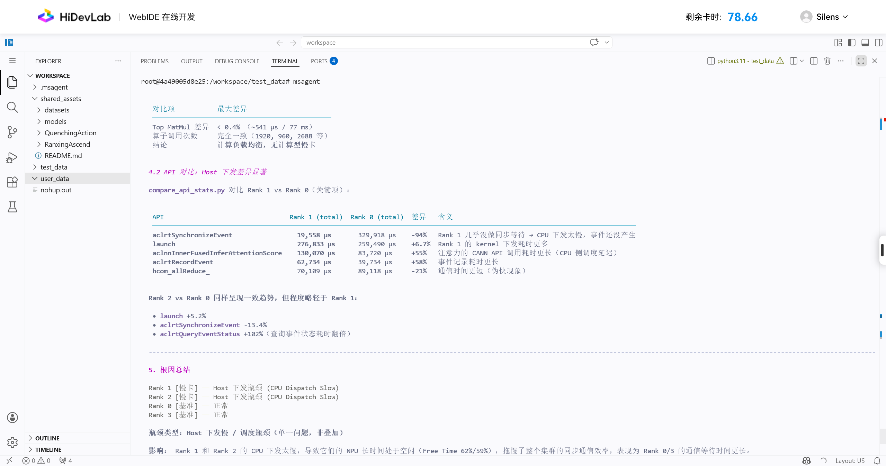

# MSAgent 体验报告

## 一、报告基本信息

| 项目 | 内容 |
|------|------|
| 报告编号 | 1 |
| 体验日期 | 2026年8月20日 |
| Agent版本 | 26.1.0a2 |
| Profiling数据来源 | Qwen3-32B |
| 测试目标 | 发现定位性能问题 |

---

## 二、交互记录

### 第 1 轮交互

| 项目 | 内容 |
|------|------|
| 输入 Prompt | 从当前Profiling数据来看，有无集群快慢卡，有什么关键证据”，“造成快慢卡的原因是什么 @cluster_analysis_output/  |
| Agent 输出（文字摘要） |  瓶颈类型：Host 下发慢 / 调度瓶颈（单一问题，非叠加） |
| **输出截图** |  |
| 是否符合预期 | 是 |
| 评价 | 描述与预期相符 |

*（根据实际对话轮次自行增删）*

---

## 三、多轮交互整体评价

| 评价维度 | 评分（1~5） | 说明 |
|----------|-------------|------|
| 问题理解准确性 | 5 | |
| 数据分析深度 | | 5 |
| 证据链条完整性 | 5 | |
| 优化建议实用性 | 5 | |
| 多轮对话连贯性 | 5 | |
| 响应速度与稳定性 | 5 | |
| 整体满意度 | 5 | |

---

## 四、问题与改进建议

### 发现的问题

1. msagent 命令调用后乱码
2. 
3. 

### 改进建议

1. 未@文件的时候支持自动检索当前性能分析目录下的数据文件
2. 
3. 
