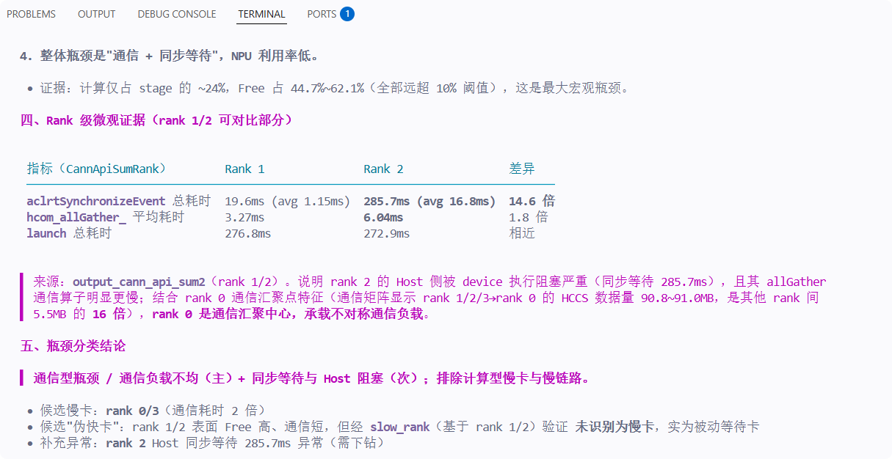
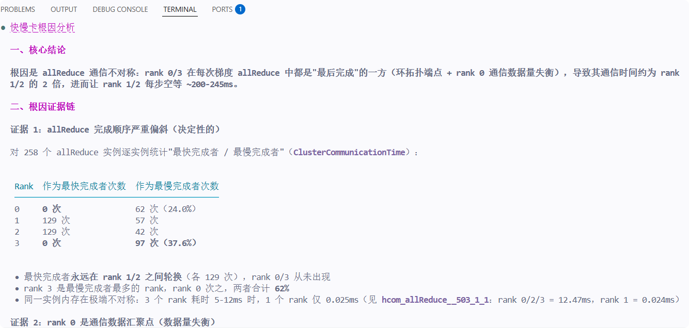
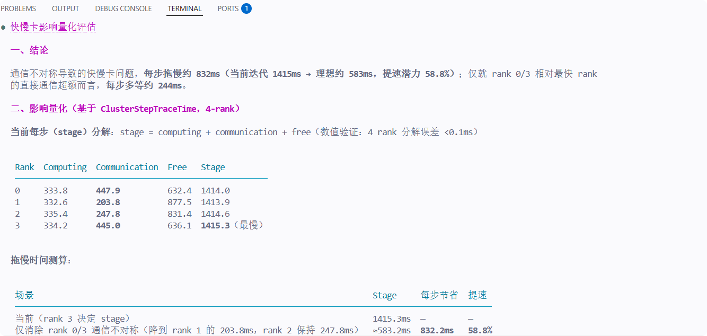

# MSAgent 体验报告
## 一、报告基本信息
| 项目 | 内容 |
|------|------|
| 报告编号 | 1 |
| 体验日期 | 2026-08-20 |
| Agent版本 | v26.1.0a2 |
| Profiling数据来源 | Qwen3-32B |
| 测试目标 | 发现定位性能问题 |

---

## 二、交互记录
### 第 1 轮交互
| 项目 | 内容 |
|------|------|
| 输入 Prompt | 从当前Profiling数据来看，有无集群快慢卡，有什么关键证据 |
| Agent 输出（文字摘要） |   通信型瓶颈 / 通信负载不均（主）+ 同步等待与 Host 阻塞（次）；排除计算型慢卡与慢链路。 • 候选慢卡：rank 0/3（通信耗时 2 倍）      • 候选"伪快卡"：rank 1/2 表面 Free 高、通信短，但经 slow_rank（基于 rank 1/2）验证 未识别为慢卡，实为被动等待卡   • 补充异常：rank 2 Host 同步等待 285.7ms 异常（需下钻）     |
| **输出截图** |  |
| 是否符合预期 | 是 |
| 评价 | 好 |

### 第 2 轮交互

| 项目 | 内容 |
|------|------|
| 输入 Prompt | 造成快慢卡的原因是什么 |
| Agent 输出（文字摘要） |  根因是 allReduce 通信不对称：rank 0/3 在每次梯度 allReduce 中都是"最后完成"的一方（环拓扑端点 + rank 0 通信数据量失衡），导致其通信时间约为 rank 1/2 的 2 倍，进而让 rank 1/2 每步空等 ~200-245ms。 |
| **输出截图** |    |
| 是否符合预期 | 是 |
| 评价 | 好 |

### 第 3 轮交互

| 项目 | 内容 |
|------|------|
| 输入 Prompt | 评估快慢卡问题造成的影响，拖慢了多少时间 |
| Agent 输出（文字摘要） | 通信不对称导致的快慢卡问题，每步拖慢约 832ms（当前迭代 1415ms → 理想约 583ms，提速潜力 58.8%）；仅就 rank 0/3 相对最快 rank 的直接通信超额而言，每步多等约 244ms。    |
| **输出截图** |    |
| 是否符合预期 | 是 |
| 评价 | 好 |

---

## 三、多轮交互整体评价
| 评价维度 | 评分（1~5） | 说明 |
|----------|-------------|------|
| 问题理解准确性 | 5 | |
| 数据分析深度 | 5 |  |
| 证据链条完整性 | 5 | |
| 优化建议实用性 | 5 | |
| 多轮对话连贯性 | 5 | |
| 响应速度与稳定性 | 5 | |
| 整体满意度 | 5 | |

---
## 四、问题与改进建议
### 发现的问题
1. 
2. 
3. 
### 改进建议
1. 
2. 
3. 

