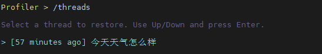
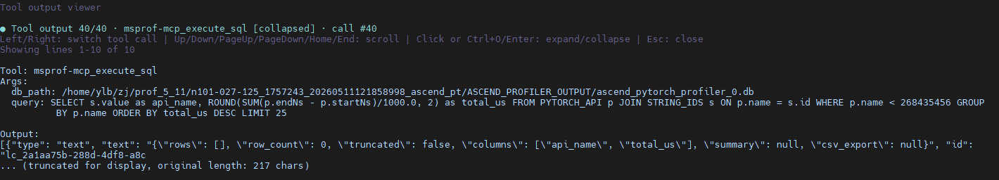

# msAgent快速入门

本文介绍如何配置模型、选择 Agent 功能、启动并进入msAgent最小可用的交互流程。

## 1. 环境准备

1. 安装昇腾NPU驱动和配套版本的CANN软件（包含Toolkit和ops包）并配置环境变量，具体请参见《[CANN 快速安装](https://www.hiascend.com/cann/download)》。
2. 安装本工具，具体请参见《[msAgent安装指南](./install_guide.md)》。

## 2. 配置 LLM

1. 准备一个可用的 LLM API Key。

   需要用户自行登录模型服务商网站进行创建。

2. 配置 LLM。

   包括 LLM 服务的环境变量（*_API_KEY）、通过`msagent config`命令的`--llm-provider`参数配置LLM 服务的协议类型、`--llm-base-url`参数配置模型服务商地址、`--llm-model`参数配置模型名称（模型名称从模型服务商网站的模型广场获取）。

   | 配置场景 | 环境变量 | 配置命令 |
   | --- | --- | --- |
   | OpenAI 兼容接口（如 DeepSeek） | `export OPENAI_API_KEY="your-key"` | `msagent config --llm-provider openai --llm-base-url "https://api.deepseek.com" --llm-model "deepseek-v4-flash"` |
   | 本地 OpenAI 兼容服务 | `export OPENAI_API_KEY="dummy"` | `msagent config --llm-provider openai --llm-base-url "http://127.0.0.1:8000/v1" --llm-model "your-model"` |
   | Anthropic 兼容服务 | `export ANTHROPIC_API_KEY="your-key"` | `msagent config --llm-provider anthropic --llm-base-url "https://example.com/anthropic" --llm-model "claude-sonnet-4-20250514"` |
   | Google / Gemini 服务 | `export GOOGLE_API_KEY="your-key"` | `msagent config --llm-provider google --llm-base-url "https://example.com/google" --llm-model "gemini-2.5-pro"` |

3. 查看当前配置。

   ```bash
   msagent config --show
   ```

   显示步骤2配置的参数值则表示配置成功。

## 3. 启动会话

- 启动并进入默认交互式会话。

  ```bash
  msagent
  ```

- 常用 Agent 启动示例：

  | Agent | 说明 | 启动命令 |
  | --- | --- | --- |
  | [Profiler](../agent_guide/Profiler.md) | 性能调优 | `msagent --agent Profiler` |
  | [Accuracy](../agent_guide/Accuracy.md) | 精度调试 | `msagent --agent Accuracy` |
  | [Quantizer](../agent_guide/Quantizer.md) | 模型量化 | `msagent --agent Quantizer` |
  | [Operator](../agent_guide/Operator.md) | 算子调优 | `msagent --agent Operator` |
  | [Minos](../agent_guide/Minos.md) | 文档辅助 | `msagent --agent Minos` |

- 更多命令请参见《[msAgent使用指南](../user_guide/usemap.md)》。


## 4. 使用技巧

### /threads

浏览并恢复之前的会话线程，列表中按时间倒序展示预览摘要。做过 offload 的线程会显示 `[history offloaded]` 标记，仍可恢复查看。

```text
/threads
```



### /skills

打开交互式 Skill 浏览器，也可直接指定 Skill 或一步传入任务执行：

```text
/skills
/skills my-skill
/skills profiling/my-skill
/skills my-skill 帮我分析当前项目的性能瓶颈
```

同名 Skill 建议带分类路径（如 `profiling/my-skill`）精确匹配。已安装的 Skill 可直接作为斜杠快捷命令调用（如 `/my-skill`）。


### /add-skill

从本地路径安装自定义 Skill，支持指定 Skill 目录或 `SKILL.md` 文件，安装后立即生效。

```text
/add-skill path/to/skill
/add-skill path/to/SKILL.md
```


### /tool-output

打开全屏工具输出查看器，浏览较长的工具输出内容。也可用快捷键 `Ctrl+O` 直接打开。

```text
/tool-output
```

查看器内操作：

| 操作 | 说明 |
| --- | --- |
| 左右方向键 | 切换多个工具输出 |
| 上下方向键、`PageUp`/`PageDown` | 滚动内容 |
| `Enter` / `Ctrl+O` / 鼠标点击 | 展开或折叠完整输出 |
| `Esc` | 关闭查看器 |



更完整的命令和快捷键说明请参见《[msAgent使用指南](../user_guide/usemap.md)》。

