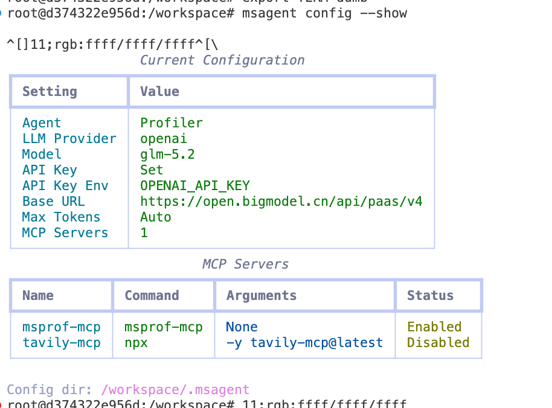
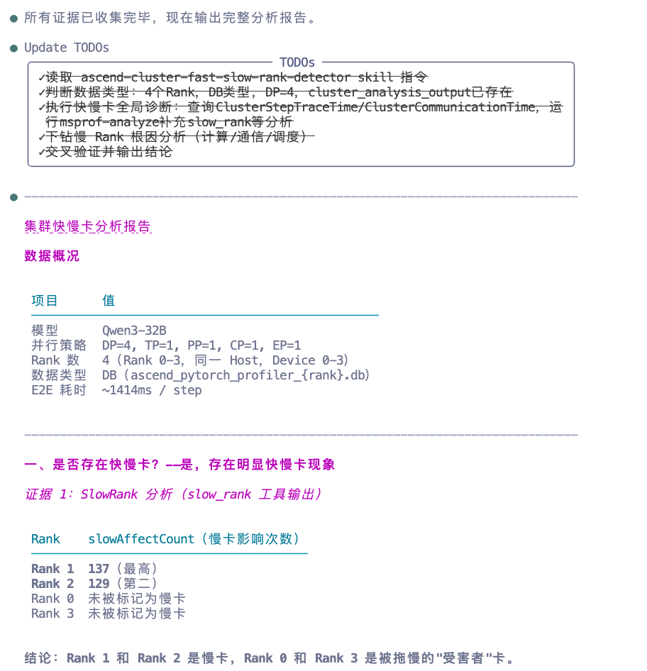
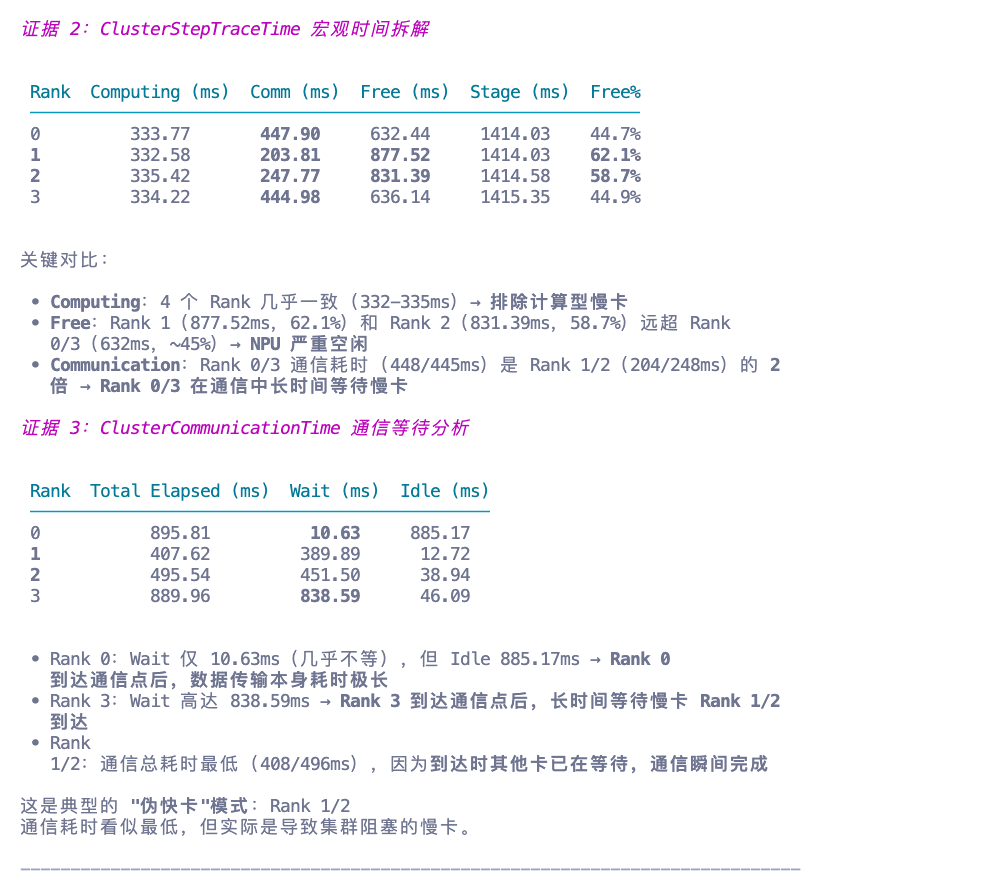
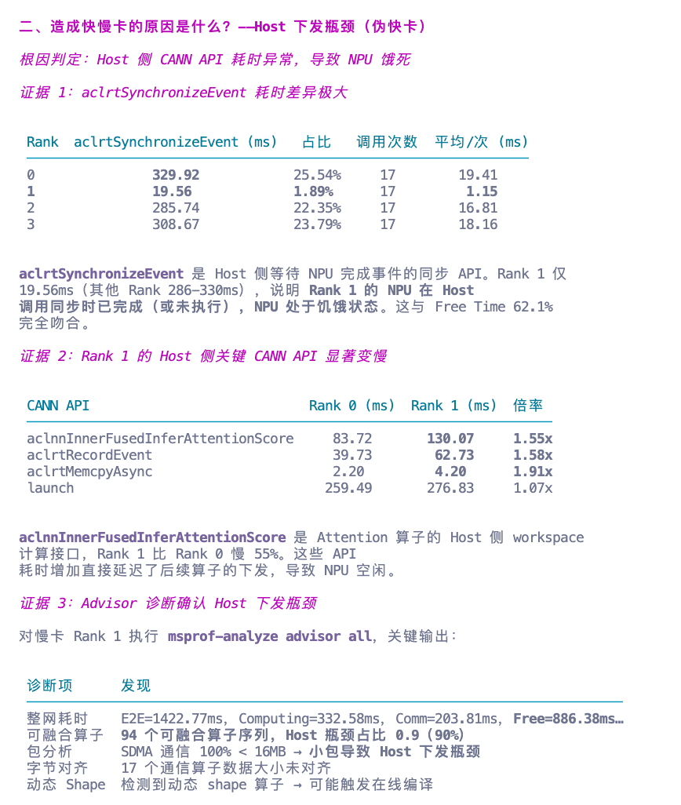
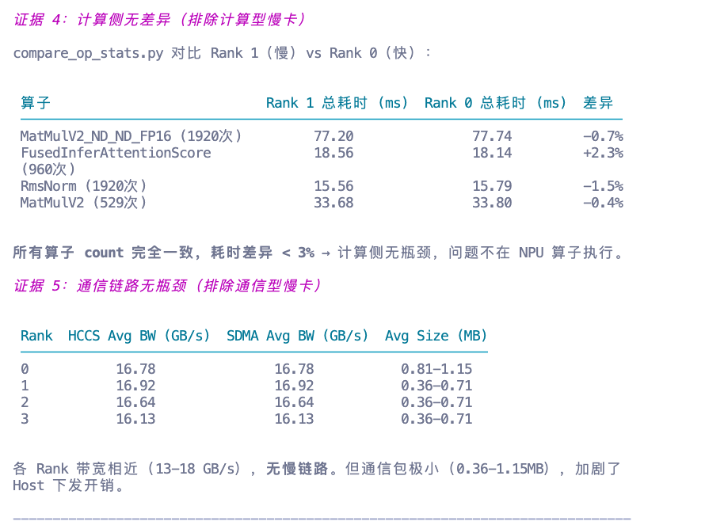
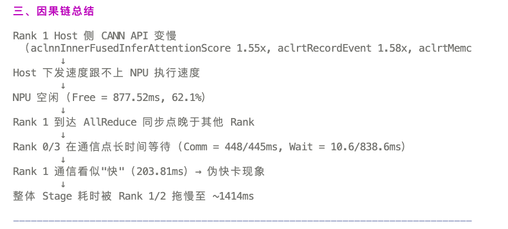
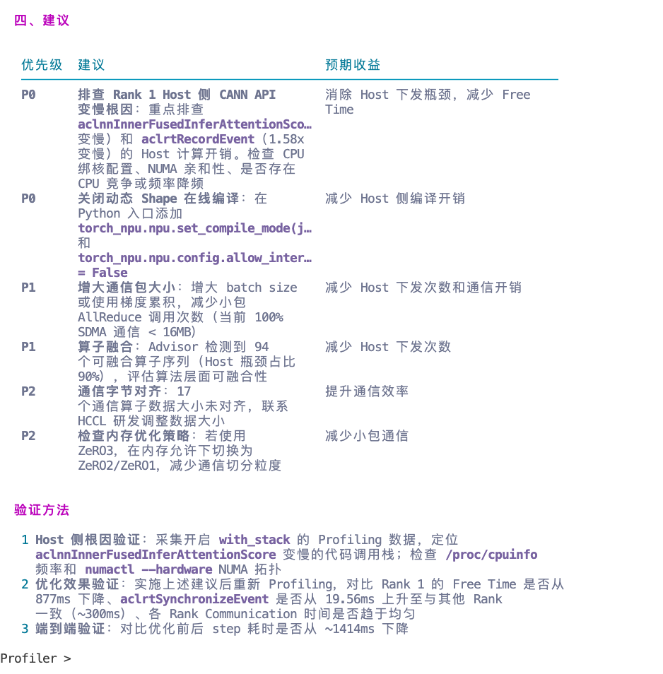

# MSAgent 体验报告

## 一、报告基本信息
| 项目             | 内容                                            |
|----------------|-----------------------------------------------|
| 报告编号           | 淬火行动-20260819-rociss周鹏-msagent使用体验报告          |
| 体验日期           | 2026-08-20                                    |
| Agent版本        | 26.1.0a2                                      |
| Profiling数据来源  | /workspace/rociss（Qwen3-32B 推理场景，4 卡 DP=4，DB 类型数据） |
| msAgent配置     |  接入glm-5.2     |
| 测试目标           | 验证Agent分析 Ascend 集群 Profiling 数据中，问题的自动诊断能力   |

---

## 二、交互记录

### 第 1 轮交互

| 项目 | 内容                                                                                                                                                                                                                                                                                                                     |
|------|------------------------------------------------------------------------------------------------------------------------------------------------------------------------------------------------------------------------------------------------------------------------------------------------------------------------|
| 输入 Prompt | 从当前Profiling数据来看，有无集群快慢卡，有什么关键证据”，“造成快慢卡的原因是什么“                                                                                                                                                                                                                                                                        |
| Agent 输出（文字摘要） | 总结
  Rank 1 Host 侧 CANN API 变慢
   （aclnnInnerFusedInferAttentionScore 1.55x, aclrtRecordEvent 1.58x, aclrtMemc
          ↓
  Host 下发速度跟不上 NPU 执行速度
          ↓
  NPU 空闲（Free = 877.52ms, 62.1%）
          ↓
  Rank 1 到达 AllReduce 同步点晚于其他 Rank
          ↓
  Rank 0/3 在通信点长时间等待（Comm = 448/445ms, Wait = 10.6/838.6ms）
          ↓
  Rank 1 通信看似"快"（203.81ms）→ 伪快卡现象
          ↓
  整体 Stage 耗时被 Rank 1/2 拖慢至 ~1414ms |

| **输出截图** |

  

| 是否符合预期 | ✅️是　□ 否                                                                                                                                                                                                                                                                                                                |
| 评价 |                                                                                                                                                                                                                                                                                                                        |

## 三、交互整体评价

| 评价维度 | 评分（1~5） | 说明 |
|----------|-------------|------|
| 问题理解准确性 | 5 | 精准识别Qwen3-32B模型DP4并行训练场景下的集群快慢卡问题，准确判定伪快卡核心特征，精准匹配昇腾集群快慢卡检测分析能力，场景识别准确无误、无偏差、无错判。 |
| 数据分析深度 | 5 | 具备完善的层级化分析能力，遵循从宏观到微观的下钻逻辑：依托Step时序、SlowRank数据完成宏观研判，通过通信时延分布开展中层分析，基于CANN API、算子性能、通信带宽及Advisor诊断实现微观定位，层层递进精准锁定核心瓶颈。 |
| 证据链条完整性 | 5 |构建多维度交叉验证的完整证据闭环，通过慢卡统计、集群时序拆解、通信时序分析、Host API耗时对比、算子与通信链路校验五大维度相互佐证，逐层排除计算、通信链路类瓶颈，根因推导逻辑严谨、论据充分、无逻辑漏洞。 |
| 优化建议实用性 | 4 |优化方案采用P0/P1/P2分级设计，层级清晰、贴合根因、落地性强，覆盖紧急故障排查、性能效率优化、细节精度提升三大方向，同时配套标准化效果验证方案；仅部分优化手段（通信字节对齐、ZeRO策略调整）依赖外部研发支持与硬件资源条件，自主落地存在一定限制。 |
| 多轮对话连贯性 | 5 | 多轮分析逻辑连贯统一，从现象识别、根因下钻、因果梳理到优化方案输出，全程结论一致、递进有序，基于已有证据深化分析，无重复论证、逻辑冲突及结论跑偏问题。 |
| 响应速度与稳定性 | 3 |分析过程整体稳定可靠，无报错、无中断，输出内容规范完整；但因多次调用msprof-analyze、算子对比脚本等工具，叠加工具固有耗时，导致整体分析周期偏长，响应效率存在明显短板。 |
| 整体满意度 | 4 |整体分析输出质量优异，具备判定精准、证据完备、根因透彻、方案体系化的优势，可有效支撑集群性能调优工作；核心扣分点为工具调用耗时叠加导致整体响应效率偏低，是主要优化短板。 |

---

## 四、问题与改进建议

### 发现的问题

1. 工具调用耗时较高，整体分析响应效率不足。分析过程需多次调用msprof-analyze、算子对比脚本等工具，工具固有耗时叠加，导致完整分析周期偏长，实时性有待提升。
2. 部分优化方案落地局限性较强。输出的P2级优化建议如通信字节对齐、ZeRO内存策略调整，无法独立完成落地，高度依赖外部研发支持、硬件资源条件，自主落地执行能力不足。
3. 工具执行流程未做效率优化。多类诊断工具串行重复执行，未做任务合并、并行调度处理，进一步放大分析耗时，影响整体输出效率。

### 改进建议

1. 优化工具调度机制，提升分析响应速度。整合msprof-analyze、算子对比等诊断工具，支持任务并行执行、重复任务合并，减少工具串行耗时；同时优化 Profiling 数据采集逻辑，精简冗余采集流程，压缩整体分析周期。
2. 分层细化优化方案，明确落地边界与替代方案。针对依赖外部条件的优化项，补充轻量化、可自主落地的替代优化策略；同时清晰标注各方案落地前置条件、适配场景，提升方案实用性与可落地性。
3. 建立分级工具执行策略。针对常规快慢卡分析场景，配置轻量化工具执行链路，默认跳过冗余深度诊断；仅复杂疑难场景启用全量工具分析，兼顾分析精度与响应效率。
