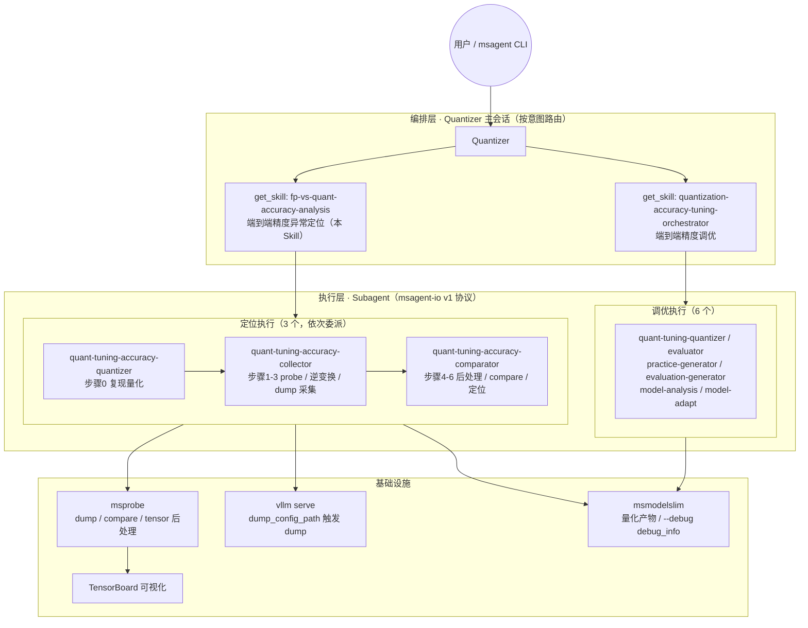
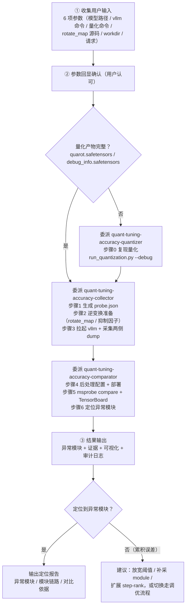

# 设计文档：fp-vs-quant-accuracy-analysis（端到端量化精度异常定位）

> 整体方案设计文档
> 版本：0.5.0 | 更新日期：2026-08-03
> 设计方法论参考：msmodelslim-design（Q0-Q8 结构化设计）

---

## 0. 需求与变更摘要

### 0.1 需求来源

[new_dev.md](../../../new_dev.md)：Agent 当前仅支持 LLM 调优（调整 Practice YAML 提升量化精度），但当出现**算子异常**（量化实现与浮点行为不一致）或**框架组图异常**（量化后计算图结构异常）时，调优无法继续，需要一种精度异常定位能力：对比浮点权重推理与量化权重推理的中间激活值，找到首个出现显著偏差的模块。

### 0.2 本次设计要点（v0.5.0）

| 变更 | 说明 |
|------|------|
| **与调优并列的端到端流程** | 由"调优互斥路径"重构为"与 `quantization-accuracy-tuning-orchestrator` 并列的端到端 workflow skill"，由 Quantizer 主会话按意图路由加载 |
| **执行层 subagent 化（对齐 orchestrator 两层架构）** | 编排层（主会话）收集输入/委派/汇总；执行层由 **3 个执行 subagent** 承载：`quant-tuning-accuracy-quantizer`（步骤0）、`quant-tuning-accuracy-collector`（步骤1-3）、`quant-tuning-accuracy-comparator`（步骤4-6） |
| **SKILL.md 编排化** | 重写为 workflow 编排风格：整体设定（编排者角色）+ 执行委派小节 + 用户输入确认 → 步骤 0-6（执行依据）→ 结果输出 |
| **约束冲突修正** | Quantizer 硬性规则"禁止读代码仓"增加豁免：本流程需阅读用户明确提供的 `get_rotate_map` 源码位置 |

---

## Q0 业务场景分析

### 用户与流程

- **用户**：Quantizer Agent 的使用者（量化调优用户）
- **使用流程**：用户向 Quantizer 提出"量化后精度异常/定位异常模块"需求 → Quantizer 按意图路由加载本 Skill → 端到端执行定位 → 输出异常模块结论与证据

### 场景用例

| 用例 | 触发条件 | 说明 |
|------|---------|------|
| 量化精度异常定位（主场景） | 量化推理出现精度异常，需定位到具体 module | 对比浮点 vs 量化 dump，定位首个"输入一致、输出不一致"模块 |
| 调优无法继续时定位 | 算子/框架组图异常导致调优流程无法继续 | 先定位异常模块，为修复提供方向 |
| 量化方案排查 | W8A8 + QuaRot + SmoothQuant 等方案 | 支持逆变换后对齐数值空间再比对 |

### 上下游依赖

```
msmodelslim 量化（--debug）→ 量化产物（quarot.safetensors / div.mul_scale / debug_info）
        → 本 Skill：复现量化(可选) → probe 配置 → 逆变换准备 → vllm serve dump 采集
        → msprobe compare 比对 → 异常模块结论
        → （若确认为累积误差）反馈回 quantization-accuracy-tuning-orchestrator 继续调优
```

### 成功标准（验收条件）

参照 new_dev.md 验收用例（MiniMax-M3 W8A8，A2/A3 硬件）：

1. Agent 自行采集浮点权重推理 dump 数据
2. Agent 自行采集量化权重推理 dump 数据
3. Agent 自行用调试模式复现量化过程，获取旋转和抑制中间量，设计逆过程方案并提供对应 msprobe 配置
4. Agent 自行对比分析 dump 数据，输出异常模块结论与证据

---

## 整体架构与端到端流程

### 系统架构

本 Skill 与精度调优并列，共享 Quantizer 的"编排层 + 执行层"两层架构：



### 端到端执行流程



---

## Q1 接口设计

### 功能入口

| 入口 | 说明 |
|------|------|
| Skill 加载 | `get_skill(name="fp-vs-quant-accuracy-analysis")`，由 Quantizer 主会话按意图路由加载（**无需新增** Agent/子命令） |
| 用户输入 | 6 项参数（见下表），获取后**回显确认**方可执行 |

### 用户输入参数

| # | 输入项 | 类型 | 必需 | 校验约束 |
|---|--------|------|------|---------|
| 1 | 浮点/量化权重模型路径 | string | ✅ | 必须由用户提供，禁止无范围搜索；量化路径须含对应产物 |
| 2 | vllm serve 启动命令或脚本 | string | ✅ | 用户模型特定参数（TP、max-model-len 等） |
| 3 | msmodelslim 模型适配器文件路径 | string | QuaRot 必需 | 含 `get_rotate_map`，定义旋转作用范围 |
| 4 | 模型结构文件路径（transformers `modeling_*.py`） | string | QuaRot 必需 | 模型层级结构与激活流向 |
| 5 | 保存路径（输出目录） | string | ✅ | 中间产物与结果目录；用户指定优先，缺省 agent 建议 |
| 6 | 推理请求内容 | object | ⬜ | 触发 dump 的 prompt，默认 `"Hello" + max_tokens=1`（`step=[0]` 只采一次）；异常仅在特定输入复现时由用户提供 |

**无需用户提供**（agent 自主获取/推断）：
- 量化配置 `{model_type}_best_practice.yaml`：在量化权重模型路径下自主查找（范围明确，不违反禁止搜索规则）
- msmodelslim 量化命令：以自主获取的 yaml 为 `--config-path` + `--debug` 自然语言拉起复现（`model_type` 从 yaml 或模型路径推断，`device` 默认 `npu:0`）

### 参数与约束

- 默认 `step=[0], rank=[0]`（1 step + 1 rank），用户可通过参数扩展
- 量化产物路径要求：`quant_model_weights.safetensors`（NonFusion）、`optional/quarot.safetensors`（QuaRot）、`debug_info/debug_info.safetensors`（Fusion，需 `--debug`）
- 不存在的路径必须向用户索取，**禁止** ls/glob/递归搜索

### 安全敏感操作

- 本 Skill 会拉起用户环境的 vllm serve 服务并发送推理请求（复用用户提供的启动命令，不新增服务）
- 结论禁止编造：所有指标必须来自真实 dump 数据并附证据（路径、md5、shape）
- 审计日志（`--audit-log <workdir>/audit.jsonl`）全流程记录

---

## Q2 应用分析（Quantizer Agent 层）

| 组件 | 状态 | 变更内容 |
|------|------|---------|
| `resources/configs/default/agents/Quantizer.yml` | 🔧 修改 | `skills.patterns` 保留 `default:fp-vs-quant-accuracy-analysis`；`subagents` 注册 3 个执行 subagent（quantizer/collector/comparator），共 9 个 |
| `resources/configs/default/prompts/agents/Quantizer.md` | 🔧 修改 | Skill 调用规则表加入本 Skill 并标注端到端定位；新增「两条端到端流程（按意图路由）」段落（并列而非互斥，一次任务只走一条，可先后衔接）；委派规则表加 3 个执行 subagent 行；委派协议第 3 点字段表引用；硬性规则第 5 条"禁止读代码仓"增加 `get_rotate_map` 源码阅读豁免 |

**应用层诉求**：Quantizer 需要两种并列的端到端能力（调优 / 定位），通过用户意图路由。**不**要求应用层直接执行定位细节——细节全部由本 Skill 的编排文档承载。

---

## Q3 领域分析（Skill 体系）

### 3.1 与 quantization-accuracy-tuning-orchestrator（并列端到端）

| 维度 | 精度调优（orchestrator） | 精度异常定位（本 Skill） |
|------|--------------------------|--------------------------|
| skill_class | workflow | workflow |
| 加载方式 | 主会话 `get_skill` | 主会话 `get_skill` |
| 流程结构 | 用户输入 → 环境/模型准备 → 调优循环 → 结果输出 | 用户输入 → 步骤 0-6 → 结果输出 |
| 内部执行 | 委派 6 个执行类 subagent + 编排层 execute 脚本 | **委派 3 个执行类 subagent**（quantizer/collector/comparator） |
| 委派协议 | msagent-io v1（subagent_io_protocol.md） | msagent-io v1（同一协议，字段表见本 skill references/subagent_io.md） |
| 关系 | **并列**：按用户意图二选一；定位结论可反馈回调优 | 同左 |

**关键决策**：执行层 subagent 化，与 orchestrator 两层架构（编排层 + 执行层）对齐。**按能力拆 3 个而非每步 7 个**：重型步骤（量化复现、拉服务采集 dump、compare 比对）全部 agent 化以获得上下文隔离与失败重试隔离；轻脚本步骤（生成 probe、格式转换、生成配置）并入相邻重步骤作为前置准备——一次性线性流程的 7 层委派协议链开销过大，且中间产物（probe/dump/postprocess 路径）逐层传递成本高。subagent 拆分与职责：

| subagent | 承载步骤 | 职责 |
|----------|---------|------|
| `quant-tuning-accuracy-quantizer` | 步骤 0 | 调试模式复现量化（对齐 quantizer 能力） |
| `quant-tuning-accuracy-collector` | 步骤 1-3 | probe 生成 + 逆变换准备 + 拉 vllm 采集 dump |
| `quant-tuning-accuracy-comparator` | 步骤 4-6 | 后处理配置 + compare + 定位异常模块 |

### 3.2 与执行类 Skill 的边界

- `quant-tuning-quantize` 等执行类 skill 由对应 subagent 承载，**仅**服务于 orchestrator 循环
- 本 Skill 步骤 0 的量化复现使用**自有脚本** `run_quantization.py`（同一 msmodelslim 命令，独立封装），不委派 quant-tuning-quantizer
- 领域协议：本 Skill 不参与 msagent-io 委派协议（该协议仅调优体系使用）

---

## Q4 组件分析（Skill 内部）

### 4.1 保留组件（✅ 无变更）

| 组件 | 说明 |
|------|------|
| `scripts/run_quantization.py` | 调试模式复现量化（`--debug`），产出旋转/抑制中间量 |
| `scripts/gen_msprobe_config.py` | 生成 probe.json（默认 L0 / step0 / rank0） |
| `scripts/convert_rotation_to_npy.py` | 旋转矩阵 safetensors → npy |
| `scripts/convert_suppression_to_npy.py` | NonFusion `div.mul_scale` → diag(s) npy |
| `scripts/extract_fusion_scales.py` | Fusion `smooth_scales.*` → diag(s) npy |
| `scripts/gen_postprocess_config.py` | 生成 msprobe tensor 后处理配置（统一 matmul） |
| `scripts/inspect_dump.py` | dump 结构检查、提取实际 data_name |
| `scripts/audit_log.py` | 审计日志公共模块 |
| `examples/rotate_map_minimax_m3.json` | 旋转作用范围参考示例 |
| `references/rotate_map_minimax_m3.md` | MiniMax-M3 旋转作用范围说明 |
| `README.md` / `faq.md` | 快速开始 / 常见问题 |

### 4.2 修改组件（🔧）

| 组件 | 变更内容 |
|------|---------|
| `SKILL.md` | 重写为 workflow 编排风格：恢复 `metadata`（`skill_class: workflow`、aliases、trigger_intents）；新增整体设定（编排者角色）、执行委派小节、用户输入回显确认、结果输出环节；步骤 0-6 脚本流程保留（作为执行层依据） |
| `DESIGN.md`（本文档） | 按 Q0-Q8 方法论重构，修正过时内容（SmoothQuant 逆变换、流程步骤数、脚本清单），同步执行 subagent 层设计 |
| `references/subagent_io.md` | 新增：3 个执行 subagent 的 input/output 字段表与委派顺序（对齐 orchestrator quantization_tuning.md 风格） |

### 4.3 新增执行层组件（🆕）

| 组件 | 说明 |
|------|------|
| `resources/configs/default/subagents/quant-tuning-accuracy-quantizer.yml` | 执行层-步骤 0，`skills.patterns: [default:fp-vs-quant-accuracy-analysis]` |
| `resources/configs/default/subagents/quant-tuning-accuracy-collector.yml` | 执行层-步骤 1-3 |
| `resources/configs/default/subagents/quant-tuning-accuracy-comparator.yml` | 执行层-步骤 4-6 |
| `resources/configs/default/prompts/subagents/quant-tuning-accuracy-{quantizer,collector,comparator}.md` | 各执行层 prompt：读 msagent-io input → 按 SKILL.md 对应步骤执行 → 按输出协议回传 |

---

## Q5 基础设施分析

| 基础设施 | 状态 | 承载的诉求 |
|----------|------|-----------|
| msprobe（mindstudio-probe） | ✅ 无变更 | dump 采集（`task=tensor, level=L0`）；compare 比对（`cos,md5,max_diff`）；tensor 后处理（逆变换，compare 阶段实时生效） |
| vllm-ascend | ✅ 无变更 | 通过 `--additional-config '{"dump_config_path": ...}'` 触发 dump；`--enforce-eager` 前提 |
| msmodelslim | ✅ 无变更 | 量化产物（`quarot.safetensors` / `div.mul_scale` / `debug_info.safetensors`）；`{model_type}_best_practice.yaml` 的 `spec.process` 是复现判断依据；Fusion scales 依赖量化时 `--debug` |
| TensorBoard | ✅ 无变更 | compare 结果可视化 |

**技术选型关键决策**（详见附录 A 决策 3.1/3.7/3.9/3.10）：

- 逆变换用 **msprobe 原生 tensor 后处理**（非自写脚本改 dump）：官方能力、与 compare 无缝集成、不污染原始 dump、配置可迭代
- 逆抑制用 **diag(s) 对角矩阵 + matmul** 等价替换逐元素乘法：msprobe 后处理仅支持 matmul，方案 B 零改动、数学严格等价
- dump 通过 **vllm serve 集成**触发（非独立运行 msprobe 命令行）：与生产部署形态一致
- 后处理在 **compare 阶段生效**（非 dump 阶段）：msprobe 源码验证（`CompareRealData.compare_by_op` 第 2.5 步，读入 tensor 后、校验前）

---

## Q6 性能评估

| 维度 | 评估 | 说明 |
|------|------|------|
| 采集开销 | 默认 1 step + 1 rank | 一个 token 的激活足够定位首个偏差模块，数据量最小化 |
| diag(s) 磁盘 | ~144MB/个（hidden=6144） | MiniMax-M3 场景；msprobe 逐算子加载，不会爆内存；随 hidden² 增长，超大模型需评估 |
| compare 内存 | 逐 tensor 读入处理 | 后处理在内存中作用，不落盘 |
| 流程耗时 | 主耗时在 dump 采集与 compare | 脚本均为秒级/分钟级确定性操作 |

---

## Q7 模块开发顺序

按"领域 → 应用 → 接口/资料"顺序：

| 阶段 | 内容 | 并行性 | 验收点 |
|------|------|--------|--------|
| 1. 技术调研 | msprobe 机制验证（后处理时机、vllm 集成、dump 格式） | — | 决策 3.1-3.10 依据成立 |
| 2. 脚本开发 | 7 个 scripts/ 脚本 + 审计模块 | 各脚本可并行 | 单脚本可执行、产物正确 |
| 3. Skill 编排 | SKILL.md 工作流 + DESIGN.md + references/examples | 与阶段 2 部分并行 | 按 SKILL.md 可走通全流程 |
| 4. Agent 集成 | Quantizer.yml / Quantizer.md 路由与约束 | — | 意图路由正确、约束无冲突 |
| 5. 端到端验证 | MiniMax-M3 W8A8（A2/A3）验收用例 | — | new_dev.md 4 条验收标准通过 |

---

## Q8 变更覆盖检查

| 变更项 | 覆盖章节 |
|--------|---------|
| SKILL.md 编排化重写 + 执行委派小节 | Q4.2 |
| 并列端到端定位（与 orchestrator 关系） | Q0 / Q2 / Q3.1 |
| 执行层 subagent 化（3 个执行 subagent + 字段表） | Q3.1 / Q4.2 / Q4.3 |
| Quantizer.yml / Quantizer.md 集成修改 | Q2 |
| 读源码豁免（硬性规则第 5 条） | Q2 |
| scripts / references / examples 组件 | Q4.1 |
| msprobe / vllm / msmodelslim 基础设施依赖 | Q5 |
| 本文档（DESIGN.md）重构 | 本文档 |
| skills/README.md 索引（已并入 HEAD 提交） | Q2 周边 |

无未归类变更项。

---

## 输出汇总

### 第一阶段：变更清单

| 模块 | 类别 | 变更类型 | 服务场景 | 修改内容 |
|------|------|---------|---------|---------|
| fp-vs-quant-accuracy-analysis/SKILL.md | Skill 组件 | 🔧 | 端到端定位编排 | workflow 风格重写（metadata/整体设定/执行委派/输入确认/结果输出）；步骤 0 改为基于 `{model_type}_best_practice.yaml` 算法判断复现；步骤 2.1 rotate_map 输入拆为适配器文件 + 模型结构文件 |
| fp-vs-quant-accuracy-analysis/DESIGN.md | Skill 组件 | 🔧 | 设计文档 | Q0-Q8 重构，同步执行 subagent 层设计 |
| fp-vs-quant-accuracy-analysis/references/subagent_io.md | Skill 组件 | 🆕 | 执行层委派契约 | 3 个执行 subagent 的 input/output 字段表 |
| quant-tuning-accuracy-quantizer.yml/.md | 配置/Prompt | 🆕 | 执行层-步骤0 | 调试模式复现量化，回传产物路径 |
| quant-tuning-accuracy-collector.yml/.md | 配置/Prompt | 🆕 | 执行层-步骤1-3 | probe 生成 + 逆变换准备 + dump 采集 |
| quant-tuning-accuracy-comparator.yml/.md | 配置/Prompt | 🆕 | 执行层-步骤4-6 | 后处理配置 + compare + 定位异常模块 |
| Quantizer.yml | 应用配置 | 🔧 | Agent 集成 | subagents 注册 3 个执行 subagent（共 9 个） |
| Quantizer.md | 应用 Prompt | 🔧 | 意图路由 | 并列端到端流程段落、委派规则 3 行、字段表引用、读源码豁免 |
| subagent_io_protocol.md | 协议文档 | 🔧 | 协议适用表 | 登记 3 个执行 subagent（字段定义指向本 skill） |
| skills/README.md | 索引 | 🔧（已在 HEAD） | skill 索引 | fp-vs-quant 归入 2.3 量化 Skills |
| scripts/ + references/ + examples/ | Skill 组件 | ✅ | 执行与参考 | 无变更（7 脚本 + 2 参考文件） |

### 第二阶段：开发计划

1. **技术调研**（阶段 1）：msprobe/vllm 机制验证 → 验收：决策 3.1-3.10
2. **脚本开发**（阶段 2，可并行）：7 个脚本 → 验收：单脚本可执行
3. **Skill 编排**（阶段 3）：SKILL.md + DESIGN.md → 验收：全流程可走通
4. **Agent 集成**（阶段 4）：Quantizer 路由与约束 → 验收：意图路由正确
5. **端到端验证**（阶段 5）：MiniMax-M3 W8A8（A2/A3）→ 验收：new_dev.md 4 条标准

---

## 附录 A：核心技术决策（编号保留，供 SKILL.md/README.md 引用）

### 决策 3.1：用 msprobe tensor 后处理做逆变换（非自写脚本改 dump）

- 方式 A（自写脚本改 dump）vs 方式 B（msprobe 后处理配置）
- **决策**：方式 B。理由：官方支持、与 compare 流程无缝集成、避免解析 dump 文件格式、配置可复用可审计

### 决策 3.2：旋转矩阵格式从 safetensors 转换为 npy

msmodelslim 产物为 `safetensors`（`global_rotation` key），msprobe 后处理只支持 pt/npy。转换无损。

### 决策 3.3：SmoothQuant 抑制需要逆变换（NonFusion + Fusion 都需要）

**NonFusion 路径**（从 `div.mul_scale` 获取）：
- 量化后模块结构变化：Linear 被包装为 `NonFusionSmoothQuantWrapper`，内部 Linear 名为 `<prefix>.linear`
- msprobe 对 Wrapper 外层与内部 Linear 产生两条 dump 记录，默认 outer merge 无法匹配浮点侧
- 能匹配的内部 Linear 输入为 `x/s`（被抑制缩放），与浮点侧 `x` 不一致
- 保存值 `div.mul_scale = 1/s`；推理时 `x' = x/s`；**逆变换 `x = x' * s`**

**Fusion 路径**（从 `debug_info.safetensors` 提取，需量化时 `--debug`）：
- s 被吸收进相邻层权重（`W_up /= s`，`W_down *= s`），不保存 `div.mul_scale`
- msmodelslim 在 `subgraph_fusion.py:57` 将 s 写入 context 的 `smooth_scales` namespace，受 `enable_debug and is_rank_zero()` 双重门控，量化加 `--debug` 才落盘
- `debug_info` 保存值 `scales = s`；脚本保存 npy 值 `1/s`；**逆变换 `x = x' * s`**（对上游层输出 = 下游 Linear 输入做后处理）

### 决策 3.4：msmodelslim context 机制（Fusion scales 获取的基础）

- `IContext` 贯穿量化流程：`ctx[key] → INamespace`，`.state`（始终生效）/ `.debug`（受 `enable_debug` 门控）
- `DebugDict.__setitem__` 双重门控：`enable_debug=False` 静默丢弃；`=True` 仅 rank0 写入
- 落盘：`naive_quantization/__main__.py` 的 `--debug` 参数触发 `DebugInfoPersistence.save_from_context`
- **结论**：Fusion scales 完全依赖量化时 `--debug`，不开则无法提取

### 决策 3.5：定位用 msprobe compare + TensorBoard 可视化

msprobe compare 指标完整（COS/相对误差/最大值误差），TensorBoard 分级可视化构图比对，无需自写比对逻辑。

### 决策 3.6：旋转矩阵从 `quarot.safetensors` 加载而非重新生成

产物文件是量化实际使用的 R，最可靠；重新生成依赖 seed 不变。**限制**：仅支持离线 QuaRot。

### 决策 3.7：逆抑制用 diag(s) 对角矩阵 + matmul 等价替换（方案 B）

- msprobe tensor 后处理原生仅支持 matmul（`_PROCESSOR_REGISTRY = {"right_matmul", "matmul"}`），不支持逐元素运算
- **方案 B**：`x * s = x @ diag(s)`（x 最后一维为 hidden 时 numpy matmul 自动广播）
- 方案对比：A（扩展 msprobe，需改源码）❌ / **B（diag(s)+matmul，零改动）✅** / C（自写脚本）❌ / D（混合）❌
- 选择理由：零改动、统一 matmul 形式、磁盘开销可接受（6144²×4B ≈ 144MB/个，逐算子加载）、数学严格等价
- msprobe 后处理机制：`TensorPostprocessManager` 在**比对时实时处理**（读入 tensor 后、校验前），不修改 dump 文件；YAML 放 `tensor_postprocess/` 目录自动扫描

### 决策 3.8：模型无关设计（不硬编码模型类型）

初版硬编码 `--model-type minimax_m3` 与内置旋转规则。**改为 `--rotate-map` 参数以 JSON 文件传入**（`right_input`/`right_output`/`left_output` 分类），支持任意模型，新模型只需提供 rotate_map.json。

rotate_map.json 的生成需要**两个模型侧输入文件**（用户提供路径，禁止搜索）：

| 输入 | 用途 | 示例 |
|------|------|------|
| msmodelslim 模型适配器文件 | `get_rotate_map` 定义旋转作用范围（`rot_right`/`rot_left`/`pre_run`，key 为完整模块路径） | `msmodelslim/model/minimax_m3/model_adapter.py` |
| 模型结构文件（transformers） | 模型层级结构与激活流向：模块嵌套关系、哪些激活处于旋转空间（如 embed_tokens 输出右旋、RMSNorm 位于旋转空间内）、哪些不旋转 | `transformers/models/minimax_m3_vl/modeling_minimax_m3_vl.py` |

适配器 key 为完整模块路径（如 `model.language_model.layers.0.self_attn.q_proj`），需结合模型结构文件提取为模块名（如 `q_proj`）并确认旋转空间内的中间模块。

### 决策 3.9：dump 通过 vllm serve 集成（不独立运行 msprobe 命令行）

- 生产环境模型通过 vllm serve 服务化部署，dump 在服务化推理中触发
- `--additional-config '{"dump_config_path": ...}'`：由 vllm-ascend 解析（`NPUModelRunner.__init__` 传给 `PrecisionDebugger`），probe.json 格式与 msprobe 原生 config.json 一致
- 每次推理请求触发一次 start→前向→stop→step；`--enforce-eager` 必须（dump 仅 eager 模式生效）
- 配置字段：`level: "L0"`（模块级）、`scope` 在 task 子块内、`data_mode`/`summary_mode`/`async_dump`/`dump_enable`

### 决策 3.11：复现量化判断基于 `{model_type}_best_practice.yaml` 算法配置（非产物完整性）

**背景**：初版以"量化产物是否完整"（`quarot.safetensors` / `debug_info.safetensors` 是否存在）决定是否复现。但产物缺失不等于需要复现（纯 W8A8 场景本就不需要中间量），产物存在也不等于免复现（抑制 scales 仅 debug 模式落盘）。

**决策**：在量化权重模型路径下**自主获取** `{model_type}_best_practice.yaml`（用户无需提供路径；该文件即用户量化配置本身），按 `spec.process` 的 **processor 算法类型集合** + 产物现状判断：

| `spec.process` 配置 | 产物现状 | 是否需要复现 |
|---------------------|---------|-------------|
| 含旋转类算法 | 无 `optional/`（如 `quarot.safetensors`） | ✅ 复现（产出旋转矩阵） |
| 含旋转类算法 | 已有 `optional/` | ❌ 不需要（旋转矩阵已保存） |
| 含抑制类算法 | 无 `debug_info/debug_info.safetensors` | ✅ 复现（`--debug` 产出抑制 scales） |
| 含抑制类算法 | 已有 `debug_info/debug_info.safetensors` | ❌ 不需要（抑制中间量已保存） |
| 无旋转、无抑制（纯线性量化） | — | ❌ 不需要 |

**算法类型集合**（对应 `spec.process[].type`，msmodelslim 支持多旋转/多抑制算法，清单见 msmodelslim《量化算法总览》）：

| 类别 | processor type |
|------|---------------|
| 旋转类 | `quarot`、`adapt_rotation` |
| 抑制类 | `smooth_quant`、`iter_smooth`、`flex_smooth_quant`、`flex_awq_ssz`、`awq`、`kv_smooth`、`oasq` |
| 不支持 | `online_quarot`（在线旋转，旋转矩阵分散保存） |

集合外的 processor（如 `linear_quant`、`fa3_quant`、`gptq`、`autoround` 等）不产生旋转/抑制中间量需求。

**关键区分**：
- 旋转矩阵是量化产物的**常规输出**（`export_extra_info: true` 时导出 `optional/quarot.safetensors`），**无需 debug 模式**——产物有 `optional/` 目录即可直接用
- 抑制 scales（`smooth_scales.*`）是 **debug 中间量**，仅量化时加 `--debug` 落盘到 `debug_info/`——配置了抑制且无 `debug_info` 时必须复现
- 复现用 yaml 应与用户量化配置一致（相同 process 列表），保证中间量与产物同源

**维护注意事项**：算法类型集合为**静态维护清单**（SKILL.md 步骤 0 / DESIGN.md 决策 3.11 / quantizer subagent prompt 三处同步）。msmodelslim 算法持续演进，新增旋转或抑制类算法时必须同步更新三处集合，否则会漏判（把含新抑制算法的配置误判为"无需复现"）。核对来源为 msmodelslim《量化算法总览》（`docs/zh/knowledge_base/quantization_algorithms/README.md`）及 processor 注册表（`msmodelslim/processor/` 下各算法的 `Literal["type"]` 判别字段）。

### 决策 3.12：失败路径的错误输出设计

**决策**：每个执行环节失败时向用户明确输出"**失败环节 + error.code + 证据摘要 + 建议下一步**"，统一错误枚举（`VALIDATION_ERROR` / `MODEL_LOAD_ERROR` / `DUMP_ERROR` / `POSTPROCESS_ERROR` / `UNKNOWN_ERROR`，与执行 subagent 协议对齐）；执行层同一问题重试 5 次未解决上报编排层，由编排层汇总"已尝试措施"后向用户询问方案。**未定位到异常模块不是错误**，输出"累积误差"结论与建议。详见 SKILL.md「失败路径与错误处理」。

**理由**：定位流程跨多个重型环节（量化复现 / 服务采集 / compare 比对），失败必须可定位、可上报、可询问；禁止静默重试掩盖错误或编造替代结论（对应硬性规则 1）。

### 决策 3.13：禁止搜索规则的放宽（量化权重路径下自主获取 `{model_type}_best_practice.yaml`）

**变更**：硬性规则 2 由

- **原**：`用户未提供明确路径时必须先索取，禁止 ls/glob/递归搜索`
- **改**：`用户未提供明确路径时必须先索取，禁止无范围的全盘搜索；在用户提供的量化权重模型路径下自主查找 {model_type}_best_practice.yaml 除外（步骤 0）`

**动机**：`{model_type}_best_practice.yaml` 是 msmodelslim 量化产物目录的标准组成文件（命名约定 `{model_type}_best_practice.yaml`，如 `MiniMax-M3_best_practice.yaml`，前缀即 model_type）。用户已提供量化权重路径后，再要求其单独提供 yaml 路径属于重复输入；且该文件是判断量化算法与复现需要的唯一权威来源（决策 3.11）。

**输入约定**：本 Skill 指定的量化权重模型路径下**仅存放一份量化产物**（对应唯一 `{model_type}_best_practice.yaml`），不存在多份产物的歧义；若用户路径指向多产物目录，要求其指定到单份产物目录。

**边界（放行的前提）**：

1. **范围限定**：仅限用户已提供的**量化权重模型路径**这一个明确目录，不扩展到任意目录、不递归全盘搜索
2. **匹配模式限定**：仅 `{model_type}_best_practice.yaml` 单一命名约定，不扫描其他文件
3. **配置文件属性**：yaml 属于"配置"——Quantizer 硬性规则"禁止读代码仓"的例外列表已含"日志、配置、命令输出"，读取不违反读代码仓禁令

**风险与处理**：

| 风险 | 场景 | 处理 |
|------|------|------|
| 目录内不存在 yaml | 量化产物非 msmodelslim 标准产物 | 索取正确路径或确认产物来源 |
| 路径无效/无权限 | 用户路径拼写错误 | 规则保留：索取正确路径 |
| 误读无关文件 | 非 best_practice 命名的 yaml 被扫描 | 匹配模式限定，不扫描 |

**审查结论**：已确认放宽可行（量化权重路径仅一份量化产物，yaml 唯一）。

**影响范围**：SKILL.md 硬性规则 2 / 步骤 0、references/subagent_io.md（quantizer input 删除 `quant_config_path`）、quantizer prompt、DESIGN.md 决策 3.11 / Q1 输入表。

### 决策 3.10：后处理在 compare 阶段生效（不在 dump 阶段）

- msprobe dump 流程无任何后处理钩子；后处理入口在 `CompareRealData.compare_by_op` 第 2.5 步（`multiprocessing_compute.py:207`）
- 执行时机：读入 tensor 后、校验前；**不修改 dump 文件**
- 配置部署：YAML 放 `tensor_postprocess/` 目录，compare 时自动扫描加载，支持多 YAML 链式叠加（按文件名排序）
- 优势：不污染原始 dump、配置可迭代、支持多策略对比

---

## 附录 B：逆变换数学原理

### B.1 QuaRot 旋转

正向变换（正交 Hadamard 矩阵 R，`R @ R^T = I`）：

| 方向 | 权重变换 | 激活变换 | 作用模块 |
|------|---------|---------|---------|
| right | `W' = W @ R` | `x' = x @ R` | q/k/v_proj, gate_proj, up_proj, gate, embed_tokens, lm_head |
| left | `W' = R^T @ W` | `x' = R^T @ x` | o_proj, down_proj, merge_linear_2 |

逆变换（R 正交，`R^T = R^{-1}`）——**统一 `side=right, mat=R^T`**：

| 分类 | 逆变换 | 作用对象 |
|------|--------|---------|
| right 旋转模块 | `x = x' @ R^T` | 对**输入**做后处理 |
| left 旋转模块 | `x = y @ R^T`（`y = x @ W'^T = x @ W^T @ R` 在右旋空间） | 对**输出**做后处理 |

### B.2 SmoothQuant 抑制（需要逆变换）

数学上 `y' = (W·s) @ (x/s) = W @ x = y` 输出等价，但 **module 级采集下中间激活不一致**（`x/s` vs `x`），且 NonFusion 路径存在 Wrapper 包装导致的 compare 匹配问题，因此**需要逆变换**（详见决策 3.3）：

| 路径 | 保存值 | 逆变换 |
|------|--------|--------|
| NonFusion | `div.mul_scale = 1/s` | `x = x' * s` |
| Fusion | `debug_info.scales = s` | `x = x' * s`（对上游层输出） |

统一用 `diag(s)` 对角矩阵 + matmul 实现（决策 3.7）。

---

## 附录 C：msprobe 配置设计

### C.1 dump 配置（gen_msprobe_config.py 生成）

```json
{
  "task": "tensor",
  "dump_path": "/workdir/dump_fp",
  "summary_mode": "md5",
  "scope": ["module"],
  "step": [0],
  "rank": [0]
}
```

### C.2 tensor 后处理配置（gen_postprocess_config.py 生成）

- 所有规则统一 `operation: matmul` + `side` 字段（right/left）
- 逆抑制用 `diag(s)` 对角矩阵（决策 3.7）
- `--dump-json` 启用方案 C：从 dump.json 的 `data` 字段提取模块执行顺序，自动推导右旋空间中间模块（含 RMSNorm）的逆变换规则

### C.3 compare 配置

```shell
msprobe compare -tp <workdir>/dump_quant/step0 -gp <workdir>/dump_fp/step0 \
  -o <workdir>/compare_result -c cos,md5,max_diff
tensorboard --logdir <workdir>/compare_result
```

---

## 附录 D：验证策略与审计

### D.1 单元验证

- 旋转矩阵正交性：转换脚本启动时检查 `max|R@R^T - I| < 1e-5`
- 格式转换正确性：转换前后 tensor 数值一致（md5 比对）
- 后处理配置正确性：对随机 tensor 验证 `postprocess(forward(x)) == x`

### D.2 端到端验证（MiniMax-M3 W8A8）

1. 浮点/量化权重分别推理采集 dump（1 step + 1 rank）
2. 转换旋转矩阵、生成后处理配置、应用逆变换
3. msprobe compare + TensorBoard 可视化
4. 确认定位到异常模块（或确认无单点异常 → 累积误差）

### D.3 审计日志

| 阶段 | 记录内容 |
|------|---------|
| 采集 dump | 推理脚本路径、配置文件路径、产物目录、step/rank 范围 |
| 格式转换 | safetensors 路径、npy 输出路径、R 的 shape/dtype、正交性检查 |
| 后处理配置 | 配置文件路径、规则数量、匹配的 module 数 |
| 比对 | 浮点/量化 dump 路径、compare 结果目录 |
| 结论 | 异常模块名、对比指标、TensorBoard 路径、报告路径 |

---

## 参考资料

- [SKILL.md](SKILL.md) — 主流程定义（workflow 编排）
- [README.md](README.md) — 快速开始
- [references/rotate_map_minimax_m3.md](references/rotate_map_minimax_m3.md) — MiniMax-M3 旋转作用范围
- [examples/rotate_map_minimax_m3.json](examples/rotate_map_minimax_m3.json) — rotate_map 参考示例
- msmodelslim QuaRot 实现：`msmodelslim/processor/quarot/`
- msprobe 文档：`mindstudio-probe` 包
- 设计方法论：[msmodelslim-design](https://gitcode.com/tanxiangyuu/my-skills)（Q0-Q8 结构化设计）
