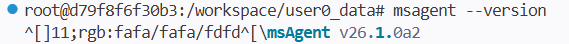
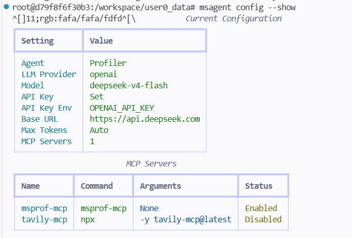
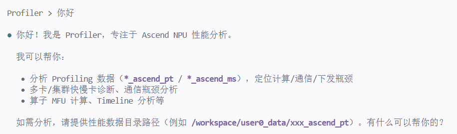
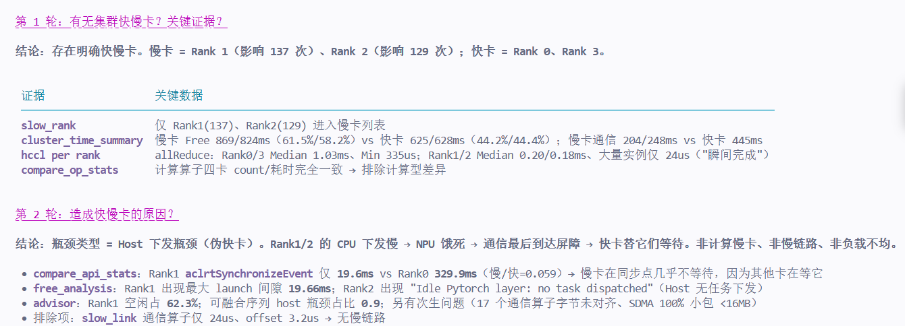
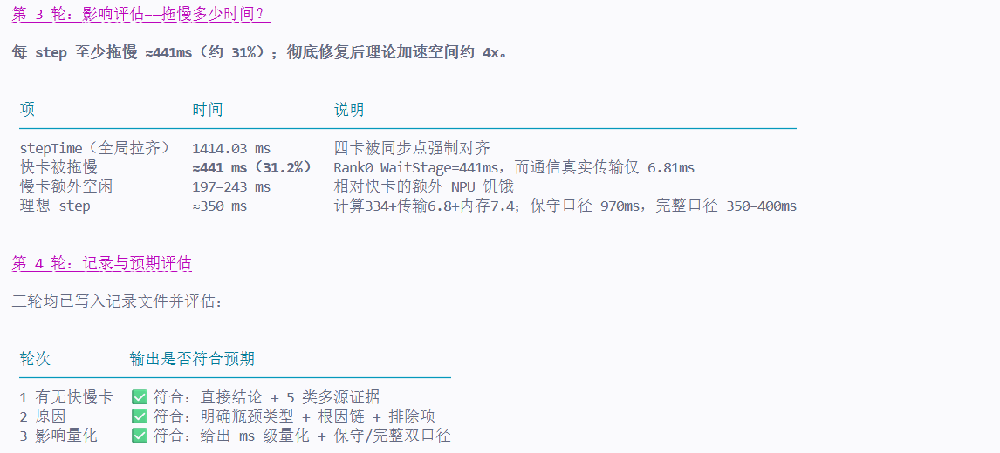

# MSAgent 体验报告

## 一、报告基本信息

| 项目 | 内容 |
|------|------|
| 报告编号 | MSA-20260820-001 |
| 体验日期 | 2026/08/20 |
| Agent版本 | 26.1.0a2 |
| Profiling数据来源 | /workspace/user0_data（Qwen3-32B 推理场景，4 卡 DP=4，DB 类型数据） |
| 测试目标 | 验证Agent分析调度类问题的能力 |

---

## 二、交互记录

### 第 1 轮交互

| 项目 | 内容 |
|------|------|
| 输入 Prompt | msagent --version |
| Agent 输出（文字摘要） | msAgent v26.1.0a2 |
| **输出截图** |  |
| 是否符合预期 | 是 |
| 评价 | |

### 第 2 轮交互

| 项目 | 内容 |
|------|------|
| 输入 Prompt | msagent config --show |
| Agent 输出（文字摘要） | 如图 |
| **输出截图** |  |
| 是否符合预期 | 是 |
| 评价 | |

### 第 3 轮交互

| 项目 | 内容 |
|------|------|
| 输入 Prompt | 你好 |
| Agent 输出（文字摘要） | 如图 |
| **输出截图** |  |
| 是否符合预期 | |
| 评价 | |

### 第 4 轮交互

| 项目                   | 内容                                                         |
| ---------------------- | ------------------------------------------------------------ |
| 输入 Prompt            | “从当前Profiling数据来看，有无集群快慢卡，有什么关键证据”，“造成快慢卡的原因是什么”，“评估快慢卡问题造成的影响，拖慢了多少时间”等***\*多轮交互\****，记录每次对话的输出，判断是否符合预期。 |
| Agent 输出（文字摘要） | 如图                                                         |
| **输出截图**           |   |
| 是否符合预期           | 是                                                           |
| 评价                   |                                                              |

---

## 三、多轮交互整体评价

| 评价维度 | 评分（1~5） | 说明 |
|----------|-------------|------|
| 问题理解准确性 | 4 | |
| 数据分析深度 | 4 | |
| 证据链条完整性 | 5 | |
| 优化建议实用性 | 4 | |
| 多轮对话连贯性 | 5 | |
| 响应速度与稳定性 | 4 | |
| 整体满意度 | 5 | |

---

## 四、问题与改进建议

### 发现的问题

1. **路径不可达时分析中断，缺少主动引导**：当用户提供的路径不存在时，Agent虽能坚守“数据驱动”原则不臆测，但未主动提供替代方案，导致单次无产出的往返，影响体验

### 改进建议

1. **优化路径不可达的兜底流程与引导**：数据路径错误时，应主动提供多选引导（如检查路径、挂载数据，或**直接提供压缩包由Agent解压**），减少无效交互。
